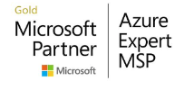
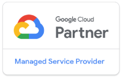
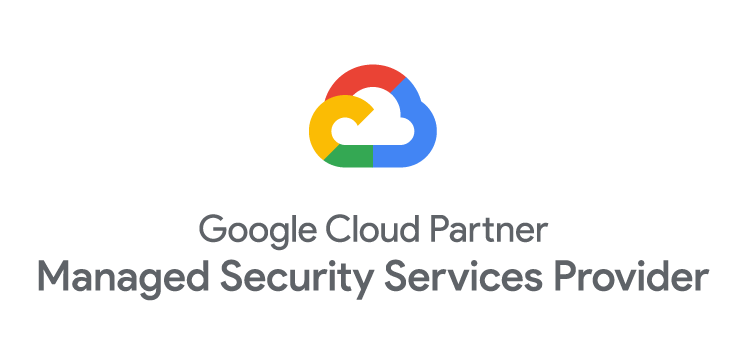
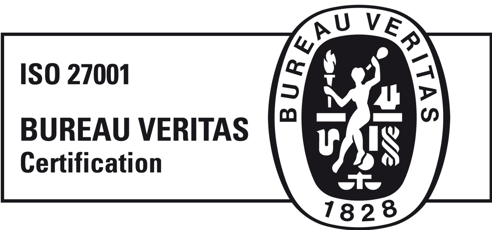
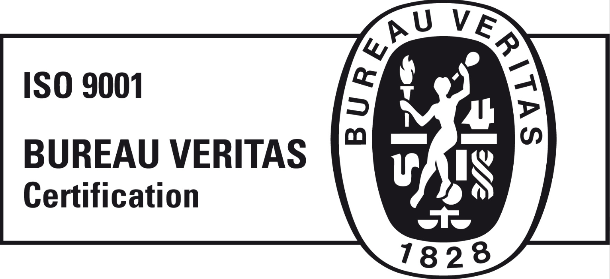
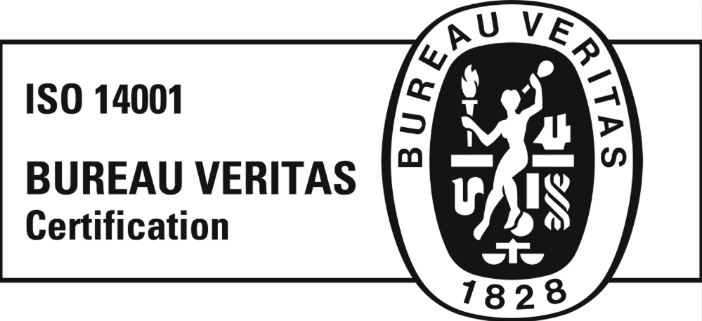
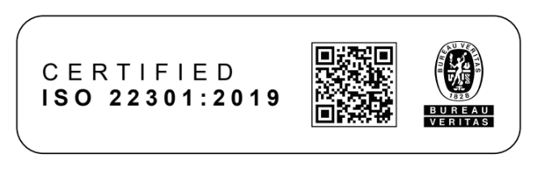

# Audit & Compliance
{: .no_toc }

As the Cloud-native Managed Services organization within Devoteam group, we focus on delivering automation, operational excellence and support clients with a cutting-edge IT Operating Model aligned to most recognizable industry standards and certifications.

  

    Table of contents
  

  {: .text-delta }
- TOC
{:toc}

---

The **Compliance and Certification** function covering ISO 27001, ISO 9001, ISO 14001, ISO 22301, as well as Azure MSP, AWS MSP, and Google MSP certifications within a Cloud Managed Services organization, is strategically critical to Devoteam Group. It ensures the consistent delivery of secure, resilient, high-quality, and sustainable cloud services across all entities and customer engagements.

ISO 27001 reinforces structured information security governance, risk management, and data protection practices; ISO 9001 drives service excellence, operational efficiency, and customer satisfaction; ISO 14001 demonstrates measurable commitment to environmental responsibility and sustainable operations; and ISO 22301 strengthens business continuity, crisis management, and operational resilience to ensure uninterrupted service delivery under adverse conditions.

Together with hyperscaler MSP certifications, this integrated compliance framework validates technical competence, governance maturity, and continuous improvement capabilities — positioning Devoteam as a trusted, audit-ready, and regulation-aligned cloud service provider.

## Areas of Expertise

| **Microsoft Azure Expert MSP** | **Google Cloud MSP** | **AWS Managed Service Provider** | **Managed Security Services Provider** |
|:--:|:--:|:--:|:--:|
| Last Audit: `12 May 2025` | Last Audit: `07 November 2025` | Last Audit: `24 October 2024` | Last Audit: `01 August 2025` |
|  |  |  |  |

Each designation is awarded to a partner following an independent third-party audit of its managed services practice - its operating model, tooling, security controls and customer outcomes - and is re-examined on the certifying provider's own cycle. The date of the most recent audit is shown above.

## Certification and Attestation

| **Validity** | **Status** | **Logo** | **Description** |
|:--|:--|:--:|:--|
| 2025.06.07 - 2028.06.06 | **Certificate:** ISO/IEC 27001:2022 |  | Conformity with ISO/IEC 27001 means that an organization or business has put in place a system to manage risks related to the security of data owned or handled by the company, and that this system respects all the best practices and principles enshrined in this International Standard. [Logo](https://drive.google.com/file/d/1shnN9wfMixL_V51Edwmlr1y4g3wNKy0L/view?usp=drive_link) · [Certificate](https://drive.google.com/drive/folders/1XQ_8iOaL6yZRjMeTsMQfAPG8XtcBQlNy) |
| 2024.03.13 - 2027.03.12 | **Certificate:** ISO/IEC 9001:2015 |  | Conformity with ISO 9001 means that an organization has put in place a quality management system governing how its services are planned, delivered, measured and improved, and that this system has been audited against the requirements of the International Standard. It commits the organization to defined processes, measurable objectives, and continual improvement driven by customer feedback. [Logo](https://drive.google.com/drive/folders/1j8_VHzROTrR7Mul3W6MOhY7oFlvSOJsE) |
| 2024.03.13 - 2027.03.12 | **Certificate:** ISO/IEC 14001:2015 |  | Conformity with ISO 14001 means that an organization has put in place an environmental management system to identify, control and reduce the environmental impact of its operations, to meet the environmental obligations that apply to it, and to set and review objectives for improving that performance over time. [Logo](https://drive.google.com/drive/folders/116ZPARuJgh1Y6jXYMibfyXIVBBmGFFg1) |
| 2026.12.16 - 2029.12.15 | **Certificate:** ISO/IEC 22301:2019 |  | Conformity with ISO 22301 means that an organization has put in place a business continuity management system: identifying the threats that could interrupt service delivery, defining how quickly each service must be restored, and exercising those plans so the organization can keep operating through a disruption. [Logo](https://drive.google.com/drive/folders/1veeUaOrq4_cNd63Z5EACBHDLegNu_MY4?lfhs=2) · [Certificate](https://drive.google.com/drive/u/0/folders/1aXZ7ByjQiwUl6nOrPbRYvHLOCXIdG3QF?lfhs=2) |

The logo and certificate links above are access-restricted. Access is granted to customers on request, as are the certificates themselves. See also the [Information Security Policy](information-security-policy.md) and the [Security & Data Protection Q&A](faq.md).
