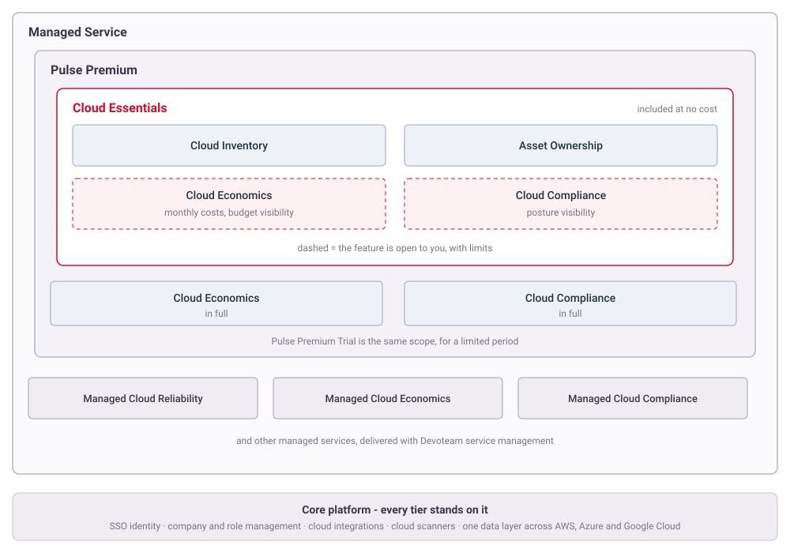

# Pulse Ecosystem
{: .no_toc }

Pulse is one platform, packaged three ways. This page explains how it is put together: what each tier gives you, which features are shared between them, and where the boundaries actually fall.

  

    Table of contents
  

  {: .text-delta }
- TOC
{:toc}

---

## How Pulse Is Put Together

Three things are easy to confuse, and separating them makes everything else simpler:

- **The core platform** - identity, company and role management, cloud integrations, scanners and the data layer that turns three clouds into one set of numbers. Every customer has all of it. It is not sold in pieces; it is what everything else stands on.
- **Features** - the functional areas you actually work in: Cloud Inventory, Asset Ownership, Cloud Economics, Cloud Compliance.
- **Tiers** - how those features are packaged commercially: Cloud Essentials, Pulse Premium, Managed Service.

Features are what you use. Tiers decide how much of each you get.

Each tier contains the one before it, which is why the boxes nest. A feature can appear twice - Cloud Economics is open to Cloud Essentials customers with limits, and comes in full with Pulse Premium.

---

## Cloud Essentials

Included at no cost, self-service, no contract. Connect your clouds and you get:

- **[Cloud Inventory](cloud-inventory.md)** - every resource across AWS, Azure and Google Cloud, with costs, tags, regions, security alerts, recommendations and compliance posture. One dashboard over all three.
- **[Asset Ownership](asset-ownership.md)** - asset groups, delegated owners and cost allocation per team.

Both in full. On top of that, several Cloud Economics and Cloud Compliance screens are open to you as well, so you can see those features working on your own data before deciding whether you need them - see [Where Features Are Partly Available](#where-features-are-partly-available).

Start here: [Cloud Onboarding](onboarding/README.md).

---

## Pulse Premium

Adds the two features above in full.

- **Cloud Economics** - Cost Analysis with daily granularity, Budget & Alerts including the alerting itself, and Cost Savings.
- **Cloud Compliance** - Compliance State, Policy Manager, Remediation Planner, Exemptions and Compliance Analysis.

**Pulse Premium Trial** is the same scope for a limited period, so the features can be evaluated on real data rather than on a demo.

---

## Managed Service

Everything above, plus managed services delivered by Devoteam rather than run by you:

- **Managed Cloud Reliability** - operational management, with ITSM and service reporting inside the portal.
- **Managed Cloud Economics** and **Managed Cloud Compliance** - the same domains as the Premium features, but operated on your behalf.

Other managed services sit alongside these under **Governance**, which is the umbrella term for the managed service scope. This tier is a contracted engagement with a Service Delivery Manager, not a self-service upgrade.

Read more: [Cloud Managed Services](https://www.devoteam.com/services/cloud-managed-services).

---

## Where Features Are Partly Available

Cloud Economics and Cloud Compliance are Pulse Premium features, but parts of them are open to Cloud Essentials customers anyway. That is deliberate: you see the feature working on your own estate rather than reading about it.

Two limits apply at the Cloud Essentials tier:

| Feature | Open to Cloud Essentials | Comes with Pulse Premium |
| --- | --- | --- |
| **Cloud Economics** | Costs in monthly granularity; budgets and how spend tracks against them | Daily cost granularity, and budget alerts actually being sent |
| **Cloud Compliance** | Compliance posture per subscription, scored against a framework | Policy management, remediation planning and exemption handling |

So a Cloud Essentials customer can answer "what are we spending and are we compliant". Acting on the answer at scale is what the services add.

---

## What Your Company Has

Entitlements come from the service catalog, not from your role. The **Service Catalog** page in the portal lists the services your company holds and the ones available to it, so it is the authoritative answer to "what do we actually have" - your own role only decides what you can do with it.

Roles work alongside that, at two levels:

- **Company roles** separate who can change the setup from who can only read it: **Manager** makes changes, **Analyst** reads everything, **User** reads only the assets delegated to them.
- **Feature roles** are granted on top of a company role for a specific feature. **Ownership Manager** configures [Asset Ownership](asset-ownership.md).

---

## The Core Platform

Shared by every tier, and the reason the rest works:

- **Identity** - SSO to your own identity provider. Pulse stores no passwords.
- **Company and role management** - one tenant, with roles and delegation as described above.
- **Cloud integrations and scanners** - read-only access to AWS, Azure and Google Cloud, discovering resources continuously. Pulse changes nothing in your cloud.
- **One data layer** - three providers' billing, resource and security data normalised into a single set of figures, which is what makes a multi-cloud total meaningful rather than three reports side by side.

---

## Next Steps

- Start with the free tier: [Cloud Onboarding](onboarding/README.md)
- See what Cloud Essentials includes, screen by screen: [Cloud Inventory](cloud-inventory.md)
- Set up ownership so costs and resources can be attributed: [Asset Ownership](asset-ownership.md)
- Leaving, or removing a cloud: [Offboarding](offboarding.md)
- Talk to us about managed services: [Cloud Managed Services](https://www.devoteam.com/services/cloud-managed-services)
