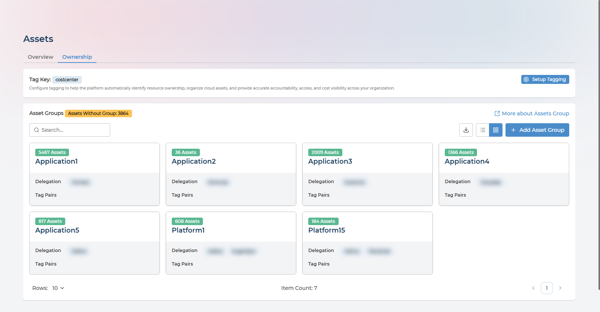
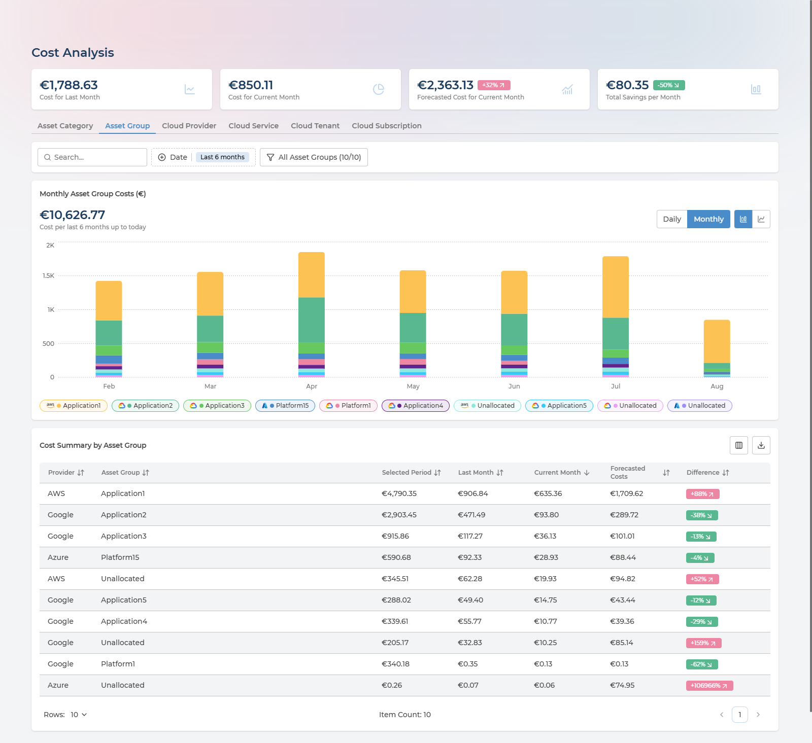
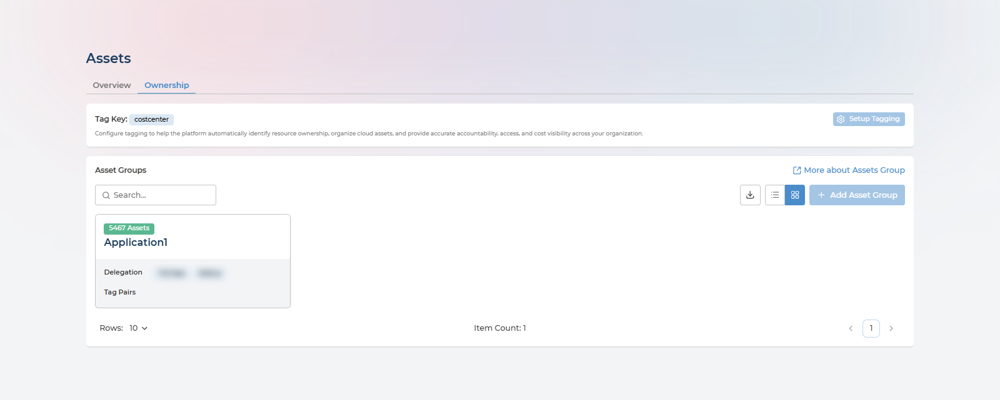
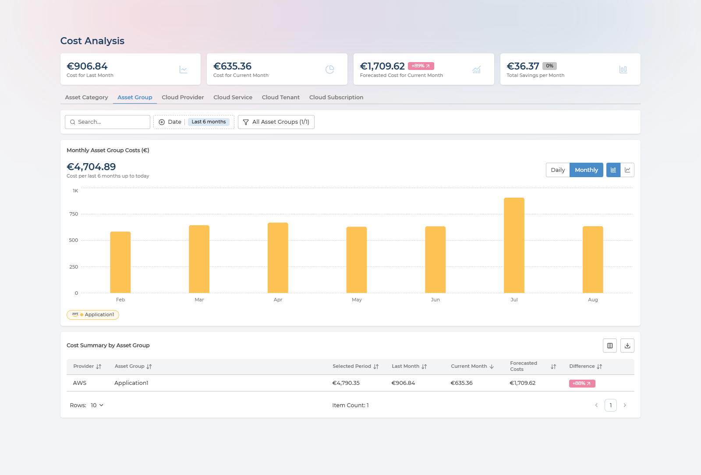
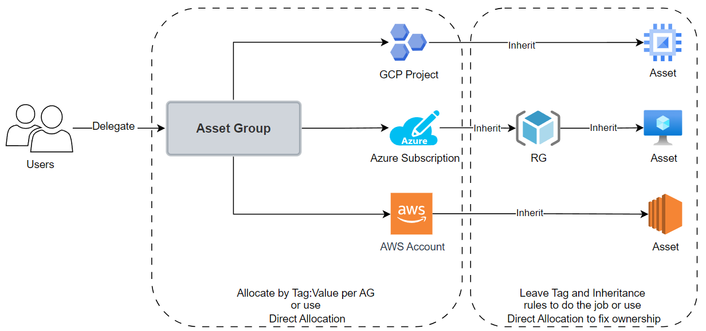
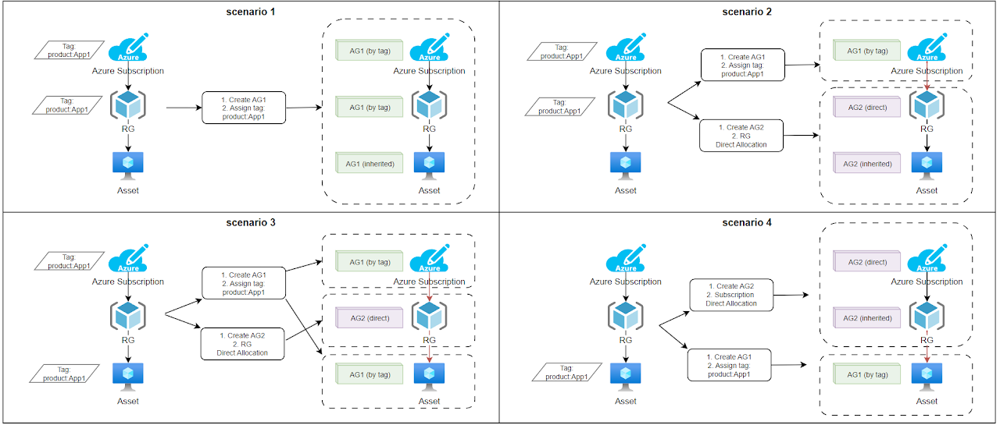

# Asset Ownership
{: .no_toc }

An inventory tells you what you have. Ownership tells you who is answerable for it - and that single addition is what turns a list of resources into something you can act on. Without it there is no accountability, no way to scope access, and no way to put a number against a team. This page covers what ownership gives you and how to set it up.

  

    Table of contents
  

  {: .text-delta }
- TOC
{:toc}

Screenshots show page content only, with delegated user names blurred; they appear in full in the product.
{: .fs-3 }

---

## What You Get From It

Ownership is a means to four ends, and it is worth being clear about which one you are after before you configure anything:

| Purpose | What it gives you |
| --- | --- |
| **Ownership Management** | Every asset has a named responsible party, assigned through an Asset Group rather than one resource at a time |
| **Accountability** | Ownership information that operations, internal automations and other systems can consume |
| **Security** | A basis for granting or restricting who sees which resources and their recommendations |
| **Economics** | **Cost allocation** - cost per Asset Group, so a team sees its own spend instead of a company total, and spend can be attributed and recharged |

The cost view is the one that tends to justify the setup effort on its own - see [Cost per Asset Group](#cost-per-asset-group).

---

## Terminology

| Term | Definition |
| --- | --- |
| **Asset** | A metadata copy of a cloud provider object - virtual machines, public IP addresses, firewall rules, billing containers, configuration items |
| **Asset Parent** | Every asset has a parent container. Azure: Cloud Tenant → Subscription → Resource Group → Resource. AWS: Cloud Organization → Account → Resource. Google: Cloud Organization → Project → Resource |
| **Asset Group (AG)** | A logical grouping of allocated assets, visible to the users delegated to it |
| **Allocation** | Assigning an *asset* to an Asset Group |
| **Delegation** | Assigning a *user* to an Asset Group as its owner |
| **Cost allocation** | The FinOps practice of attributing cloud spend to the team or business unit responsible for it. In Pulse it is the result of the two above: once assets belong to a group, so does their cost |

Allocation and delegation are easy to confuse and do different jobs: allocation decides what is in a group, delegation decides who can see it.

---

## The Ownership Tab

Ownership lives on the second tab of the **Assets** page.

**Asset Groups** shows every group with the number of assets allocated to it, the users delegated to it, and the tag pairs that pull assets in automatically. Search by group name to find a team, switch between card and list views, export the groups to CSV, or create one with **Add Asset Group**. Opening a group leads to its detail page, where allocation and delegation are managed.

Two figures here are worth returning to:

- **Tag Key**, at the top, is the single company tag Pulse uses to assign assets to groups automatically - `costcenter` in the example above. This is the setting that makes ownership maintain itself instead of needing manual work.
- **Assets Without Group** counts everything that has escaped assignment altogether. It is the gap between having an inventory and having accountability for it, and reducing it is the point of everything below.

---

## Cost per Asset Group

This is **cost allocation**: once assets are allocated, the **Asset Group** tab on the Costs page reads your cloud bill by team instead of by service or subscription. It is the practice most FinOps work depends on, and ownership is what makes it possible without restructuring your subscriptions to match your org chart.

Each group gets its spend for the period, last month, the current month, a forecast and the trend between them. This is the number to hand to the team that generated it, and it arrives without anyone having to reorganise subscriptions or maintain a spreadsheet.

Note the **Unallocated** rows, one per provider. That is spend nobody owns. It is the same accountability gap the Ownership tab reports as *Assets Without Group*, expressed in currency - which is usually the more persuasive form.

---

## What a Delegated User Sees

Delegation is not a label on a group - it changes what Pulse shows. A user delegated to one group sees that group's estate and nothing else, on every page, without any filtering on their part.

Compare these with the two screenshots above, which are the same screens seen by someone with visibility of the whole estate.

The **Ownership** tab lists one group instead of seven. **Assets Without Group** is absent, because unowned assets elsewhere in the estate are not this user's concern. **Setup Tagging** and **Add Asset Group** are greyed out - company-wide configuration stays with the Ownership Manager.

On the Costs page the rescoping goes further than the table. The headline figures change too: this user's **Cost for Last Month** reads €906.84 - their group's spend - where the same card shows €1,788.63 for the whole company. Six-month spend reads €4,704.89 against €10,626.77, the chart carries a single series, and the summary table has one row.

That is what makes delegation safe to hand out widely. A team lead gets their own costs, their own assets and their own recommendations, in the same interface, without seeing anyone else's - and without you building a separate report for them.

---

## How Assets Are Allocated

Every asset belongs to exactly one group at a time. When more than one rule could apply, a strict priority decides:

1. **Direct** - an Ownership Manager assigned the asset by hand. Always wins.
2. **Tag** - the asset carries a cloud tag key:value that maps to a group. Applies when there is no direct allocation.
3. **Inheritance** - an automatic rule places the asset in its parent's group, when neither direct nor tag allocation applies.
4. **Unassigned** - the catch-all Default group, for everything with no other allocation.

Direct beats tag; tag beats inheritance. Most surprises about group membership come from forgetting this order - a direct allocation made months ago will quietly keep overriding the tag you just fixed.

The whole model in one picture. Users are delegated to an Asset Group; the group is allocated containers - a Google Cloud project, an Azure subscription, an AWS account - and the assets beneath them inherit that group without being allocated one by one. Which is why allocating at the container level and letting inheritance do the rest is so much less work than the alternative, and why direct allocation exists only to fix the cases inheritance gets wrong.

---

## Who Can Do What

Configuring ownership - creating groups, allocating assets, setting up tagging and delegating users - requires the **Ownership Manager** role. Ask a Manager to grant it to you if you do not have it.

The **Manager** and **Analyst** roles have read-only visibility of every Asset Group, without needing to be delegated to them.

A user delegated to an Asset Group sees the same pages as everyone else in the company, with everything on them limited to the assets in their group or groups. Delegation is what sets that boundary - see [What a Delegated User Sees](#what-a-delegated-user-sees).

---

## Before You Start

1. You hold the **Ownership Manager** role. If not, a Manager grants it in user management.
2. At least one cloud is connected and has synced, so assets exist to allocate - see [Cloud Onboarding](onboarding/README.md).
3. Users you intend to delegate already exist and hold at least the **Company User** role.
4. If you plan to use tag-based allocation, the assets are already tagged in the cloud with the key:value pairs you intend to use.

Point 4 is the one that catches people out: Pulse reads the tags your cloud already has. It does not create them.

---

## The Common Path

Most organisations end up here, and it takes about ten minutes of actual work:

1. On **Assets → Ownership**, click **Setup Tagging** and pick the tag key your teams already use for ownership - something like `costcenter`, `team` or `owner`.
2. Enable **Automatically Create Asset Groups by Tag Values**, so Pulse creates one group per distinct value it finds instead of you naming them.
3. Wait for the next processing cycle - up to 24 hours - then come back.
4. Check **Assets Without Group**. Whatever is left has no usable tag, and is the list worth fixing.
5. Delegate users to the groups that matter, and read spend per group on the Costs page's **Asset Group** tab.

The sections below cover the alternatives, the detail behind each step, and what to do when tags cannot express how you are organised.

---

## Choosing an Approach

| Approach | Best when | What you do |
| --- | --- | --- |
| **Automatic** (recommended) | Your cloud tagging is consistent | Pick a tag key and let Pulse create one group per tag value |
| **Semi-manual** | You need group names or groupings that do not map 1:1 to tag values | Create groups yourself, then attach a tag value to each |
| **Manual** | One-off corrections, untagged assets, or tag allocation producing the wrong answer | Assign assets directly |

These are not exclusive. The common end state is automatic for the bulk of the estate with a handful of direct allocations fixing what the tags cannot express.

---

## Step 1 - Set Up Organisation Tagging

This defines which cloud tag **key** represents ownership across the whole estate. It is a one-time, company-level setting.

Skip this if you only intend to allocate directly.
{: .fs-3 }

1. On the **Assets** page, open the **Ownership** tab.
2. Click **Setup Tagging** (or the existing tag key button, if one is already configured).
3. In the panel that opens:
   - **Associated Tag** - select the tag key that carries ownership, for example `costcenter`, `team` or `owner`.
   - **Automatically Create Asset Groups by Tag Values** - enable this to have Pulse generate one group per distinct tag value it finds.
4. **Save**.

Groups created this way are initially named after the tag value; rename them freely afterwards.

---

## Step 2 - Create an Asset Group

Only needed for the semi-manual approach. Skip it if Step 1 created your groups.
{: .fs-3 }

1. On the **Ownership** tab, click **Add Asset Group**.
2. In the **Group Builder** panel:
   - **Group Name** - something a person would recognise, such as `Networking Team` or `Production AWS`.
   - **Delegate Asset Owners** - one or more users, each holding at least the Company User role.
3. **Save**.

The group's detail page opens with allocation still to do.

---

## Step 3 - Allocate Assets

Three ways in, matching the three approaches above.

### Option A - By tag pair

1. Open the group's detail page.
2. Click **Allocate Based on Tag Pair**.
3. Choose the **Tag Value** that belongs to this group. The tag key is already filled in from Step 1.
4. **Save**.

Tag allocation is not immediate. Assets appear in the group once the next processing cycle has run, which can take **up to 24 hours**. This is the most common reason for "I configured it and nothing happened".
{: .fs-3 }

### Option B - Directly, from the group

1. Open the group's detail page.
2. Click **Allocate Directly**.
3. Narrow the list with the cloud provider, custom and tag filters.
4. Tick the assets you want.
5. Click **Assign to Group**.

This takes effect immediately, and takes priority over any tag or inherited allocation for those assets.

### Option C - In bulk, from the inventory

1. Go to the **Assets** page, **Overview** tab.
2. Tick the assets you want using the row checkboxes.
3. Click **Manage Allocation**.
4. Choose the target group, or **Unallocate** to return them to the Default group.

Useful when you are working from the inventory rather than from a group - you find the assets first and decide where they belong second.

---

## Delegating Users

Open the group, update **Delegate Asset Owners** in the Group Builder panel, and save.

From then on that user sees the company's pages scoped to the assets in this group. Delegating the same user to several groups widens the boundary to cover all of them.

---

## Managing Groups

**Edit** - open the group and change its name or delegates in the Group Builder panel.

**Unallocate** - from the Assets Overview tab, select the assets, click **Manage Allocation** and choose **Unallocate**. They return to the Default group.

**Delete** - only possible when a group has **zero allocated assets**. Unallocate everything first, then delete.

### The Default Group

Pulse maintains a read-only **Default** group that collects every asset not allocated anywhere else. Ownership Managers, Managers and Analysts can all see it. Treat it as your worklist: everything in it has no owner.

---

## Scenarios

The four cases below, drawn out. Each shows a subscription, a resource group and an asset, the steps taken, and which group everything lands in - by tag, directly, or by inheritance. The examples use Azure because its extra Resource Group level makes the inheritance clearest; the same rules apply to AWS accounts and Google Cloud projects with one level fewer.

**Standard tag-based setup - the common case.** Configure a tag key, enable automatic creation, and let tag allocation do the work while inheritance handles untagged child resources. This leans on the tagging strategy you already have.

**Several applications sharing one subscription, account or project.** Tags alone may not separate them. Use direct allocation to override tag or inherited allocation for the specific resources that belong elsewhere.

**An Azure Resource Group split across teams.** Possible, but generally best avoided - it produces inheritance conflicts that are hard to reason about later. Prefer a tagging strategy over splitting at Resource Group boundaries.

**An asset that must not follow its parent.** A virtual machine inside a Resource Group owned by another team, for example. A direct allocation on the child overrides the inherited group.

---

## Day-to-Day Reference

  
Where to do each thing

| Task | Where |
| --- | --- |
| See all groups | Assets → Ownership tab, card or list view |
| See the assets in a group | Open the group; the asset table is on its detail page |
| See unallocated assets | The Default group, or the **Assets Without Group** count |
| Check how an asset was allocated | Assets → Overview tab, **Allocation Type** column or filter |
| Find which group an asset belongs to | Assets → Overview tab, **Asset Group** column or filter |
| Reassign assets | Assets → Overview tab, select rows, **Manage Allocation** |
| Read spend per group | Costs page, **Asset Group** tab |

---

## Questions and Answers

### I configured tag-based allocation but nothing has appeared
{: .no_toc }

Tag allocation is not immediate - allow up to 24 hours for the next processing cycle. If it is still empty after that, check that the asset really carries the exact tag key and value in the cloud, since Pulse matches them literally.

### The Add Asset Group button is not there
{: .no_toc }

It is only shown to Ownership Managers. Ask a Manager to grant you that role.

### Can an asset be in two groups at once?
{: .no_toc }

No. Exactly one group at a time, decided by the priority order: direct, then tag, then inheritance, then unassigned.

### Direct allocation is overriding the tag I set - is that right?
{: .no_toc }

Yes. Direct allocation always wins. To let the tag take effect, unallocate the asset to clear the direct allocation, then allow tag allocation to place it.

### A delegated user cannot see their group
{: .no_toc }

Confirm the user holds the **Company User** role as well as being delegated, and that the group actually has assets allocated to it - a group with nothing in it looks the same as no access.

### I want groups generated from the tags I already use
{: .no_toc }

Enable **Automatically Create Asset Groups by Tag Values** in the Setup Tagging panel. Pulse creates one group per distinct value it finds, which you can then rename.

### Why can't I delete this group?
{: .no_toc }

Groups must be empty before they can be deleted. Unallocate every asset in it first.

---

## Next Steps

- See ownership in context of the wider inventory: [Cloud Inventory](cloud-inventory.md)
- Connect a cloud so there are assets to allocate: [Cloud Onboarding](onboarding/README.md)
- Learn more about the platform: [Pulse Ecosystem](README.md)
