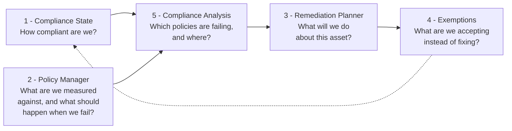

# Cloud Compliance

Cloud Compliance brings the compliance engines of AWS, Azure and Google Cloud under one process. Five pages, each answering one question, in the order you meet them:

Read left to right, that is the working cycle:

- **Choose what you are measured against.** Assign security frameworks in [Policy Manager](policy-manager.md), and decide what should happen when each policy inside them is broken.
- **See where you stand.** [Compliance State](compliance-state.md) scores every subscription against the framework and plots it over time.
- **Find out what is behind the number.** [Compliance Analysis](compliance-analysis.md) groups the violations by policy, down to the individual asset.
- **Commit to doing something.** [Remediation Planner](remediation-planner.md) is where the owner of an asset says what will happen to it, and by when.
- **Record what you accept instead.** [Exemptions](exemptions.md) is where an accepted risk is requested, approved or refused, with an expiry date.

---

## The Pages

| Page | What you do there |
| --- | --- |
| **[Compliance State](compliance-state.md)** | Track compliance metrics over time and compare subscriptions |
| **[Policy Manager](policy-manager.md)** | Review security frameworks, assign them, and set what happens to each policy |
| **[Remediation Planner](remediation-planner.md)** | Review violations assigned to you and plan what to do about them |
| **[Exemptions](exemptions.md)** | Review, approve and reject exemption requests, with expiry and risk number |
| **[Compliance Analysis](compliance-analysis.md)** | Explore violation detail grouped by policy, down to the individual asset |

---

## What You Get at Each Tier

- **Cloud Essentials** - [Compliance State](compliance-state.md) only. You can see your compliance posture per subscription, scored against a framework, without holding a Cloud Compliance subscription.
- **Pulse Premium** - all five pages. Choosing frameworks, setting policy actions, planning remediation and handling exemptions are the part that Premium adds.
- **Managed Cloud Compliance** - the same five pages, plus Devoteam operating them with you. The decisions you record in Pulse become work Devoteam carries out in your cloud, rather than a list your own team has to action.

That last difference is the one worth understanding before you start, because it changes what a decision in Pulse means. See [Nothing in Pulse changes your cloud](policy-manager.md#nothing-here-changes-your-cloud).

For how the tiers fit together across the whole platform, see [Pulse Ecosystem](../README.md).

---

## Before the Data Arrives

Pulse reports on compliance data your cloud produces. Which standards your cloud evaluates is a setting in the cloud itself, not in Pulse:

- Every framework and every policy inside it is listed in Pulse, whatever your cloud evaluates.
- **Violations are what depend on the cloud side.** A standard your cloud does not evaluate shows its policies with nothing reported against them.

- [Enabling Standards in Your Cloud](enabling-standards.md)
