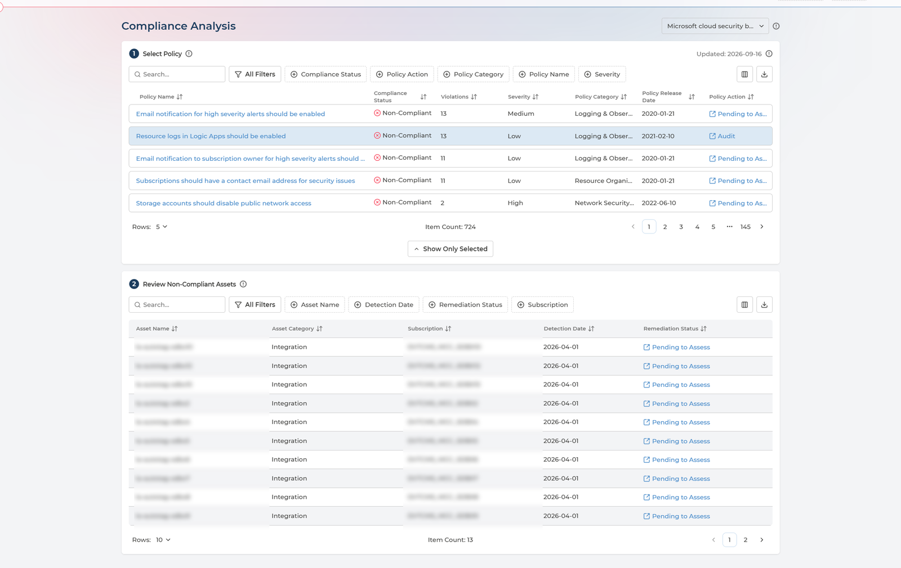
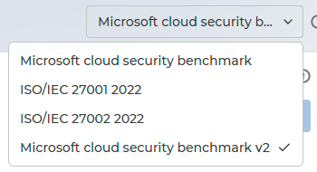
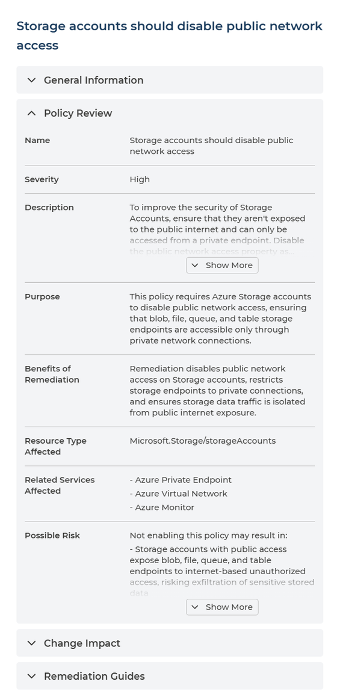
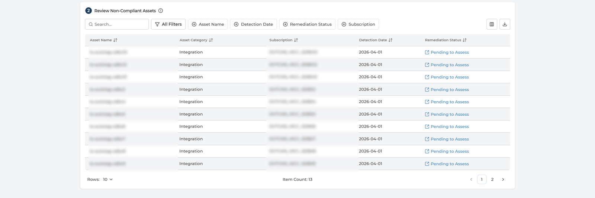

# Compliance Analysis
{: .no_toc }

[Compliance State](compliance-state.md) tells you the estate is 74% compliant. Compliance Analysis tells you which policies are failing, on which assets, and what is already being done about them.

  

    Table of contents
  

  {: .text-delta }
- TOC
{:toc}

---

## What the Page Is For

It is the investigative view: violations grouped by the policy that raised them, and each policy opened up to the individual resources breaching it.

- **The question here** is *what is wrong with us* - which controls we are failing, how badly, and how widely.
- **The question in [Remediation Planner](remediation-planner.md)** is *what will we do about this asset* - it is a live planning tool, worked violation by violation.

This is the view to bring to a review meeting or an auditor.

---

## Choosing a Framework

Everything on the page is scoped to one security framework, chosen from the selector beside the page title.

- Only assigned frameworks appear - assigning them is done in [Policy Manager](policy-manager.md).
- The framework you open on is your organisation's **default framework**, the same one for everyone.
- Changing the selection resets the filters on both tables, because a filter that made sense for one framework rarely means anything in another.

---

## Step 1 - Select Policy

The upper table lists every evaluated policy in the framework, with its status and how many violations it has raised.

  
Every column in the policy table

| Column | What it holds | Values |
| --- | --- | --- |
| **Policy Name** | The policy - click it to open the full analysis | The provider's own policy name |
| **Compliance Status** | Whether the estate currently meets it | **Compliant** · **Non-Compliant** |
| **Violations** | How many assets are breaching it | A count |
| **Severity** | The assessed risk of the policy | **Low** · **Medium** · **High** · **Critical** |
| **Policy Category** | The security domain the policy belongs to | One of fourteen - see below |
| **Policy Action** | What your organisation decided should happen, and a link to change it | **Pending to Assess** · **Under Investigation** · **Audit** · **Remediate** · **Exempt** · **Exemption Due Soon** · **Exempt Expired** |
| **Prevention Preference** | Whether non-compliant deployments should be blocked | **Permit** · **Prevent** |
| **Remediation Complexity** | How much work a fix typically takes | **Simple** · **Moderate** · **Complex** |
| **Policy Release Date** | When the provider published the policy | A date |

Prevention Preference, Remediation Complexity and Policy Release Date are **not shown by default** - add them from the column control in the table toolbar.

**Show Only Selected** collapses the list to the policy you picked, which frees the screen for the assets below once you have found it.

  
The fourteen Policy Categories

Every policy belongs to exactly one security domain:

- Identity & Access Management (IAM)
- Network Security & Perimeter
- Data Protection (At Rest & In Transit)
- Key & Secret Management
- Logging & Observability
- Compute & Runtime Security
- Container & Orchestration (Kubernetes)
- Configuration Management (CSPM)
- Infrastructure as Code (IaC) Security
- Vulnerability Management
- Storage Governance
- Resilience & Disaster Recovery
- Resource Organization & Tagging
- Cloud Service Enablement

Filtering by category is how you review one control area at a time - all your logging controls, or everything touching keys and secrets.

Filter by **Compliance Status** to see only what is failing. Sorting by Violations descending puts the widest failures first, which is usually not the same order as severity: a Low severity policy breached on two hundred assets may matter more than a High one breached on one.

### Opening a policy
{: .no_toc }

Click the policy name for the full analysis.

The analysis is organised into four sections. This is the same analysis you see from [Policy Manager](policy-manager.md) and [Remediation Planner](remediation-planner.md).

  
Every field in the policy analysis

**Policy Review** - what the policy is and why it matters

| Field | What it tells you |
| --- | --- |
| **Name** | The policy's name |
| **Severity** | Low, Medium, High or Critical |
| **Description** | The provider's own description of the control |
| **Purpose** | What the policy enforces, in one or two sentences |
| **Benefits of Remediation** | Three specific benefits of fixing it |
| **Resource Type Affected** | The resource types the policy applies to |
| **Related Services Affected** | Other services touched, and how |
| **Possible Risk** | What leaving it unaddressed may result in |

**Change Impact** - what happens to your estate if you remediate

| Field | What it tells you |
| --- | --- |
| **Changes Made by Remediation** | Exactly what property is changed, and whether it is in-place or destructive |
| **Preparation for Remediation** | The inputs to gather before starting |
| **Service Reboot Required After Remediation** | **YES** or **NO**, with the reason |
| **Resource Redeployment Required for Remediation** | **YES** or **NO** - YES means the resource must be recreated |
| **Change Impact on Running Services** | **YES** or **NO**, naming the workload disrupted |

**Remediation Guides** - how the fix is carried out

| Field | What it tells you |
| --- | --- |
| **Manual Steps to Remediate** | Numbered steps describing the target state |
| **Remediation Complexity** | Simple, Moderate or Complex |
| **Roll Back Steps** | How to reverse the change if it goes wrong |
| **Verification in JSON** | What a compliant resource looks like, as a property and value |

**More Info** - how the policy maps to the wider world

| Field | What it tells you |
| --- | --- |
| **Controls Covered** | The equivalent control in ISO/IEC 27001:2022, CIS Controls v8.1, NIST SP 800-53 Rev. 5, PCI DSS v4.0.1 and SWIFT CSCF v2025 |
| **Maturity** | Where the policy sits in the provider's lifecycle |
| **Category** | The security domain |
| **Standard Names** | The frameworks that include this policy |

Two parts earn their place in a review meeting. **Possible Risk** and **Benefits of Remediation** are written to be quoted directly to whoever approves the work. **Controls Covered** answers the auditor's question - which ISO or NIST control this policy actually satisfies - without a mapping exercise.

And read **Roll Back Steps** before starting, not after. They exist so a change can go to a change board with an exit route already written down.

---

## Step 2 - Review Non-Compliant Assets

Selecting a policy fills the lower table with the individual resources breaching it.

  
Every column in the assets table

| Column | What it holds | Values |
| --- | --- | --- |
| **Asset Name** | The resource in breach | Your own resource names |
| **Asset Category** | What kind of resource it is | For example Storage, Integration |
| **Subscription** | The subscription, project or account it lives in | Your own names |
| **Detection Date** | When the violation was first found | A date |
| **Remediation Status** | What has been decided about this violation, and a link to change it | **Pending to Assess** · **Internal Investigation** · **Planned to Remediate** · **Scheduled Remediation** · **Planned to Decommission** · **Exemption Requested** |

Filter by Asset Name, Asset Category, Detection Date, Remediation Status or Subscription. **Subscription** is the one that matters most in practice: it narrows a policy's breaches down to the assets one team owns, which is what turns a finding into an assignment.

Both tables export to CSV in full, not only the page on screen.

When the selected policy has no violations the table says **No violations detected** - the answer you want, rather than an error.

---

## The Two Columns That Act

**Policy Action** and **Remediation Status** are not plain labels. Each one shows the current decision *and* links to the page where you can change it.

| Column | Shows | Links to |
| --- | --- | --- |
| **Policy Action**, in the policy table | What your organisation decided should happen when this policy is broken | [Policy Manager](policy-manager.md), in a new tab, on that exact framework and policy |
| **Remediation Status**, in the assets table | What has been decided about this specific violation | [Remediation Planner](remediation-planner.md), for that violation |

**Read them as a to-do list.** Either one showing **Pending to Assess** means nobody has decided yet - and the link is there so you can go and decide without hunting for the row on another page.

So the traversal through Cloud Compliance runs: a number on [Compliance State](compliance-state.md), the policies behind it here, and then either the decision in Policy Manager or the work in Remediation Planner.

The **Policy Action** column is not shown to the **User** role.

---

## Q&A

### Nothing is listed in the lower table
{: .no_toc }

Select a policy in the upper table first - the assets table shows the resources breaching whichever policy is selected. If one is selected and the table still says **No violations detected**, that policy is currently being met.

### How is this different from Remediation Planner?
{: .no_toc }

[Remediation Planner](remediation-planner.md) is a live planning tool: violations listed as individual pieces of work, each given an owner, an action and a date. Compliance Analysis is for understanding rather than planning - it groups the same violations by policy to show which controls are failing and how widely.

### The violation count here does not match Compliance State
{: .no_toc }

They count different things and are not meant to agree:

- **Here**, violations are counted **per policy** - how many assets breach this one control.
- **On [Compliance State](compliance-state.md)**, they are counted **per subscription**, or across the whole tenant.

One asset can breach several policies, so no arithmetic connects the two figures.

### Can I change a policy's action from here?
{: .no_toc }

Not on this page, but the **Policy Action** value is a link: it opens [Policy Manager](policy-manager.md) in a new tab, already filtered to that framework and policy. Changing it there requires the Manager role.
