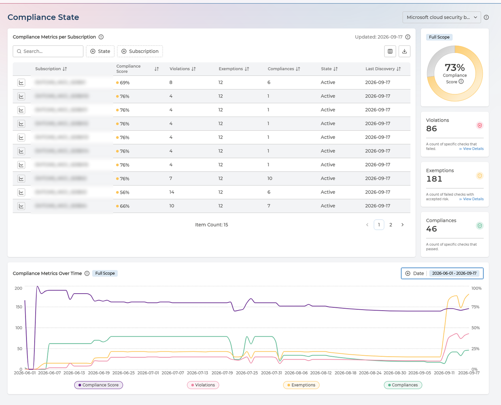
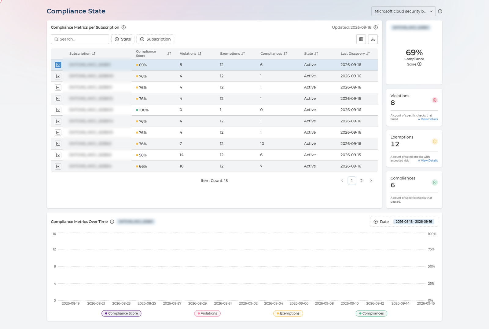
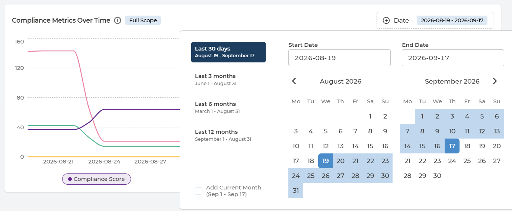

# Compliance State
{: .no_toc }

Compliance State answers the question everyone else asks you: *how compliant are we, and is it getting better?* It scores every subscription against a framework, and plots the same figures day by day so the answer is a trend rather than a snapshot.

<details open markdown="block">
  <summary>
    Table of contents
  </summary>
  {: .text-delta }
- TOC
{:toc}
</details>

---

## The Page at a Glance



Three things work together:

- **Compliance Metrics per Subscription** - scores each subscription and counts what is behind the score.
- **The scorecards alongside** - the same figures for whatever scope you have selected, each linking onward to the detail.
- **Compliance Metrics Over Time** - all four figures plotted across a period you choose.

Everything is scoped to one framework, chosen from the selector beside the page title. Switching framework rescores the whole page - a subscription can be strong against one standard and weak against another, which is exactly what this page is for.

---

## Whole Tenant, or One Subscription

This is the control that changes what the page means, and it is easy to miss:

- **Nothing selected** - the scorecards and the chart cover **your whole tenant**. The badge reads **Full Scope**.
- **A subscription row selected** - both narrow to that subscription, and the badge changes to its name.
- **Select the row again** - the selection clears and you are back to the whole tenant.



So the same page serves two audiences without switching views. Leave it unselected for the number you report upwards; select a row when a subscription owner asks about theirs.

Always check the badge before quoting a figure. A tenant-wide score and a single subscription's score look identical on screen and differ completely in meaning.

---

## The Compliance Score

The score is not a judgement. It is arithmetic on three counts:

```
(Compliances + Exemptions) / (Violations + Compliances + Exemptions) x 100%
```

- **Violations** - a count of specific checks that failed.
- **Exemptions** - a count of failed checks with accepted risk.
- **Compliances** - a count of specific checks that passed.

**An exemption counts towards your score exactly as a pass does.** That is deliberate - an accepted risk is a decision your organisation made knowingly, not an outstanding failure. But it means the score alone cannot distinguish an estate that was fixed from one that was exempted, which is why the three counts sit beside it and never appear on their own.

When you report this figure, report the exemption count with it.

---

## Compliance Metrics per Subscription

Each row is one subscription. Work the table by score ascending: the weakest subscription is where remediation effort buys the most.

<details markdown="block" class="reference-box">
  <summary>Every column in the table</summary>

| Column | What it holds | Values |
| --- | --- | --- |
| **Subscription** | The subscription, project or account being scored | Your own names |
| **Provider** | Which cloud it belongs to | AWS · Azure · Google Cloud |
| **Compliance Score** | The score for that subscription, colour-coded | 0–100% |
| **Violations** | Checks that failed | A count |
| **Exemptions** | Failed checks with accepted risk | A count |
| **Compliances** | Checks that passed | A count |
| **State** | Whether the subscription is still being scanned | **Active** · **Not Active** |
| **Last Discovery** | When Pulse last collected compliance data for it | A date, or **Never** |

Filter by **State** and **Subscription**, or search by name. The table exports to CSV in full - which is the usual way to get these figures into an audit pack or a board report.

</details>

**Last Discovery is the first thing to check when a figure looks wrong.** A score that has not moved may be a score that has not been recollected. **Never** means Pulse has not yet scanned that subscription at all.

**Not Active** means the subscription is no longer being scanned, so its figures are frozen at the last collection rather than current.

---

## From a Number to the Detail

The **Violations** and **Exemptions** scorecards each carry a **View Details** link, and they are the fastest route out of this page:

| Scorecard | Takes you to |
| --- | --- |
| **Violations** | [Compliance Analysis](compliance-analysis.md), to see which policies are failing and on which assets |
| **Exemptions** | [Exemptions](exemptions.md), to see what has been accepted and when it expires |

That is the intended path through Cloud Compliance: notice a number here, follow it to the detail, act on it in [Remediation Planner](remediation-planner.md).

---

## The Trend



**Compliance Metrics Over Time** plots compliance score, violations, exemptions and compliances together, day by day. Plotting them together is the point - a score moving on its own tells you nothing about why. The chart follows the same scope as the scorecards, so the badge on it tells you whether you are looking at the tenant or one subscription.

Choose the period from the **Date** control:

- **Last 30 days**
- **Last 3 months**
- **Last 6 months**
- **Last 12 months**
- **A custom range**, by setting a start and end date
- **Add Current Month** extends a preset to include the month in progress

Three shapes are worth recognising:

- **Score rises, violations flat, exemptions rise** - risk is being accepted rather than removed. Legitimate, but it should be a decision someone made, not a surprise.
- **Score flat, violations flat, compliances rise** - the estate is growing and new resources are passing. Holding a score while growing is real progress.
- **Score drops sharply on one day** - usually a newly assigned framework or a newly onboarded subscription bringing its findings with it, rather than a sudden regression.

---

## Q&A

### Which framework am I looking at?
{: .no_toc }

The one named in the selector beside the page title. Only assigned frameworks appear there - assigning them is done in [Policy Manager](policy-manager.md).

### Am I looking at the whole tenant or one subscription?
{: .no_toc }

Check the badge on the scorecards and the chart. **Full Scope** is the whole tenant; anything else is the subscription named on the badge. Clicking the selected row again returns you to Full Scope.

### A subscription shows Never under Last Discovery
{: .no_toc }

Pulse has not yet collected compliance data for it. Newly onboarded subscriptions show this until the first collection completes.

### Our score went up but we have not fixed anything
{: .no_toc }

Check the exemptions count over the same period. Exemptions count towards the score as passes do, so approving them raises it without changing the estate.

### Why does the chart show a different figure from the table?
{: .no_toc }

The table shows the latest collection; the chart shows a series over the period you selected. They agree at the right-hand end of the chart, not across it.

### Can I get these figures out of Pulse?
{: .no_toc }

Yes - the metrics table exports to CSV in full, not only the page on screen.
