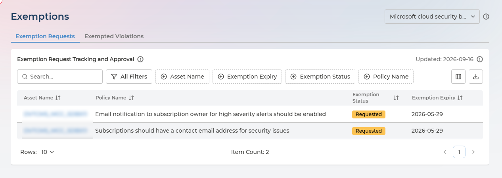
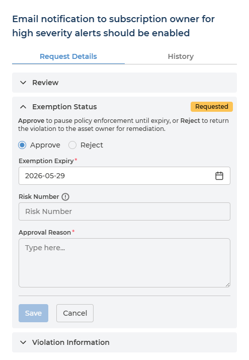
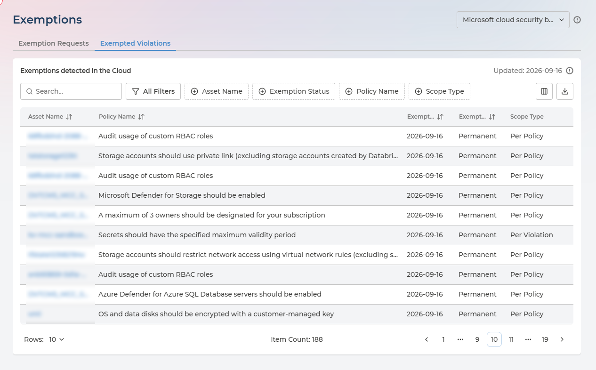

# Exemptions
{: .no_toc }

Sometimes a violation will not be fixed, and that is the right answer - the fix would break a system, cost more than the risk, or apply to a resource on its way out. Exemptions is where those decisions are asked for, granted or refused, and kept on record.

  

    Table of contents
  

  {: .text-delta }
- TOC
{:toc}

---

## Two Tabs, Two Different Things

| Tab | What it holds |
| --- | --- |
| **Exemption Requests** | The decision workflow inside Pulse - who asked for an exemption, and what a Compliance Manager decided |
| **Exempted Violations** | Exemptions that actually exist **in your cloud**, found by scanning it |

The distinction is deliberate. **Approving a request does not implement it.** Approval records a decision in Pulse; making the cloud stop reporting the violation is separate work - carried out by your own team on Pulse Premium, or by Devoteam Operations where Managed Cloud Compliance is enabled.

So the two tabs answer two different questions. *What have we agreed to accept?* is the first. *What is actually exempted right now?* is the second.

Both tabs show one security framework at a time, chosen from the selector beside the page title.

---

## Who Can Use This Page

| Role | What they can do |
| --- | --- |
| **Manager** | Open the page and decide requests - approve or reject |
| **Analyst** | Open the page and review everything on it, without deciding |

An Analyst sees *Read-Only View: Only Compliance Managers can approve or reject exemption requests.* in place of the decision form.

The **User** role does not see this page at all.

---

## The Request Lifecycle

A request passes through three states, and only three:

| Status | Meaning |
| --- | --- |
| **Requested** | Submitted by a Risk Owner, awaiting a decision |
| **Approved** | A Compliance Manager accepted the risk, with an expiry date |
| **Rejected** | A Compliance Manager refused it; the violation returns to the owner to be remediated |

Requests are raised from [Remediation Planner](remediation-planner.md#requesting-an-exemption) by choosing **Exempt Request** on a violation. They are never created from this page - this page is where they are reviewed.

---

## Exemption Requests

Each row is one request: the asset it concerns, the policy it breaches, its current **Exemption Status**, and the **Exemption Expiry** being asked for.

Read that last column carefully while a request is still **Requested** - the date shown is the one the Risk Owner proposed, not one anybody has agreed to. It becomes binding only if you approve it.

  
Finding a request

Filters are available for Asset Name, Policy Name, Exemption Status and Exemption Expiry, alongside free-text search, and the list exports to CSV.

Filtering on **Exemption Status: Requested** gives you the queue of decisions waiting on you, which is the usual way to work through the page.

---

## Reviewing a Request

Click the asset name to open the request.

The panel is titled with the policy in question and holds two tabs, **Request Details** and **History**. Request Details has three sections:

| Section | What it holds |
| --- | --- |
| **Review** | The requester's case - their exemption reason, the policy, the framework, the resource and its subscription |
| **Exemption Status** | The decision itself, badged with where the request currently stands |
| **Violation Information** | The surrounding fact - full asset path, subscription, policy, framework, current Policy Action and when the violation was detected |

Start with Review, since that is what you are deciding on, and open Violation Information when the justification does not tell you enough on its own.

### Approving or rejecting
{: .no_toc }

Pulse states the consequence of each choice above the buttons:

> **Approve** to pause policy enforcement until expiry, or **Reject** to return the violation to the asset owner for remediation.

**Approving** takes three fields:

- **Exemption Expiry** (required) - pre-filled with the date the requester asked for. It must be a future date, so if the request has been sitting long enough for the proposed date to pass, you have to choose a new one.
- **Risk Number** (optional) - maps this exemption to an entry in your own risk register.
- **Approval Reason** (required) - your reasoning, which matters as much as the requester's, because it is what an auditor reads.

**Rejecting** takes a **Rejection Reason** and nothing else. That reason is what the Risk Owner sees, so it should say what would make the request acceptable, or why it never could be.

The **History** tab records what was decided on this request and when.

---

## Exemptions Detected in the Cloud

The **Exempted Violations** tab lists what your cloud reports as exempted, whether or not the exemption was ever requested through Pulse. An exemption created directly in a cloud console appears here too.

Two columns describe the exemption itself rather than the asset:

- **Exemption Status** - whether the exemption is **Temporary**, **Permanent** or **Expired**.
- **Scope Type** - whether it covers the policy wherever that policy applies (**Per Policy**), or one specific violation (**Per Violation**).

Scope Type is the one to check when a violation you expected to see has disappeared from Remediation Planner. A Per Policy exemption silences far more than the single finding someone had in mind when they created it.

Use this tab as the check on the first one. An approved request that never appears here has been agreed but not carried out.

---

## Q&A

### We approved an exemption but the violation is still being reported
{: .no_toc }

Approval is a decision in Pulse, not a change in your cloud. Until the exemption is implemented cloud-side, the violation continues to be found and reported. Check the **Exempted Violations** tab - if it is not there, the work has not been done yet.

Implementation is your own team's on Pulse Premium, or Devoteam's under Managed Cloud Compliance.

### Who can approve a request?
{: .no_toc }

Only users with the **Manager** company role. Analysts can read the page but not decide; Risk Owners raise requests and cannot decide their own.

### A request is no longer needed - can it be withdrawn?
{: .no_toc }

There is no withdraw action in Pulse. If the risk is now going to be fixed instead, set a different action on the violation in [Remediation Planner](remediation-planner.md#setting-an-action), and tell your Compliance Manager, so the request is not decided on out-of-date information.

### What happens when an exemption expires?
{: .no_toc }

The violation becomes reportable again. In [Policy Manager](policy-manager.md), policies with an exemption approaching or past its expiry show as **Exemption Due Soon** or **Exempt Expired**, which is the cue to renew the exemption or remediate.

### Can an exemption be granted permanently?
{: .no_toc }

Not through a request - approving one requires an expiry date. **Permanent** appears as a type under Exempted Violations because an exemption in your cloud can be open-ended.
