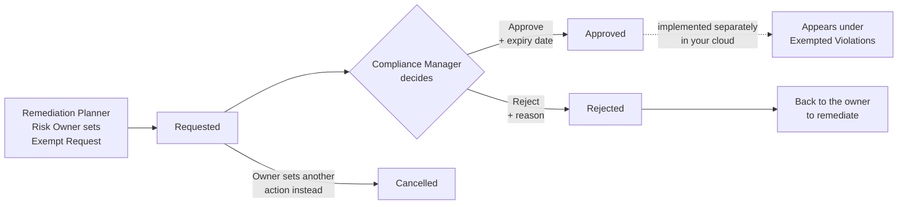
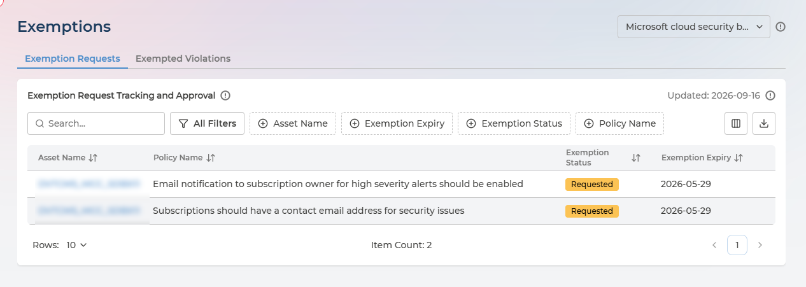
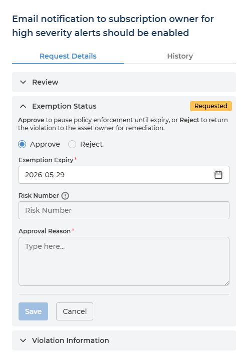
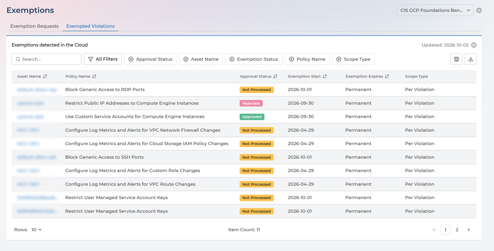
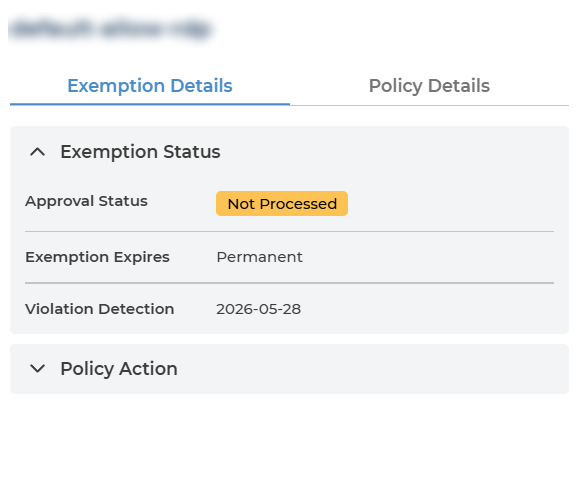
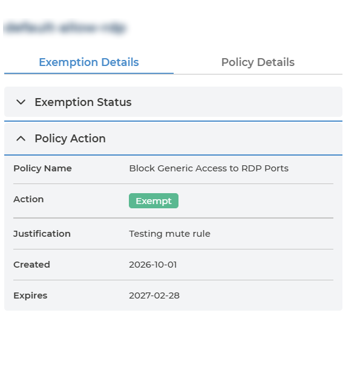

# Exemptions
{: .no_toc }

Sometimes a violation will not be fixed, and that is the right answer - the fix would break a system, cost more than the risk, or apply to a resource on its way out. Exemptions is where those decisions are asked for, granted or refused, and kept on record.

  

    Table of contents
  

  {: .text-delta }
- TOC
{:toc}

---

## What the Page Is For

The page holds two tabs, and the difference between them is the whole point:

| Tab | What it holds |
| --- | --- |
| **Exemption Requests** | The decision workflow inside Pulse - who asked for an exemption, and what a Compliance Manager decided |
| **Exempted Violations** | Exemptions that actually exist **in your cloud**, found by scanning it |

The distinction is deliberate. **Approving a request does not implement it.** Approval records a decision in Pulse; making the cloud stop reporting the violation is separate work - carried out by your own team on Pulse Premium, or by Devoteam Operations where Managed Cloud Compliance is enabled.

So the two tabs answer two different questions:

- *What have we agreed to accept?* - the first tab.
- *What is actually exempted right now?* - the second.

**The check runs in both directions.** An approved request that never appears under Exempted Violations has been agreed but not carried out. The reverse is the more serious case: an exemption that is live in your cloud but was rejected in Pulse, or never requested at all. Someone has silenced a finding without authorisation, and the **Approval Status** column on Exempted Violations is how you find it - see [Rogue Exemptions](#rogue-exemptions).

Both tabs show one security framework at a time, chosen from the selector beside the page title.

---

## Who Can Use This Page

| Role | What they can do |
| --- | --- |
| **Manager** | Open the page and decide requests - approve or reject |
| **Analyst** | Open the page and review everything on it, without deciding |

- An Analyst sees *Read-Only View: Only Compliance Managers can approve or reject exemption requests.* in place of the decision form.
- The **User** role does not see this page at all.

---

## The Request Lifecycle

```mermaid
flowchart LR
    RP["Remediation Planner<br/>Risk Owner sets<br/>Exempt Request"] --> REQ["Requested"]
    REQ --> MGR{"Compliance Manager<br/>decides"}
    MGR -- "Approve<br/>+ expiry date" --> APP["Approved"]
    MGR -- "Reject<br/>+ reason" --> REJ["Rejected"]
    REQ -- "Owner sets another<br/>action instead" --> CAN["Cancelled"]
    REJ --> BACK["Back to the owner<br/>to remediate"]
    APP -.->|"implemented separately<br/>in your cloud"| CLOUD["Appears under<br/>Exempted Violations"]
```

A request passes through four states, and only four:

| Status | Meaning |
| --- | --- |
| **Requested** | Submitted by a Risk Owner, awaiting a decision |
| **Approved** | A Compliance Manager accepted the risk, with an expiry date |
| **Rejected** | A Compliance Manager refused it; the violation returns to the owner to be remediated |
| **Cancelled** | The Risk Owner chose a different pathway for the violation, so the request no longer reflects what they want |

Requests are raised from [Remediation Planner](remediation-planner.md#requesting-an-exemption) by choosing **Exempt Request** on a violation. They are never created from this page - this page is where they are reviewed.

**A violation holds at most one open request, and it always reflects the owner's current intention.** Setting any of the other four actions on that violation cancels the request; choosing Exempt Request again while one is still pending revises the one already there rather than adding a second. Approved, Rejected and Cancelled requests are final - a later request starts a new one alongside them, with its own justification and date.

---

## Exemption Requests

Each row is one request: the asset it concerns, the policy it breaches, its current status, and the expiry being asked for.

**Read the expiry column carefully while a request is still Requested** - the date shown is the one the Risk Owner proposed, not one anybody has agreed to. It becomes binding only if you approve it.

  
Every column in the requests list

| Column | What it holds | Values |
| --- | --- | --- |
| **Provider** | Which cloud the asset is in | AWS · Azure · Google Cloud |
| **Violation ID** | The violation the request concerns | A number |
| **Asset Name** | The resource in breach - click it to open the request | Your own resource names |
| **Subscription** | The subscription, project or account it lives in | Your own names |
| **Policy Name** | The policy being breached | The provider's own policy name |
| **Request Date** | When the Risk Owner submitted it | A date |
| **Exemption Status** | Where the request stands | **Requested** · **Approved** · **Rejected** · **Cancelled** |
| **Exemption Expiry** | The expiry date - proposed while Requested, agreed once Approved | A date |
| **Last Updated** | When the request last changed | A date |

Not all are shown at once - use the column control in the table toolbar. Filter by Asset Name, Policy Name, Exemption Status and Exemption Expiry, or search by name; the list exports to CSV.

**Filtering on Exemption Status: Requested** gives you the queue of decisions waiting on you, which is the usual way to work through the page.

---

## Reviewing a Request

On the Exemption Requests tab, click the asset name to open the request. (On Exempted Violations the same click opens something different - see [Exemption Details](#exemption-details).)

The panel is titled with the policy in question and holds two tabs, **Request Details** and **History**. Request Details has three sections:

| Section | What it holds |
| --- | --- |
| **Review** | The requester's case - their exemption reason, the policy, the framework, the resource and its subscription |
| **Exemption Status** | The decision itself, badged with where the request currently stands |
| **Violation Information** | The surrounding fact - full asset path, subscription, policy, framework, current Policy Action and when the violation was detected |

Start with Review, since that is what you are deciding on, and open Violation Information when the justification does not tell you enough on its own.

### Approving or rejecting
{: .no_toc }

Pulse states the consequence of each choice above the buttons:

> **Approve** to pause policy enforcement until expiry, or **Reject** to return the violation to the asset owner for remediation.

**Approving** takes three fields:

- **Exemption Expiry** (required) - pre-filled with the date the requester asked for. It must be a future date, so if the request has been sitting long enough for the proposed date to pass, you have to choose a new one.
- **Risk Number** (optional) - maps this exemption to an entry in your own risk register.
- **Approval Reason** (required) - your reasoning, which matters as much as the requester's, because it is what an auditor reads.

**Rejecting** takes a **Rejection Reason** and nothing else. That reason is what the Risk Owner sees, so it should say what would make the request acceptable, or why it never could be.

The **History** tab records what was decided on this request and when.

---

## Exemptions Detected in the Cloud

The **Exempted Violations** tab lists what your cloud reports as exempted, whether or not the exemption was ever requested through Pulse. An exemption created directly in a cloud console appears here too.

  
Every column in the exempted violations list

| Column | What it holds | Values |
| --- | --- | --- |
| **Violation ID** | The violation being exempted | A number |
| **Provider** | Which cloud the asset is in | AWS · Azure · Google Cloud |
| **Asset Name** | The exempted resource | Your own resource names |
| **Subscription** | The subscription, project or account it lives in | Your own names |
| **Policy Name** | The policy it is exempted from | The provider's own policy name |
| **Approval Status** | Whether Pulse authorised this exemption - sortable and filterable | For a **Per Violation** exemption: **Requested** · **Approved** · **Rejected** · **Not Processed**. For a **Per Policy** exemption: **Authorised** · **Not Authorised** |
| **Detection Date** | When the violation was first found | A date |
| **Exemption Start** | When the exemption began | A date |
| **Exemption Expires** | When it lapses | A date |
| **Exemption Type** | How long it lasts | **Temporary** · **Permanent** · **Expired** |
| **Scope Type** | How much it covers | **Per Policy** · **Per Violation** |

Violation ID, Provider, Detection Date, Exemption Start and Exemption Type are off by default - add them from the column control. Filter by Approval Status, Asset Name, Policy Name, Exemption Status and Scope Type.

**Approval Status and Exemption Status are different things.** Exemption Status (and the Exemption Type column) says how long the exemption lasts - Temporary, Permanent or Expired. Approval Status says whether Pulse authorised it. An exemption can be Permanent and Approved, or Permanent and Not Processed.

**What each Approval Status means**

| Approval Status | Applies to | Meaning |
| --- | --- | --- |
| **Requested** | Per Violation | A request was submitted in Pulse and is awaiting review |
| **Approved** | Per Violation | The request was approved in Pulse, and the exemption is active in your cloud |
| **Rejected** | Per Violation | The request was rejected in Pulse, yet the exemption is still active in your cloud |
| **Canceled** | Per Violation | The request was cancelled in Pulse, yet the exemption is still active in your cloud |
| **Not Processed** | Per Violation | The exemption is active in your cloud and Pulse has no active request for it - either none was ever made, or the request was cancelled |
| **Authorised** | Per Policy | The policy exemption was applied in Pulse by a Compliance Manager |
| **Not Authorised** | Per Policy | The policy exemption is active in your cloud but was not applied in Pulse |

A Per Policy exemption has no request to approve, so it is Authorised or Not Authorised rather than carrying a request status. A request that was [Cancelled](#the-request-lifecycle) is not shown as a separate value here: the exemption appears as **Not Processed**.

**Scope Type is the one to check when a violation you expected has disappeared** from Remediation Planner:

- **Per Violation** - the exemption covers one specific finding on one asset.
- **Per Policy** - it covers the policy wherever that policy applies, which silences far more than the single finding someone may have had in mind when they created it.

Use this tab as the check on the first one. An approved request that never appears here has been agreed but not carried out - and an exemption that appears here without an approval has been carried out but never agreed.

### Rogue Exemptions

A **rogue exemption** is one that is live in your cloud without Pulse's authorisation. It silences a finding, so the violation stops being reported, yet nobody with the authority to accept that risk accepted it.

Three Approval Status values mark an exemption as rogue:

- **Rejected** - a Compliance Manager refused the request, but the exemption exists in the cloud anyway.
- **Canceled** - the Risk Owner chose a different pathway and the request was cancelled, but the exemption exists in the cloud anyway.
- **Not Processed** - the exemption exists in the cloud and Pulse has no active request for it, either because none was ever made or because the request was cancelled.
- **Not Authorised** - a Per Policy exemption exists in the cloud but was not applied in Pulse.

These values appear in amber or red rather than the green of Approved and Authorised, and the Approval Status badge in the Exemption Details panel carries a tooltip saying the exemption is active in the cloud without a matching approval.

To isolate them, filter **Approval Status** on **Rejected** and **Not Processed** together. Add **Not Authorised** to catch Per Policy exemptions as well. Approved and Authorised are separate values, so to list everything Pulse has authorised, select both.

What to do with a rogue exemption is a decision for your Compliance Manager: have the exemption removed from the cloud so the violation is reported again, or raise it properly through [Remediation Planner](remediation-planner.md#requesting-an-exemption) so it can be reviewed.

### Exemption Details

On Exempted Violations, **click the asset name** to open the **Exemption Details** panel. It is not the panel that opens on the Exemption Requests tab: that one shows the request and lets a Manager decide it, while this one shows the exemption that exists in your cloud and what Pulse knows about it.

The panel has two tabs, **Exemption Details** and **Policy Details**. Exemption Details opens with an **Exemption Status** section showing, in this order:

| Field | What it holds |
| --- | --- |
| **Approval Status** | Whether Pulse authorised the exemption, with a tooltip explaining the value |
| **Exemption Justification** | The reason given when the exemption was requested |
| **Approval Reason** | The reason given by the Compliance Manager who decided |
| **Exemption Expires** | When the exemption lapses |
| **Violation Detection** | When the violation was first found |
| **Risk ID** | The entry in your own risk register, where one was recorded |

A field with nothing to show - justification, approval reason or risk ID - is left out rather than shown empty. A **Not Processed** exemption has no request behind it, so its panel normally carries only the status and the dates.

Below it, a **Policy Action** section shows what Pulse has decided about the policy itself, as set in [Policy Manager](policy-manager.md):

| Field | What it holds |
| --- | --- |
| **Policy Name** | The policy the exemption is for |
| **Action** | The policy's current Policy Action |
| **Justification** | The justification recorded against the policy action |
| **Created** | When the policy exemption was created in Pulse - left out when there is none |
| **Expires** | When the policy exemption lapses in Pulse - left out when there is none |

This **Expires** date belongs to the policy's action in Pulse. It is not the same as **Exemption Expires** in the section above, which is the date held in your cloud, so the two can differ.

---

## Q&A

### We approved an exemption but the violation is still being reported
{: .no_toc }

Approval is a decision in Pulse, not a change in your cloud. Until the exemption is implemented cloud-side, the violation continues to be found and reported. Check the **Exempted Violations** tab - if it is not there, the work has not been done yet.

Implementation is your own team's on Pulse Premium, or Devoteam's under Managed Cloud Compliance.

### An exemption shows Rejected or Not Processed - what does that mean?
{: .no_toc }

The exemption is live in your cloud, but Pulse did not authorise it. **Rejected** means a request was refused and the exemption was applied anyway; **Not Processed** means no request exists. Both are [rogue exemptions](#rogue-exemptions) - the finding is hidden without anyone having accepted the risk. Open the asset to see the details, then decide whether to have the exemption removed or to request it properly.

### Who can approve a request?
{: .no_toc }

Only users with the **Manager** company role. Analysts can read the page but not decide; Risk Owners raise requests and cannot decide their own.

### A request is no longer needed - can it be withdrawn?
{: .no_toc }

There is no withdraw control, and none is needed. Say what you will do instead: set any of the other four actions on that violation in [Remediation Planner](remediation-planner.md#setting-an-action) - Schedule Remediation, Plan to Remediate, Internal Investigation or Plan to Decommission - and the request moves to **Cancelled** and leaves the Compliance Manager's queue.

### I asked for the wrong expiry date - do I raise a second request?
{: .no_toc }

No. Choose **Exempt Request** again on the same violation while the first is still **Requested**, and it revises the request already there - the justification, expiry date and risk number are replaced, and the original request date is kept. A violation never holds two open requests, so the Compliance Manager always sees one current version rather than guessing which is live.

Once a request has been **Approved**, **Rejected** or **Cancelled** it is settled and a later Exempt Request starts a new one alongside it.

### What happens when an exemption expires?
{: .no_toc }

The violation becomes reportable again. In [Policy Manager](policy-manager.md), policies with an exemption approaching or past its expiry show as **Exemption Due Soon** or **Exempt Expired**, which is the cue to renew the exemption or remediate.

### Can an exemption be granted permanently?
{: .no_toc }

Not through a request - approving one requires an expiry date. **Permanent** appears as a type under Exempted Violations because an exemption in your cloud can be open-ended.
