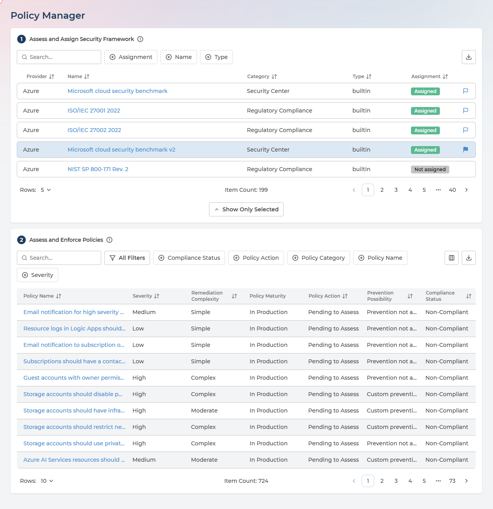
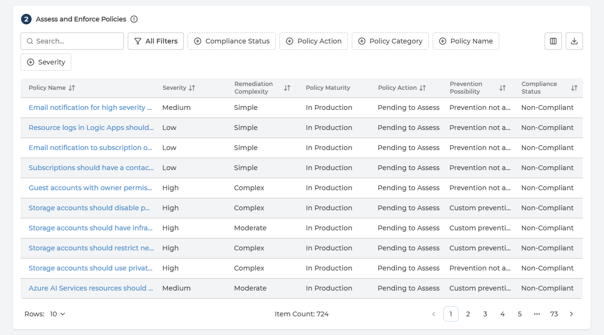
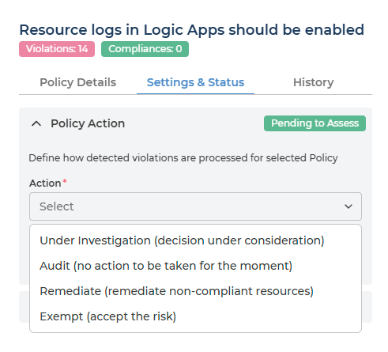

# Policy Manager
{: .no_toc }

Policy Manager is where your compliance baseline is decided: which security frameworks you are measured against, and what should happen when each individual policy inside them is broken. Everything the other Cloud Compliance pages show you follows from the choices made here.

  

    Table of contents
  

  {: .text-delta }
- TOC
{:toc}

---

## Nothing Here Changes Your Cloud

This is the most important thing to understand about the page, and it applies to every control on it.

**No action in Pulse makes a change in your cloud environment.** Assigning a framework, setting a policy to Remediate, choosing Prevent - none of it creates, alters or deletes anything in AWS, Azure or Google Cloud. What each setting produces is a decision, recorded and routed:

- **On Pulse Premium** - a note for your own teams. The record of what your organisation decided about that policy, visible to the people who act on it.
- **With Managed Cloud Compliance** - additionally a task for Devoteam Operations, who carry out the corresponding work in your cloud as an operated service.

So the page is a decision-making tool, not a deployment tool. Cloud-side changes are made separately - see [Enabling Standards in Your Cloud](enabling-standards.md).

---

## Who Can Change What

| Role | Can do |
| --- | --- |
| **Manager** | Assign and unassign frameworks, set the default framework, set Policy Action and Prevention Preference |
| **Analyst**, **User** | Read everything on the page. Forms are visible but disabled |

Without the Manager role the page shows *Read-Only View: Setting Policy Actions requires elevated Compliance Manager permissions.*

A second gate applies to everyone, Managers included: **the per-policy settings stay disabled until a framework is assigned.** Until then you will see *Please assign a Security Framework to enable configuration (Exempt, Audit, Remediate).* Step 1 has to happen before step 2 is usable.

---

## Step 1 - Assess and Assign Security Framework

The upper card lists every security framework available to your organisation and whether it is currently assigned.

- Selecting a row filters the policies table beneath it, so the two cards always show a framework and that framework's contents.
- One framework is selected at a time, and the selection is held in the page address - so a link to Policy Manager can point at a specific framework.

  
Every column in the framework list

| Column | What it holds | Values |
| --- | --- | --- |
| **Provider** | Which cloud the framework applies to | AWS · Azure · Google Cloud |
| **Name** | The framework - click it to open the assessment | For example ISO/IEC 27001 2022, Microsoft cloud security benchmark |
| **Category** | What kind of framework it is | For example Regulatory Compliance, Security Center |
| **Type** | Whether it came from the provider or was built by you | **builtin** · **custom** |
| **Assignment** | Whether it is in your active posture assessment | **Assigned** · **Not assigned** |

Managers see one further column holding the **default framework** flag.

### Reviewing a framework
{: .no_toc }

Click the framework name to open its detail panel. It opens on **Security Framework Assessment**, followed by review sections describing the framework and what adopting it involves.

Read this before assigning. It is the same material your auditors and your own security team will ask you about.

### Assigning and unassigning
{: .no_toc }

The panel footer carries the action - **Assign** if the framework is not currently assigned, **Unassign** if it is - and Pulse asks you to confirm that the framework should apply across the entire scope of the service.

On confirmation:

> Request will be implemented in the next business day.

- **Assigning** adds the framework to your organisation's active posture assessment: the set of standards Pulse scores you against and raises violations for. It does not switch anything on in your cloud.
- **Unassigning** removes it from the service scope in Pulse, and likewise leaves your cloud untouched.

If the matching standard is not enabled cloud-side, the framework and all its policies still appear - but with no violations reported against them. [Enabling Standards in Your Cloud](enabling-standards.md) covers that half.

### The default framework
{: .no_toc }

Each cloud provider has one **default framework**, marked with a flag in the framework list. Managers set it by clicking the flag on any assigned framework for that provider.

**The default is organisation-wide.** It decides which framework every user in your organisation opens on when they sign in to Pulse - not just the person who set it. They can switch to any other assigned framework during their session, but the default is where everyone starts.

That makes it a reporting decision as much as a configuration one: whichever framework is default is the one your organisation will see first, and the one people will quote.

Two more things worth knowing:

- The flag only appears on frameworks that are already assigned. Assign first, then set as default.
- **The current default cannot be unassigned while it holds that role.** Pulse will stop you and ask you to choose a different default for that provider first.

---

## Step 2 - Assess and Enforce Policies

The lower card lists every individual policy inside the selected framework, with its current settings.

Three of the columns describe the policy as your cloud provider defines it and cannot be changed in Pulse - **Policy Maturity**, **Prevention Possibility** and **Policy Release Date**. The rest either assess the policy or record your decisions about it.

  
Every column in the policies list

| Column | What it holds | Values |
| --- | --- | --- |
| **Policy Name** | The policy - click it to open the analysis | The provider's own policy name |
| **Policy Category** | The security domain the policy belongs to | One of fourteen - see [Compliance Analysis](compliance-analysis.md) for the full set |
| **Severity** | The assessed risk of the policy | **Low** · **Medium** · **High** · **Critical** |
| **Remediation Complexity** | How much work a fix typically takes | **Simple** · **Moderate** · **Complex** · **Redeployment** · **Guideline** |
| **Policy Maturity** | Where the policy sits in your provider's lifecycle | **Preview** · **In Production** · **Decommissioned** |
| **Policy Action** | What you decided should happen when it is broken | **Pending to Assess** · **Under Investigation** · **Audit** · **Remediate** · **Exempt** · **Exemption Due Soon** · **Exempt Expired** |
| **Prevention Preference** | Whether non-compliant deployments should be blocked | **Permit** · **Prevent** |
| **Prevention Possibility** | Whether the policy supports blocking at all | **Prevention not available** · **Default prevention available** · **Custom prevention available** |
| **Compliance Status** | What your cloud found | **Compliant** · **Non-Compliant** |
| **Policy Release Date** | When the provider published the policy | A date |

Policy Release Date is off by default. Which of the others appear is up to you - use the column control in the table toolbar. The list can be filtered, and the table exports to CSV in full, not only the page on screen.

**Prevention Possibility is the column to check before setting Prevention Preference.** A policy reading *Prevention not available* cannot be enforced preventively at all, whatever you would prefer.

### Reviewing a policy
{: .no_toc }

Click a policy name to open its panel. The header carries two counts - **Violations** and **Compliances** - the non-compliant and compliant resource counts for that policy. Below that are three tabs:

- **Policy Details** - what the policy checks, why it matters, the risk of leaving it unaddressed, and how it is typically remediated. The same analysis appears in [Compliance Analysis](compliance-analysis.md#opening-a-policy), where every field is described.
- **Settings & Status** - the two decisions you make, described below.
- **History** - every change made to this policy's settings, each entry recording the date and time, the user who made it, the Policy Action and Prevention set, and the comment they gave.

### Policy Action
{: .no_toc }

Policy Action answers *"when this policy is broken, what do we want to happen?"* It is the decision Remediation Planner and the reports downstream act on.

| Action | What it means | Justification |
| --- | --- | --- |
| **Remediate** | Violations are to be fixed. It marks them for Risk Owners to prepare remediation | Optional |
| **Audit** | No remediation required. The policy is still evaluated and violations still recorded - they simply carry no expectation of a fix | Optional |
| **Exempt** | The risk is accepted. Violations are not shown and are ignored | **Required** |
| **Under Investigation** | No action assigned yet, because the policy's implications are still being worked out | **Required** |

**Exempt** additionally requires an **Exemption Expiry** date, so an accepted risk cannot sit unreviewed forever, and takes an optional **Risk Number** to tie the decision to your own risk register.

Justification is required for exactly the two choices that leave a finding unfixed. That is deliberate - the reason has to be on the record.

  
Policy Action values you will see

**Pending to Assess** until someone decides, then whichever of **Under Investigation**, **Audit**, **Remediate** or **Exempt** was chosen.

Two further values appear on exempted policies - **Exemption Due Soon** and **Exempt Expired** - when the expiry date you set is approaching or has passed. Both still show as **Exempt** on the policy's own badge, so the policy list is where to look when reviewing exemptions that need renewing.

**Compliance Status** is a different column and not a decision at all: it reads **Compliant** or **Non-Compliant**, and reports what your cloud found.

### Prevention Preference
{: .no_toc }

Prevention records whether your organisation wants non-compliant deployments **permitted** or **prevented** for this policy - whether the policy should be enforced before a resource is created rather than reported afterwards.

- Which choices are offered, and how they are described, comes from the policy itself, so it varies.
- Where a policy has no deny effect available, Pulse says so: *Prevention not supported for this type of Policy.*
- As everywhere on this page, setting Prevent deploys nothing. It records the decision - a note for your teams on Pulse Premium, a task for Devoteam Operations where Managed Cloud Compliance is enabled.

---

## Q&A

### Does setting a policy to Remediate fix anything?
{: .no_toc }

No. It marks the policy so that when a violation is detected, Risk Owners know a fix is expected and can prepare one. The work itself happens in [Remediation Planner](remediation-planner.md), and the change in the cloud is made separately - by your teams, or by Devoteam Operations where Managed Cloud Compliance is enabled.

### What is the difference between Exempt here and an exemption request?
{: .no_toc }

Scope:

- **Exempt on this page** is set by a Compliance Manager against the **policy** - every violation of it is ignored.
- **An exemption request** comes from a Risk Owner about a **specific violation** they cannot fix, and is approved or rejected on the [Exemptions](exemptions.md) page.

### A framework lists policies but reports no violations
{: .no_toc }

The framework list, and the policies inside each framework, are always complete - they do not depend on what your cloud evaluates. Violations are different: they come from your cloud. A standard your cloud does not evaluate still shows all of its policies, with nothing reported against them. See [Enabling Standards in Your Cloud](enabling-standards.md).

### Can I set Prevention on any policy?
{: .no_toc }

Only where **Prevention Possibility** says the policy supports it. That comes from your cloud provider, not from Pulse - some policies have a deny effect available and some do not.

### Who can see the decisions we record here?
{: .no_toc }

Everyone in your company who can open Policy Manager, in the policy list and in each policy's History tab. Because History records the user, the timestamp and the justification alongside each change, the decisions are auditable after the fact - which is the point of requiring a justification for Exempt and Under Investigation in the first place.
