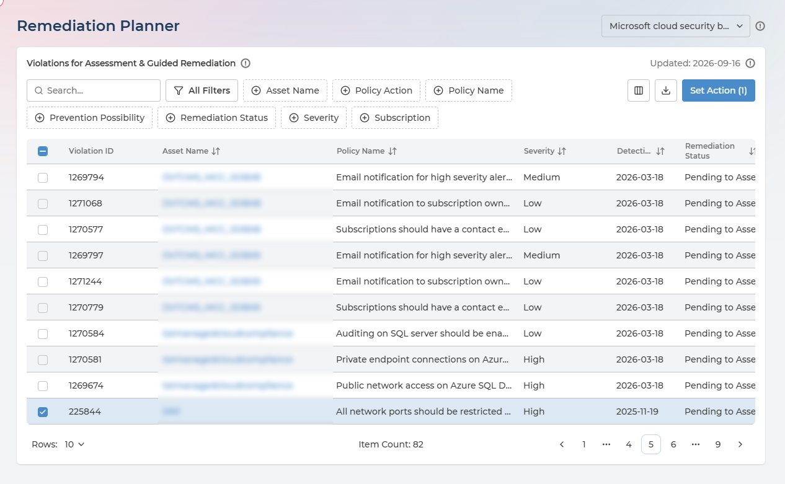
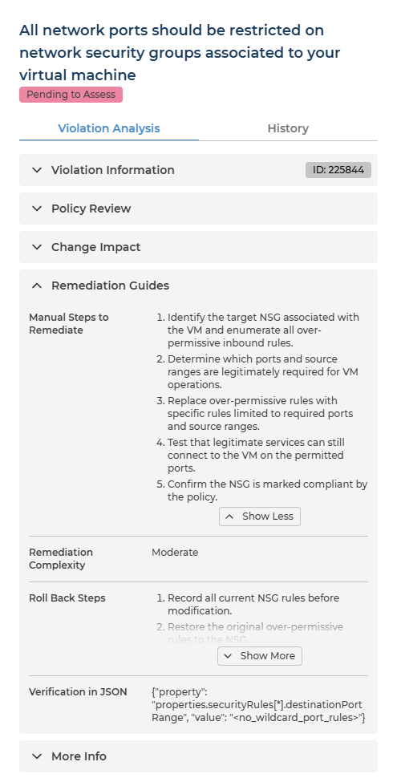
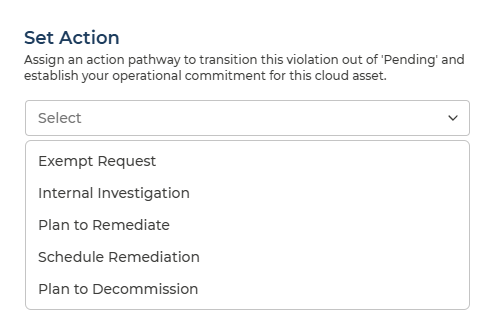
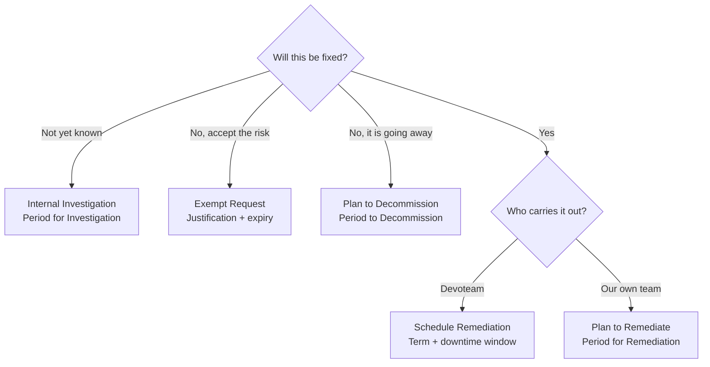

# Remediation Planner
{: .no_toc }

Policy Manager decides what should happen when a policy is broken. Remediation Planner is where someone says what will happen to a **particular** broken resource, and by when.

  

    Table of contents
  

  {: .text-delta }
- TOC
{:toc}

---

## What the Page Is For

Every violation is one asset failing one policy. The page lists them, explains each one, and asks you to commit to a course of action with a date attached. It is the live planning tool for compliance work.

- **Written for the Risk Owner** - the person who owns the application, service or subscription the asset belongs to. Who owns what is not decided here: it comes from [Asset Ownership](../asset-ownership.md), which is also what decides whose violations appear on this page.
- **Not for the compliance team.** The Compliance Manager sets the policy; the owner decides how their own resource gets fixed.

As everywhere in Cloud Compliance, **setting an action changes nothing in your cloud**. It records a commitment: a note for your teams on Pulse Premium, or a task for Devoteam Operations where Managed Cloud Compliance is enabled.

---

## Who Sees Which Violations

This page is scoped by asset ownership, because planning a fix only makes sense for a resource you are answerable for.

| Role | What the page lists |
| --- | --- |
| **Manager** | Every violation in the framework, across the whole estate |
| **Analyst** | Every violation in the framework, across the whole estate, read-only |
| **User** | Only violations on the assets in the Asset Groups they are delegated to |

A **User** is delegated to one or more Asset Groups on the [Asset Ownership](../asset-ownership.md) page. From then on Pulse narrows every page to the assets in those groups, without that person filtering anything - so they open Remediation Planner already looking at their own worklist, and at nothing else.

### Set up Asset Ownership first
{: .no_toc }

**Ownership is a prerequisite for this page, not an optional extra.** A User who is not delegated to an Asset Group owns no assets, so there are no violations here for them to plan - and an empty list looks exactly like having nothing to do. The same applies to a User delegated to a group that has no assets allocated to it yet.

Configuring it is the **Ownership Manager's** job and is done on the Assets page, not here:

1. Allocate assets to an Asset Group - usually by pointing Pulse at the cloud tag key your teams already use for ownership.
2. Delegate the asset owners to that group. Each of them needs at least the **Company User** role.
3. Allow for the next processing cycle, up to 24 hours, before tag-based allocation shows up.

[Asset Ownership](../asset-ownership.md) covers the whole setup; [Before You Start](../asset-ownership.md#before-you-start) lists what has to be in place first.

Managers and Analysts see every Asset Group without being delegated to any, so nothing on this page waits on ownership for them. It is the owners doing the planning who need it.

---

## Choosing a Framework

Violations are always shown for one security framework at a time, chosen from the selector beside the page title.

- Switching framework changes which violations are listed - an asset may breach a policy in one framework and not appear in another.
- Only assigned frameworks appear. If the one you expect is missing, it has not been assigned in [Policy Manager](policy-manager.md).
- You open on your organisation's default framework, the same one for everyone.

---

## The Violations List

Each row is one violation, identified by a **Violation ID** that stays stable - so it can be quoted in a ticket or an email and still mean the same thing later.

  
Every column in the violations list

| Column | What it holds | Values |
| --- | --- | --- |
| **Violation ID** | The violation's stable identifier | A number |
| **Provider** | Which cloud the asset is in | AWS · Azure · Google Cloud |
| **Asset Name** | The resource in breach | Your own resource names |
| **Asset Category** | What kind of resource it is | Comes from your cloud provider, so the set is open-ended - for example Storage, Integration |
| **Subscription** | The subscription, project or account it lives in | Your own names |
| **Policy Name** | The policy being breached | The provider's own policy name |
| **Policy Category** | The security domain the policy belongs to | One of fourteen - see [Compliance Analysis](compliance-analysis.md) |
| **Severity** | The assessed risk of the policy | **Low** · **Medium** · **High** · **Critical** |
| **Remediation Complexity** | How much work a fix typically takes | **Simple** · **Moderate** · **Complex** · **Redeployment** · **Guideline** |
| **Prevention Possibility** | Whether the policy supports blocking deployments at all | **Prevention not available** · **Default prevention available** · **Custom prevention available** |
| **Policy Action** | What was decided about the policy as a whole, in Policy Manager | **Pending to Assess** · **Under Investigation** · **Audit** · **Remediate** · **Exempt** · **Exemption Due Soon** · **Exempt Expired** |
| **Detection Date** | When the violation was first found | A date |
| **Remediation Status** | What you decided about this violation | **Pending to Assess** · **Internal Investigation** · **Planned to Remediate** · **Scheduled Remediation** · **Planned to Decommission** · **Exemption Requested** |
| **Term Begin** | Start of the period you committed to | A date |
| **Term End** | End of that period | A date |

**Policy Action**, **Term Begin** and **Term End** are off by default - add them from the column control. Term Begin and Term End are worth turning on once you have set actions, because they turn the list into a schedule.

Filters cover Asset Name, Policy Action, Policy Name, Prevention Possibility, Remediation Status, Severity and Subscription, alongside free-text search. The list exports to CSV in full.

**Subscription and Severity are the two filters that matter most in practice** - they narrow a shared list down to the assets one team owns, and then to the ones worth doing first. Where [Asset Ownership](../asset-ownership.md) is configured and you are a delegated User, the first of those has already been done for you.

---

## Understanding a Violation

Click the asset name to open the violation. This panel is the difference between being told a rule failed and being able to do something about it.

The **Violation Analysis** tab is organised as sections you open as you need them:

| Section | What it gives you |
| --- | --- |
| **Violation Information** | The violation's own ID and identifying details |
| **Policy Review** | What the policy checks and why it exists |
| **Change Impact** | What changes if you remediate - the question owners ask before agreeing to anything |
| **Remediation Guides** | How to actually fix it |
| **More Info** | Supporting references, including the equivalent control in ISO, CIS, NIST, PCI DSS and SWIFT |

  
Every field in the policy analysis

**Violation Information** - which violation this is

| Field | What it tells you |
| --- | --- |
| **Violation ID** | The violation's stable identifier |
| **Asset and policy detail** | The resource in breach, its subscription, and the policy it fails |

**Policy Review** - what the policy is and why it matters

| Field | What it tells you |
| --- | --- |
| **Name** | The policy's name |
| **Severity** | Low, Medium, High or Critical |
| **Description** | The provider's own description of the control |
| **Purpose** | What the policy enforces, in one or two sentences |
| **Benefits of Remediation** | Three specific benefits of fixing it |
| **Resource Type Affected** | The resource types the policy applies to |
| **Related Services Affected** | Other services touched, and how |
| **Possible Risk** | What leaving it unaddressed may result in |

**Change Impact** - what happens to your estate if you remediate

| Field | What it tells you |
| --- | --- |
| **Changes Made by Remediation** | Exactly what property is changed, and whether it is in-place or destructive |
| **Preparation for Remediation** | The inputs to gather before starting |
| **Service Reboot Required After Remediation** | **YES** or **NO**, with the reason |
| **Resource Redeployment Required for Remediation** | **YES** or **NO** - YES means the resource must be recreated |
| **Change Impact on Running Services** | **YES** or **NO**, naming the workload disrupted |

**Remediation Guides** - how the fix is carried out

| Field | What it tells you |
| --- | --- |
| **Manual Steps to Remediate** | Numbered steps describing the target state |
| **Remediation Complexity** | How much work the fix takes - **Simple** · **Moderate** · **Complex** · **Redeployment** · **Guideline** |
| **Roll Back Steps** | How to reverse the change if it goes wrong |
| **Verification in JSON** | What a compliant resource looks like, as a property and value |

**More Info** - how the policy maps to the wider world

| Field | What it tells you |
| --- | --- |
| **Controls Covered** | The equivalent control in ISO/IEC 27001:2022, CIS Controls v8.1, NIST SP 800-53 Rev. 5, PCI DSS v4.0.1 and SWIFT CSCF v2025 |
| **Maturity** | Where the policy sits in the provider's lifecycle |
| **Category** | The security domain |
| **Standard Names** | The frameworks that include this policy |

The same analysis appears wherever a policy or a violation is opened, so it reads identically in [Policy Manager](policy-manager.md) and [Compliance Analysis](compliance-analysis.md).

Two things to read before you commit to anything:

- **Change Impact** tells you whether a reboot or a redeployment is required, and whether running services are disrupted.
- **Roll Back Steps**, inside Remediation Guides, exist so a change can go to a change board with an exit route already written down.

The **History** tab records the actions previously set on this violation.

---

## Setting an Action

Tick one or more violations and choose **Set Action**. The button shows how many are selected, and the action applies to all of them - which is how a single decision covers thirty instances of the same finding.

The panel explains its own purpose:

> Assign an action pathway to transition this violation out of 'Pending' and establish your operational commitment for this cloud asset.

| Action | When to choose it | What you must provide |
| --- | --- | --- |
| **Schedule Remediation** | Devoteam should carry out the fix. Where Managed Cloud Compliance is enabled, this is what orders the work | Term for Remediation Implementation, plus a comment - use it for the downtime window |
| **Plan to Remediate** | Your own team will carry out the fix, within a period you commit to | Period for Remediation, optional comment |
| **Internal Investigation** | The right fix is not yet known and you need time to find it | Period for Investigation, optional comment |
| **Plan to Decommission** | The resource is going away rather than being fixed | Period to Decommission, optional comment |
| **Exempt Request** | The risk should be accepted rather than fixed - this asks a Compliance Manager to approve that | Justification, an expiry date, and optionally a risk number |

### Schedule or Plan?
{: .no_toc }

These two are easy to confuse and they mean different things. The difference is **who does the work**.

- **Schedule Remediation** hands the fix to Devoteam. With Managed Cloud Compliance enabled it is how the work is ordered, which is why it asks for an implementation term and a downtime window rather than a loose period - Devoteam needs to know when it may touch the resource.
- **Plan to Remediate** keeps the fix with your own team. You are recording that you will resolve it within the period you set, and nobody else is being asked to act.

Every date must be today or later. Pulse confirms with *Action performed successfully!*

Setting an action on a violation that already has one replaces it, and Pulse warns you first: *Existing status will be overridden by new status.*

---

## Requesting an Exemption

**Exempt Request** is the one action that does not end with you. The other four are commitments you are making; this one is a request someone else decides on.

- What you write in the justification is what the Compliance Manager reads when deciding.
- Business and technical constraints - why the fix is not feasible, or costs more than the risk it removes - are what make a request approvable.
- Once submitted, the request appears on the [Exemptions](exemptions.md) page, and the violation's Remediation Status reads **Exemption Requested** until it is approved or rejected.

**An approved exemption is still not an implemented one.** Approval records a decision in Pulse; making the cloud stop reporting the violation is separate work - carried out by your own team on Pulse Premium, or by Devoteam Operations where Managed Cloud Compliance is enabled. [Exemptions](exemptions.md) explains how to tell the two apart.

---

## Q&A

### Nothing is listed, or far less than I expected
{: .no_toc }

Three things narrow this list, in this order:

1. **The framework selector** - you are looking at one framework at a time.
2. **Asset ownership** - if you hold the **User** role, you see violations only on the assets in the Asset Groups you are delegated to. Delegated to none, you see none.
3. **The filters** - Subscription and Severity persist as you move around the page.

### I am delegated to an Asset Group but still see nothing
{: .no_toc }

Check that the group actually has assets allocated to it - a group with nothing in it looks the same as no access - and that you hold the **Company User** role as well as the delegation. Tag-based allocation is not immediate either: allow up to 24 hours for the next processing cycle. [Asset Ownership](../asset-ownership.md) covers both.

### Why can my colleague see violations I cannot?
{: .no_toc }

Because you own different assets, or they hold a different role. **Manager** and **Analyst** see the whole estate; a **User** sees only the Asset Groups they are delegated to. If a resource you are responsible for is missing, ask an Ownership Manager to allocate it to your group - see [Asset Ownership](../asset-ownership.md).

### What does Pending to Assess mean?
{: .no_toc }

Nobody has decided anything about this violation yet. It is the starting state for every violation, and setting any action moves it out.

### Can I set an action on many violations at once?
{: .no_toc }

Yes, and it is the efficient way through a long list - that is what the checkboxes are for.

**Group your selection by policy.** The action, the dates and the comment are applied to every violation you have selected, so a selection spanning several policies produces one commitment that does not fit all of them. Filter by policy first, then select.

### Can I change an action after setting it?
{: .no_toc }

Yes. Set a new one and it replaces the old, with a warning first. The History tab keeps the earlier decisions.

### Does Schedule Remediation mean Pulse will fix it?
{: .no_toc }

No - Pulse changes nothing in your cloud itself. Schedule Remediation records that the fix is to be carried out by Devoteam, and where Managed Cloud Compliance is enabled it is what raises that work. If your own team will do the fix, use **Plan to Remediate** instead.

### Where did my violation go after I fixed it?
{: .no_toc }

Once your cloud re-evaluates the resource and finds it compliant, the violation stops being reported and leaves the list. That happens on your cloud provider's evaluation schedule, not immediately after the change.
