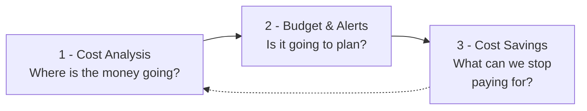

# Cloud Economics

Cloud Economics brings the billing data of AWS, Azure and Google Cloud into one process for understanding, planning and reducing spend. Three pages, each answering one question, in the order you meet them:

Read left to right, that is the working cycle:

- **See where the money goes.** [Cost Analysis](cost-analysis.md) cuts the combined bill six ways - by service, subscription, team and more - month by month or day by day, with last month and the forecast beside every figure.
- **Decide what it should be.** [Budget & Alerts](budget-alerts.md) puts a monthly cap on any of those same slices, and emails the people you name as spend approaches it.
- **Find what you can stop paying for.** [Cost Savings](cost-savings.md) lists cost recommendations resource by resource, with the monthly saving each option would bring.
- **Check that it landed.** The dotted line back: an implemented saving shows as lower spend in Cost Analysis, and is counted as implemented in the history of Cost Savings.

---

## The Pages

| Page | What you do there |
| --- | --- |
| **[Cost Analysis](cost-analysis.md)** | Break spend down six ways, monthly or daily, and save the days you want to come back to |
| **[Budget & Alerts](budget-alerts.md)** | Track spend against monthly caps, see which alert thresholds have been passed, and set up budgets with email alerts |
| **[Cost Savings](cost-savings.md)** | Review cost recommendations per resource, compare optimisation options, exempt what you will not act on, and track what was implemented |

---

## What You Get at Each Tier

- **Cloud Essentials** - costs in monthly granularity, and budgets you can see but that send no alerts. Available without a Cloud Economics subscription, and described with the rest of the free tier under [Costs](../cloud-inventory.md#costs) and [Budget & Alerts](../cloud-inventory.md#budget--alerts).
- **Pulse Premium** - all three pages. The daily view and saved views in Cost Analysis, budget alerting, and Cost Savings are the part that Premium adds.
- **Managed Cloud Economics** - the same three pages, plus Devoteam operating them with you as a managed service.

The menu tells you which you have. Without Cloud Economics, the cost page is called **Costs** and sits under Cloud Essentials; with it, the page is called **Cost Analysis** and moves into its own **Cloud Economics** section alongside the other two.

For how the tiers fit together across the whole platform, see [Pulse Ecosystem](../README.md).

---

## Before the Data Arrives

Pulse reports on billing data your clouds produce. A few things decide what you see, and when:

- **Costs arrive within 24 hours** of a cloud being connected, and refresh from then on. The most recent day in the daily view is normally yesterday - the current day has not yet been billed.
- **AWS costs come from the Cost and Usage Report export** set up during onboarding. See [AWS onboarding](../onboarding/aws.md).
- **Budgets you already have in your cloud appear on their own**, as cloud-native budgets. Pulse reads them; it does not change them.
- **Every figure follows the header selectors** - cloud provider, company and currency - and, for a user delegated to an Asset Group, that group's assets. See [Controls Shared by Every Page](../cloud-inventory.md#controls-shared-by-every-page) and [What a Delegated User Sees](../asset-ownership.md#what-a-delegated-user-sees).
