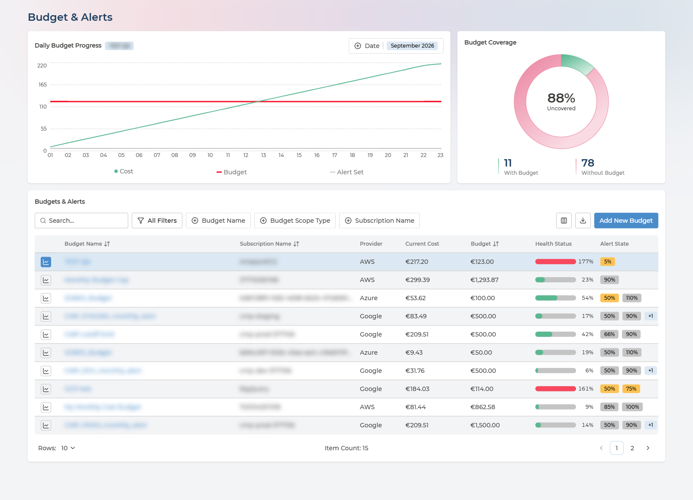
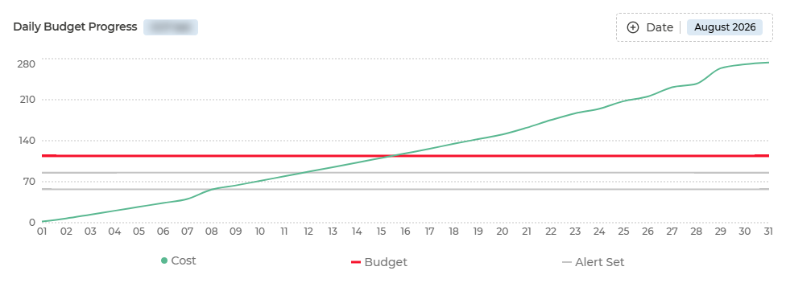
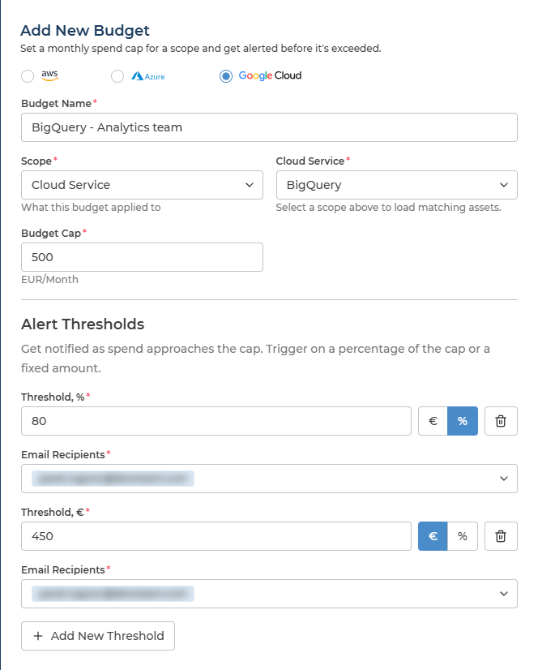

# Budget & Alerts
{: .no_toc }

Budget & Alerts answers the question Cost Analysis cannot: *was this the plan?* A budget puts a monthly cap on a slice of spend - a subscription, a service, a team - and its alert thresholds tell the people you name as spend approaches it, while there is still time to act.

  

    Table of contents
  

  {: .text-delta }
- TOC
{:toc}

---

## What the Page Is For

Three things work together:

- **Daily Budget Progress** - one budget over one month: spend building up against the cap and its alert thresholds.
- **Budget Coverage** - how much of your estate has a budget at all.
- **Budgets & Alerts** - every budget, how far through it you are, and which thresholds spend has passed.

On a first visit, start with coverage rather than with the budgets themselves. The budgets tell you how the spend you planned for is going; coverage tells you how much spend nobody planned for.

---

## Two Kinds of Budget

The table holds budgets from two sources, and they behave differently:

| | Cloud-native budget | Pulse budget |
| --- | --- | --- |
| **Where it is defined** | In your cloud provider - for example an Azure budget on a subscription | In Pulse, with **Add New Budget** |
| **How it gets here** | Read from your cloud automatically | Created here, and exists only in Pulse |
| **What it covers** | Whatever the budget is set on in your cloud | Any of six scopes - see [Adding a Budget](#adding-a-budget) |
| **Alert rules** | The notifications configured on it in your cloud, shown as they are set there | Thresholds and email recipients you set in Pulse |
| **Changing it** | In your cloud provider's own console. Read-only in Pulse | In Pulse, by Managers and Analysts |

**Creating a budget in Pulse creates nothing in your cloud, and a cloud-native budget cannot be changed from Pulse.** It is the same read-only boundary that applies to the whole platform - see [The Core Platform](../README.md#the-core-platform).

To see one kind at a time, use **All Filters** and filter on **Cloud Native**.

---

## Who Can Change What

| Role | Can do |
| --- | --- |
| **Manager**, **Analyst** | Add Pulse budgets, change their cap, thresholds and recipients, switch individual alert rules off and on, and delete them |
| **User** | Read everything on the page. Budgets open read-only, and **Add New Budget** is not shown |

Cloud-native budgets are read-only for everyone, whatever their role.

---

## Budget Coverage

The donut splits your subscriptions - accounts or projects, on AWS and Google Cloud - into **With Budget** and **Without Budget**, and the centre shows the share that is **Uncovered**.

**The uncovered share is usually the finding.** It is how much of your estate can run up spend with no ceiling and no one being told, and it is the figure worth driving down before tuning the budgets you already have.

Coverage follows the cloud provider selector in the header, so it can be read for one cloud at a time.

---

## The Budgets Table

Each row is one budget. The icon at the start of a row selects that budget for [Daily Budget Progress](#daily-budget-progress); the budget name opens its detail.

  
Every column in the budget table

| Column | What it holds | Values |
| --- | --- | --- |
| **Budget Name** | The budget - click it to open its rules | Your own names |
| **Subscription Name** | What the budget is set on | For a subscription budget, the subscription ID |
| **Provider** | Which cloud the budget belongs to | AWS · Azure · Google Cloud |
| **Current Cost** | Spend so far this month within the budget's scope | An amount |
| **Budget** | The monthly cap | An amount |
| **Health Status** | Current Cost as a share of Budget | A percentage - green below 100%, amber at 100%, red above |
| **Alert State** | The budget's thresholds, each highlighted once spend has passed it | One chip per threshold |

Filter by **Budget Name**, **Budget Scope Type** or **Subscription Name**, or search. **All Filters** adds **Cloud Native**. The table exports to CSV in full; Alert State is not part of the export.

**Health Status is progress, not a verdict.** It is simple arithmetic - this month's spend divided by the cap - so read it against the date. 40% on the 28th is comfortable; 40% on the 5th is heading for the cap well before month end.

**Alert State shows how far through the thresholds you are.** A budget with thresholds at 50%, 80% and 100% and a Health Status of 85% shows the first two chips highlighted. Where there are more thresholds than fit, the rest are summarised as **+1**, **+2** and so on.

A budget that sits well under its cap month after month is worth a look too. It is money set aside that could be planned elsewhere.

---

## Daily Budget Progress

Select a budget with the icon at the start of its row, and choose the month from **Date** - any of the last twelve. The chart draws three things:

- **Cost** - spend building up through the month.
- **Budget** - the cap, a flat line across the month.
- **Alert Set** - one line for each alert threshold.

**Where the Cost line crosses an Alert Set line is the day that threshold was passed.** The slope matters more than the height: a line on course to meet the cap by the 20th is the case to act on mid-month, rather than discover on the invoice. Hover any day for its figures.

The selected budget is held in the page address, so a link to Budget & Alerts can point at a specific budget.

---

## Adding a Budget

**Add New Budget**, above the table, opens a panel: *Set a monthly spend cap for a scope and get alerted before it's exceeded.*

1. **Cloud provider** - AWS, Azure or Google Cloud, at the top of the panel.
2. **Budget Name** - something the people receiving the alert will recognise.
3. **Scope** - what the budget applies to: **Asset Category**, **Asset Group**, **Cloud Provider**, **Cloud Service**, **Cloud Subscription** or **Cloud Tenant**.
4. **The scope value** - the field takes the name of the scope you chose, and lists the matching items for that provider.
5. **Budget Cap** - the monthly limit, in the currency selected in the header.
6. **Alert Thresholds** - at least one. For each threshold, set the value as a percentage of the cap or as a fixed amount, using the toggle beside the field, and choose the **Email Recipients** from the users in your company. **Add New Threshold** adds another.

Save, and Pulse confirms *Budget created.* The cap and each threshold must be a number greater than 0, and a budget cannot be saved without at least one threshold: *Add at least one alert threshold.*

**The six scopes are the six tabs of [Cost Analysis](cost-analysis.md#six-ways-to-cut-the-same-spend).** Whatever slice of spend you were reading there can be given a budget here. An **Asset Group** budget is a team budget, and needs [Asset Ownership](../asset-ownership.md) set up first.

Each threshold carries its own recipients, which lets one budget warn in stages: an early threshold to the team that owns the spend, a late one to whoever approves the money.

---

## Changing or Removing a Budget

Click the budget name. What opens depends on the budget and on your role.

**A Pulse budget, for a Manager or Analyst,** opens in the same panel it was created in, with its thresholds listed under **Existing Alerting Rules**:

- Each rule has a **Set Rules** switch. Turn it off to stop that rule's notifications without deleting the threshold, and back on to resume them.
- Change the cap, thresholds or recipients and save. Pulse confirms *Budget updated.*
- **Delete Budget** removes it, after a confirmation: *Delete budget? This removes the budget and all of its alert thresholds.*

**A cloud-native budget, or any budget for the User role,** opens a read-only **Rules** panel:

| Column | What it holds |
| --- | --- |
| **Type** | The rule's name - for a cloud-native budget, as defined in your cloud, for example *actual_GreaterThan_80_Percent* |
| **Threshold** | The threshold, as a percentage of the cap |
| **Amount** | The same threshold as an amount |
| **Email** | Who the rule notifies |

To change a cloud-native budget, change it in your cloud provider; Pulse reads it from there.

---

## When Alerts Are Sent

- **Cloud Essentials** - visibility only. Budgets and how spend tracks against them are shown, but notifications are not sent.
- **Pulse Premium** and **Managed Cloud Economics** - the email recipients on each threshold are notified when spend passes it.

A rule whose **Set Rules** switch is off sends nothing, whatever the tier.

---

## Q&A

### Why can I not edit this budget?
{: .no_toc }

Either it is a cloud-native budget, which is read-only in Pulse and changed in your cloud provider, or your role is **User**. Managers and Analysts can edit Pulse budgets.

### Does reaching a budget stop the spending?
{: .no_toc }

No. A budget is a cap for tracking and alerting. Nothing in Pulse stops, limits or changes resources in your cloud when a budget is reached or exceeded.

### Health Status is over 100%, but nobody was told
{: .no_toc }

Check three things. The tier: on Cloud Essentials no notifications are sent. The rules: a threshold whose **Set Rules** switch is off sends nothing. And the recipients on the threshold itself - each threshold notifies only its own list.

### Can a budget cover a team rather than a subscription?
{: .no_toc }

Yes. Choose **Asset Group** as the scope. The budget then follows the assets allocated to that group, wherever they sit - which needs [Asset Ownership](../asset-ownership.md) configured first.

### Does creating a budget here create one in my cloud?
{: .no_toc }

No. A Pulse budget exists only in Pulse. Budgets that already exist in your cloud are read into Pulse as cloud-native budgets, but nothing is written back.

### Can I get the budget list out of Pulse?
{: .no_toc }

Yes - the budget table exports to CSV in full. Alert State is the one column not included.
