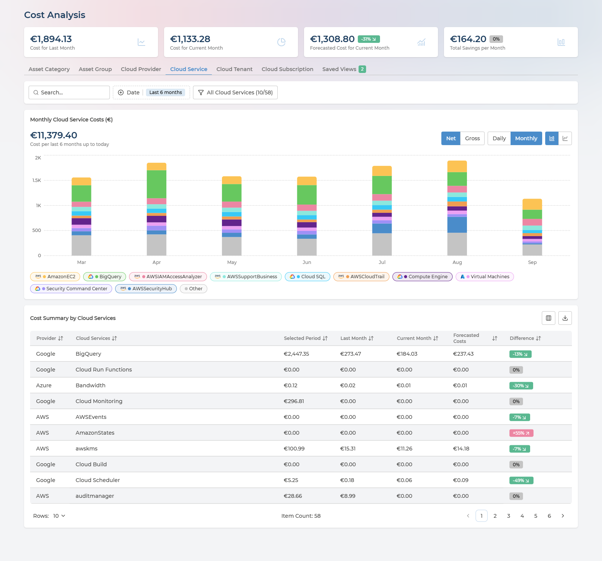
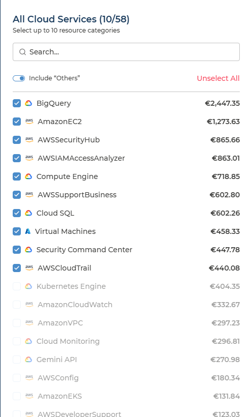
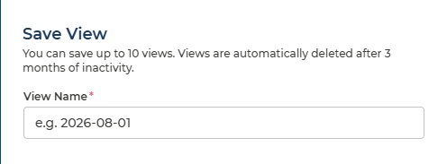
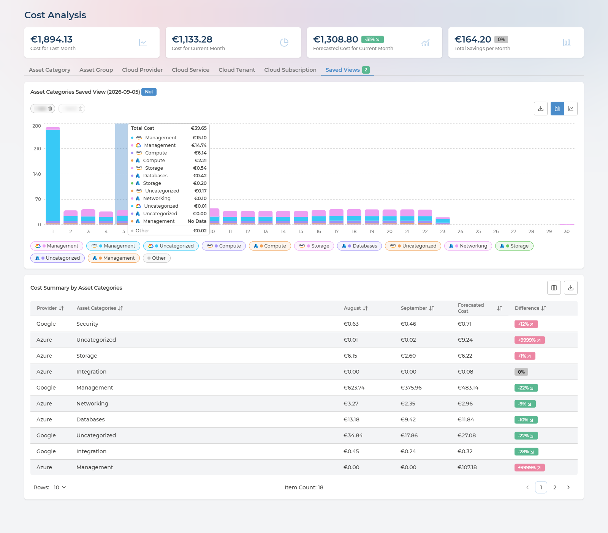

# Cost Analysis
{: .no_toc }

Cost Analysis answers the question the invoice leaves open: *where is the money going, and is this month better or worse than the last?* It takes the combined bill of every connected cloud and cuts it six ways, month by month or day by day, with last month and the forecast beside every figure.

  

    Table of contents
  

  {: .text-delta }
- TOC
{:toc}

---

## What the Page Is For

Four things work together:

- **The headline figures** - last month, this month so far, where this month is heading, and the savings on offer.
- **The dimension tabs** - the same spend cut by category, team, provider, service, tenant or subscription.
- **The cost chart** - the selected dimension over time, month by month or day by day.
- **Cost Summary** - the table beneath the chart, one row per item, with the comparison figures the chart does not show.

Everything on the page follows the three selectors in the header - cloud provider, company and currency - described in [Controls Shared by Every Page](../cloud-inventory.md#controls-shared-by-every-page). A user delegated to an Asset Group sees the page scoped to that group's assets, headline figures included - see [What a Delegated User Sees](../asset-ownership.md#what-a-delegated-user-sees).

The page address holds the tab, period, view, selection and search. A link to Cost Analysis therefore opens on exactly the view you were looking at, which is the easiest way to point a colleague at a figure.

---

## The Headline Figures

Four cards head the page:

| Card | What it holds | Badge |
| --- | --- | --- |
| **Cost for Last Month** | Spend for the last full calendar month | - |
| **Cost for Current Month** | Spend so far this month | - |
| **Forecasted Cost for Current Month** | Where this month lands if consumption holds | The forecast against last month's cost |
| **Total Savings per Month** | The monthly saving identified by your cost recommendations - the same figure as the Dashboard card of that name | The change since the previous period |

**The cards do not follow the tabs, the period or the filters below them.** They always cover the whole scope set in the header, so they stay a fixed reference while you cut the spend underneath in different ways.

The forecast badge is the quickest single check on the page. A positive figure means this month is on course to cost more than the last - worth knowing while there is still most of a month left to do something about it.

---

## Six Ways to Cut the Same Spend

Each tab re-cuts the same total along a different dimension. Switching tab never changes how much was spent, only how it is divided.

| Tab | Divides spend by | Use it to |
| --- | --- | --- |
| **Asset Category** | The kind of resource - Compute, Storage, Networking, Databases, Analytics, Containers and so on | See how much goes to compute versus storage versus networking |
| **Asset Group** | The ownership groups set up in [Asset Ownership](../asset-ownership.md) | Read spend per team or business unit |
| **Cloud Provider** | AWS, Azure and Google Cloud | Compare the clouds side by side |
| **Cloud Service** | The provider's own service names, such as Virtual Machines or Storage | Find the services driving the bill |
| **Cloud Tenant** | Tenant or organisation | Split an estate that spans more than one |
| **Cloud Subscription** | Subscription, account or project | Find who is spending, where subscriptions follow your organisation |

The last two follow the terminology of the provider you have selected: **Cloud Tenant** reads **Cloud Organization**, and **Cloud Subscription** reads **Cloud Account** or **Cloud Project**.

On the **Asset Group** tab, the **Unallocated** row is spend on assets no group owns - one row per provider. It is the accountability gap in currency, and it shrinks as ownership is set up. See [Cost per Asset Group](../asset-ownership.md#cost-per-asset-group).

---

## Monthly or Daily

The **Monthly** and **Daily** buttons above the chart change its resolution, and with it what the **Date** control offers:

| | Monthly | Daily |
| --- | --- | --- |
| **Period** | **Last 3 months**, **Last 6 months**, **Last 12 months**, the current year or the previous year | One calendar month, chosen from the last twelve |
| **Chart** | One bar per month | One bar per day of the chosen month |
| **Total above the chart** | Cost for the period, for example *Cost per last 6 months up to today* | Cost for the month, shown as *Selected Period: September 2026* |
| **Cost Summary** | Compares last month, this month and the forecast | Compares the chosen month with the months either side |

In the monthly view, **Include Current Month** in the Date control decides whether the month in progress is drawn. Leave it on to see where this month stands; switch it off when comparing complete months, since a month in progress always looks low beside finished ones.

On the **Cloud Provider** tab, the current month carries a dashed **Forecasted** segment on top of its bar - the rest of the month's expected spend, drawn so the incomplete month can be read against complete ones.

The daily view is part of Pulse Premium. On Cloud Essentials the **Daily** button is disabled, with the note *Daily View is not available on the Essential plan. Upgrade to Premium to access this feature.* and a link to the Service Catalog.

### Reading the chart
{: .no_toc }

- **Hover** any bar to see its breakdown: the total, then every series with its own figure, or *No Data* where a series has nothing for that day or month.
- **Click a legend chip** to hide that series, and again to bring it back. The total and the table do not change - it is a way to see the smaller series underneath a dominant one.
- **Bar or line** - the two icons at the end of the toolbar switch the chart type. Bars show how the stack is made up; lines make a trend in one series easier to follow.

Three shapes are worth recognising in the daily view:

- **One day far above its neighbours** - usually a one-off: a large data transfer, a batch run, a charge billed on a single day. The **Cloud Service** tab tells you which service; save the day as a view before it rolls out of the period.
- **A step that stays** - spend moves to a new level and holds. Usually a deployment, a resize or a change of commitment. Switch to **Cloud Subscription** or **Asset Group** to find whose.
- **A forecast above last month while the current month still looks modest** - this month is spending faster than the last. The daily view shows from which day.

---

## Choosing What to Chart

The chart shows up to ten items at a time. The selection button names the dimension and counts what is charted - *All Cloud Services (10/18)* means ten of eighteen services.

- The panel lists every item with its cost for the period, largest first, and can be searched.
- **Select Top 10** picks the ten largest in one click. Once they are selected, the same button reads **Unselect All**.
- **Include "Others"** folds everything not selected into one grey **Other** series, so the stack still adds up to your whole spend. Switch it off to chart only what you picked.

**Search**, beside the Date control, narrows the whole view - chart, total and table - to items whose name contains the text. Searching for part of a subscription name is the quickest route to a per-business-unit view when your naming carries it.

**The table is not limited to ten.** Cost Summary lists every item in the period, charted or not.

---

## Net or Gross

| | What it shows |
| --- | --- |
| **Net** | The amount billed, after committed-use discounts, credits, discounts and other savings are applied. The default, and the figure to use for anything that has to match an invoice |
| **Gross** | The amount before those are applied, at pay-as-you-go prices. Google Cloud only |

**Gross** is greyed out when the scope holds no Google Cloud costs, with the note *Gross cost currently supports GCP costs only. This scope doesn't include GCP data.* Where it is available, the gap between Gross and Net is what your Google Cloud commitments and credits are worth.

---

## Cost Summary

Beneath the chart, **Cost Summary by** the selected dimension gives one row per item. Its columns follow the view.

  
Every column in the monthly view

| Column | What it holds |
| --- | --- |
| **Provider** | The cloud the item belongs to |
| **The dimension** | The item itself - the service, subscription, group and so on, named after the tab |
| **Selected Period** | Cost across the period chosen in Date |
| **Last Month** | Cost for the last full month |
| **Current Month** | Cost so far this month |
| **Forecasted Costs** | Where this month is forecast to land |
| **Difference** | The forecast against last month, as a percentage |

  
Every column in the daily view

| Column | What it holds |
| --- | --- |
| **Provider** | The cloud the item belongs to |
| **The dimension** | The item itself, named after the tab |
| **The previous month** | Cost for the month before the one chosen, headed with its name - for example **August** |
| **The chosen month** | Cost for the month shown in the chart |
| **Forecasted Cost**, or **the next month** | For the current month, where it is forecast to land. For a past month, the cost of the month after it |
| **Difference** | For the current month, the forecast against the previous month. For a past month, the chosen month against the previous one. Hover the header to see which two are compared |

Columns can be sorted, shown or hidden, and the table paged. The download menu offers two exports: **Export CSV**, with the full row count shown, or **Export current page to CSV**.

**Read Difference with the amounts beside it.** In the monthly view, where the month being compared against had no cost at all, there is nothing to compare, and the column reads 0% however much the other month cost. The daily view shows the same case as **+9999%**, which is also where very large increases are capped.

---

## Saved Views

A saved view keeps one day you expect to come back to - the day a cost spiked, the day before a change went live - together with the dimension and the items you had selected.

### Saving a day
{: .no_toc }

1. Switch to **Daily** and choose the month.
2. Click the day in the chart. Its breakdown stays pinned, and **Save View** becomes available - until then it reads *To save a daily view, click on the day.*
3. Click **Save View**, enter a **View Name** - the field suggests the date as an example - and save.

The panel states the two limits that apply:

> You can save up to 10 views. Views are automatically deleted after 3 months of inactivity.

### Opening a view
{: .no_toc }

The **Saved Views** tab carries a count of your views, and lists them as badges. Select one to open it:

- The chart shows the view's month for the same dimension and items, in the same Net or Gross, with the saved day pinned.
- **Download**, followed by the view's name, exports that day's costs to CSV. It is disabled for a day with no costs: *This day has no costs to export.*
- The period, view and Net or Gross buttons are hidden while a view is open, because the view already fixes them.
- A view is deleted from its badge. Pulse asks first: *Delete this saved view?*

**Saved views are private.** Only the person who saved a view can see it, so your views never appear in a colleague's Saved Views tab. To show someone a figure, send them the page address instead - it holds the tab, period, selection and search.

Saved Views are available to the **Manager** and **Analyst** roles. Users with the **User** role - typically people delegated to an Asset Group - do not see the tab.

---

## Q&A

### Why is the Daily button greyed out?
{: .no_toc }

The daily view is part of Pulse Premium. On Cloud Essentials, Cost Analysis works in monthly granularity - see [What You Get at Each Tier](README.md#what-you-get-at-each-tier).

### Why is Gross greyed out?
{: .no_toc }

Gross cost is only available for Google Cloud. If the providers selected in the header include no Google Cloud costs, only Net is offered.

### Why do the headline figures not change when I switch tab or filter?
{: .no_toc }

They are not meant to. The four cards always cover the whole scope set in the header - provider, company and currency - so they stay the same while you cut the spend underneath. Change the header selectors to change them.

### Why does the daily view stop at yesterday?
{: .no_toc }

Costs for a day arrive once your cloud has billed it, so the day in progress is not yet in the chart. Newly connected clouds take up to 24 hours to show costs at all.

### A row shows a Difference of 0% or +9999%, but that cannot be right
{: .no_toc }

The month it is being compared against had no cost, so there is no real percentage to show - the monthly view reads 0% and the daily view +9999%. The daily view also caps very large increases at +9999%. Compare the amounts in the row directly.

### Why does Total Savings per Month differ from the savings on Cost Savings?
{: .no_toc }

They come from different lists. Total Savings per Month is the same figure as the Dashboard card, drawn from the cost recommendations described under [Recommendations](../cloud-inventory.md#recommendations). [Cost Savings](cost-savings.md) counts only the costed savings on its own recommendations, per resource.

### I cannot find the Saved Views tab
{: .no_toc }

Saved views are made from the daily view, so they need Pulse Premium, and the tab is not shown to users with the **User** role.

### Can my colleagues see my saved views?
{: .no_toc }

No. Saved views are private to the person who saved them. To share a view, send the page address - it opens Cost Analysis on the same tab, period, selection and search.

### Can I get these figures out of Pulse?
{: .no_toc }

Yes. Cost Summary exports to CSV, either in full or the page on screen, and a saved view downloads its day's costs to CSV.
---
title: Cost Analysis
layout: default
parent: Cloud Economics
grand_parent: Pulse Ecosystem
nav_order: 1
permalink: /pulse-ecosystem/cloud-economics/cost-analysis/
---

# Cost Analysis
{: .no_toc }

Cost Analysis answers the question the invoice leaves open: *where is the money going, and is this month better or worse than the last?* It takes the combined bill of every connected cloud and cuts it six ways, month by month or day by day, with last month and the forecast beside every figure.

  

    Table of contents
  

  {: .text-delta }
- TOC
{:toc}

---

## What the Page Is For

Four things work together:

- **The headline figures** - last month, this month so far, where this month is heading, and the savings on offer.
- **The dimension tabs** - the same spend cut by category, team, provider, service, tenant or subscription.
- **The cost chart** - the selected dimension over time, month by month or day by day.
- **Cost Summary** - the table beneath the chart, one row per item, with the comparison figures the chart does not show.

Everything on the page follows the three selectors in the header - cloud provider, company and currency - described in [Controls Shared by Every Page](../cloud-inventory.md#controls-shared-by-every-page). A user delegated to an Asset Group sees the page scoped to that group's assets, headline figures included - see [What a Delegated User Sees](../asset-ownership.md#what-a-delegated-user-sees).

The page address holds the tab, period, view, selection and search. A link to Cost Analysis therefore opens on exactly the view you were looking at, which is the easiest way to point a colleague at a figure.

---

## The Headline Figures

Four cards head the page:

| Card | What it holds | Badge |
| --- | --- | --- |
| **Cost for Last Month** | Spend for the last full calendar month | - |
| **Cost for Current Month** | Spend so far this month | - |
| **Forecasted Cost for Current Month** | Where this month lands if consumption holds | The forecast against last month's cost |
| **Total Savings per Month** | The monthly saving identified by your cost recommendations - the same figure as the Dashboard card of that name | The change since the previous period |

**The cards do not follow the tabs, the period or the filters below them.** They always cover the whole scope set in the header, so they stay a fixed reference while you cut the spend underneath in different ways.

The forecast badge is the quickest single check on the page. A positive figure means this month is on course to cost more than the last - worth knowing while there is still most of a month left to do something about it.

---

## Six Ways to Cut the Same Spend

Each tab re-cuts the same total along a different dimension. Switching tab never changes how much was spent, only how it is divided.

| Tab | Divides spend by | Use it to |
| --- | --- | --- |
| **Asset Category** | The kind of resource - Compute, Storage, Networking, Databases, Analytics, Containers and so on | See how much goes to compute versus storage versus networking |
| **Asset Group** | The ownership groups set up in [Asset Ownership](../asset-ownership.md) | Read spend per team or business unit |
| **Cloud Provider** | AWS, Azure and Google Cloud | Compare the clouds side by side |
| **Cloud Service** | The provider's own service names, such as Virtual Machines or Storage | Find the services driving the bill |
| **Cloud Tenant** | Tenant or organisation | Split an estate that spans more than one |
| **Cloud Subscription** | Subscription, account or project | Find who is spending, where subscriptions follow your organisation |

The last two follow the terminology of the provider you have selected: **Cloud Tenant** reads **Cloud Organization**, and **Cloud Subscription** reads **Cloud Account** or **Cloud Project**.

On the **Asset Group** tab, the **Unallocated** row is spend on assets no group owns - one row per provider. It is the accountability gap in currency, and it shrinks as ownership is set up. See [Cost per Asset Group](../asset-ownership.md#cost-per-asset-group).

---

## Monthly or Daily

The **Monthly** and **Daily** buttons above the chart change its resolution, and with it what the **Date** control offers:

| | Monthly | Daily |
| --- | --- | --- |
| **Period** | **Last 3 months**, **Last 6 months**, **Last 12 months**, the current year or the previous year | One calendar month, chosen from the last twelve |
| **Chart** | One bar per month | One bar per day of the chosen month |
| **Total above the chart** | Cost for the period, for example *Cost per last 6 months up to today* | Cost for the month, shown as *Selected Period: September 2026* |
| **Cost Summary** | Compares last month, this month and the forecast | Compares the chosen month with the months either side |

In the monthly view, **Include Current Month** in the Date control decides whether the month in progress is drawn. Leave it on to see where this month stands; switch it off when comparing complete months, since a month in progress always looks low beside finished ones.

On the **Cloud Provider** tab, the current month carries a dashed **Forecasted** segment on top of its bar - the rest of the month's expected spend, drawn so the incomplete month can be read against complete ones.

The daily view is part of Pulse Premium. On Cloud Essentials the **Daily** button is disabled, with the note *Daily View is not available on the Essential plan. Upgrade to Premium to access this feature.* and a link to the Service Catalog.

### Reading the chart
{: .no_toc }

- **Hover** any bar to see its breakdown: the total, then every series with its own figure, or *No Data* where a series has nothing for that day or month.
- **Click a legend chip** to hide that series, and again to bring it back. The total and the table do not change - it is a way to see the smaller series underneath a dominant one.
- **Bar or line** - the two icons at the end of the toolbar switch the chart type. Bars show how the stack is made up; lines make a trend in one series easier to follow.

Three shapes are worth recognising in the daily view:

- **One day far above its neighbours** - usually a one-off: a large data transfer, a batch run, a charge billed on a single day. The **Cloud Service** tab tells you which service; save the day as a view before it rolls out of the period.
- **A step that stays** - spend moves to a new level and holds. Usually a deployment, a resize or a change of commitment. Switch to **Cloud Subscription** or **Asset Group** to find whose.
- **A forecast above last month while the current month still looks modest** - this month is spending faster than the last. The daily view shows from which day.

---

## Choosing What to Chart

The chart shows up to ten items at a time. The selection button names the dimension and counts what is charted - *All Cloud Services (10/18)* means ten of eighteen services.

- The panel lists every item with its cost for the period, largest first, and can be searched.
- **Select Top 10** picks the ten largest in one click.
- **Include "Others"** folds everything not selected into one grey **Other** series, so the stack still adds up to your whole spend. Switch it off to chart only what you picked.

**Search**, beside the Date control, narrows the whole view - chart, total and table - to items whose name contains the text. Searching for part of a subscription name is the quickest route to a per-business-unit view when your naming carries it.

**The table is not limited to ten.** Cost Summary lists every item in the period, charted or not.

---

## Net or Gross

| | What it shows |
| --- | --- |
| **Net** | The amount billed, after committed-use discounts, credits, discounts and other savings are applied. The default, and the figure to use for anything that has to match an invoice |
| **Gross** | The amount before those are applied, at pay-as-you-go prices. Google Cloud only |

**Gross** is greyed out when the scope holds no Google Cloud costs, with the note *Gross cost currently supports GCP costs only. This scope doesn't include GCP data.* Where it is available, the gap between Gross and Net is what your Google Cloud commitments and credits are worth.

---

## Cost Summary

Beneath the chart, **Cost Summary by** the selected dimension gives one row per item. Its columns follow the view.

  
Every column in the monthly view

| Column | What it holds |
| --- | --- |
| **Provider** | The cloud the item belongs to |
| **The dimension** | The item itself - the service, subscription, group and so on, named after the tab |
| **Selected Period** | Cost across the period chosen in Date |
| **Last Month** | Cost for the last full month |
| **Current Month** | Cost so far this month |
| **Forecasted Costs** | Where this month is forecast to land |
| **Difference** | The forecast against last month, as a percentage |

  
Every column in the daily view

| Column | What it holds |
| --- | --- |
| **Provider** | The cloud the item belongs to |
| **The dimension** | The item itself, named after the tab |
| **The previous month** | Cost for the month before the one chosen, headed with its name - for example **August** |
| **The chosen month** | Cost for the month shown in the chart |
| **Forecasted Cost**, or **the next month** | For the current month, where it is forecast to land. For a past month, the cost of the month after it |
| **Difference** | For the current month, the forecast against the previous month. For a past month, the chosen month against the previous one. Hover the header to see which two are compared |

Columns can be sorted, shown or hidden, and the table paged. The download menu offers two exports: **Export CSV**, with the full row count shown, or **Export current page to CSV**.

**A Difference of 0% does not always mean no change.** Where the month being compared against had no cost at all, there is nothing to compare, and the column reads 0% however much the other month cost.

---

## Saved Views

A saved view keeps one day you expect to come back to - the day a cost spiked, the day before a change went live - together with the dimension and the items you had selected.

### Saving a day
{: .no_toc }

1. Switch to **Daily** and choose the month.
2. Click the day in the chart. Its breakdown stays pinned, and **Save View** becomes available - until then it reads *To save a daily view, click on the day.*
3. Click **Save View**, enter a **View Name** - the field suggests the date as an example - and save.

The panel states the two limits that apply:

> You can save up to 10 views. Views are automatically deleted after 3 months of inactivity.

### Opening a view
{: .no_toc }

The **Saved Views** tab carries a count of your views, and lists them as badges. Select one to open it:

- The chart shows the view's month for the same dimension and items, in the same Net or Gross, with the saved day pinned.
- **Download**, followed by the view's name, exports that day's costs to CSV. It is disabled for a day with no costs: *This day has no costs to export.*
- The period, view and Net or Gross buttons are hidden while a view is open, because the view already fixes them.
- A view is deleted from its badge. Pulse asks first: *Delete this saved view?*

Saved Views are available to the **Manager** and **Analyst** roles. Users with the **User** role - typically people delegated to an Asset Group - do not see the tab.

---

## Q&A

### Why is the Daily button greyed out?
{: .no_toc }

The daily view is part of Pulse Premium. On Cloud Essentials, Cost Analysis works in monthly granularity - see [What You Get at Each Tier](README.md#what-you-get-at-each-tier).

### Why is Gross greyed out?
{: .no_toc }

Gross cost is only available for Google Cloud. If the providers selected in the header include no Google Cloud costs, only Net is offered.

### Why do the headline figures not change when I switch tab or filter?
{: .no_toc }

They are not meant to. The four cards always cover the whole scope set in the header - provider, company and currency - so they stay the same while you cut the spend underneath. Change the header selectors to change them.

### Why does the daily view stop at yesterday?
{: .no_toc }

Costs for a day arrive once your cloud has billed it, so the day in progress is not yet in the chart. Newly connected clouds take up to 24 hours to show costs at all.

### A row shows a Difference of 0%, but its cost clearly changed
{: .no_toc }

The month it is being compared against had no cost, so there is no percentage to show. Compare the two amounts in the row directly.

### Why does Total Savings per Month differ from the savings on Cost Savings?
{: .no_toc }

They come from different lists. Total Savings per Month is the same figure as the Dashboard card, drawn from the cost recommendations described under [Recommendations](../cloud-inventory.md#recommendations). [Cost Savings](cost-savings.md) counts only the costed savings on its own recommendations, per resource.

### I cannot find the Saved Views tab
{: .no_toc }

Saved views are made from the daily view, so they need Pulse Premium, and the tab is not shown to users with the **User** role.

### Can I get these figures out of Pulse?
{: .no_toc }

Yes. Cost Summary exports to CSV, either in full or the page on screen, and a saved view downloads its day's costs to CSV.
