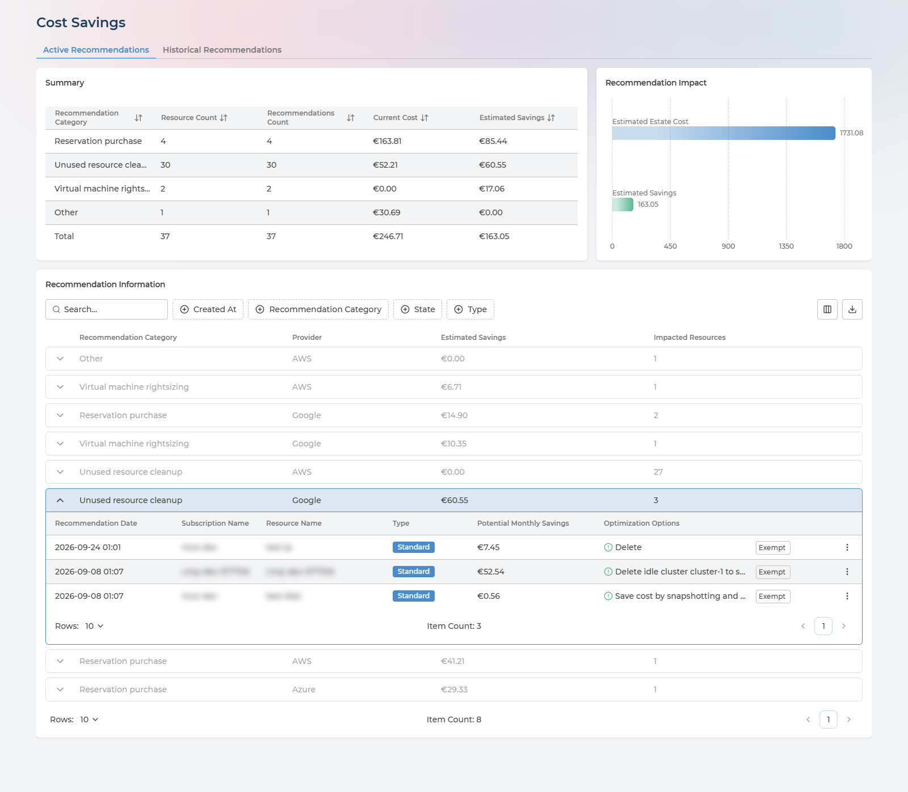
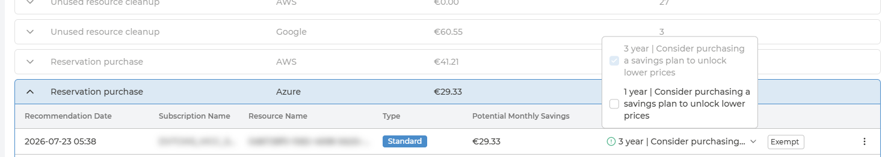
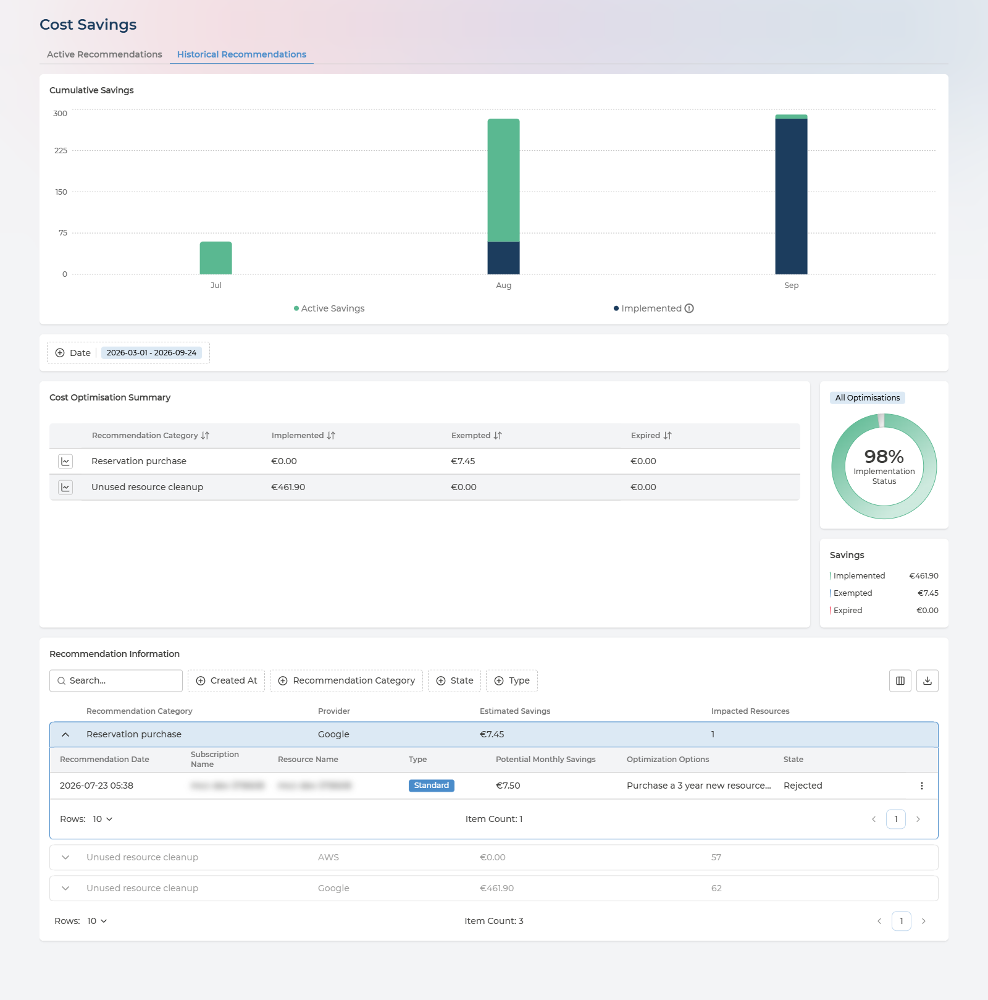

# Cost Savings
{: .no_toc }

Cost Savings answers the question that follows every cost review: *what can we stop paying for?* It lists cost recommendations resource by resource, with the monthly saving each optimisation option would bring, and keeps the record of what happened to each one afterwards.

<details open markdown="block">
  <summary>
    Table of contents
  </summary>
  {: .text-delta }
- TOC
{:toc}
</details>

---

## What the Page Is For

Two tabs, one for each half of the job:

- **Active Recommendations** - what is open now, what it is worth, and on which resources. This is the tab you work from.
- **Historical Recommendations** - what happened to the rest: implemented, exempted or left to expire. This is the tab you report from.

Both follow the cloud provider and currency selected in the header.

---

## Active Recommendations



Three cards, from the overview down to the individual resource.

### Summary
{: .no_toc }

One row per **Recommendation Category**, with a **Total** row beneath:

| Column | What it holds |
| --- | --- |
| **Recommendation Category** | The kind of optimisation - for example Virtual machine rightsizing |
| **Resource Count** | How many resources the category's recommendations apply to |
| **Recommendations Count** | How many open recommendations it holds |
| **Current Cost** | What those resources currently cost |
| **Estimated Savings** | The saving the category's recommendations would bring |

### Recommendation Impact
{: .no_toc }

Two bars side by side: **Estimated Estate Cost**, the monthly cost of the estate the recommendations are drawn from, and **Estimated Savings**, the total of the open recommendations. The distance between them is the point - the share of the bill the open recommendations would remove.

### Recommendation Information
{: .no_toc }

The working list. Each row is one category on one provider, with its **Estimated Savings** and number of **Impacted Resources**. Expand a row to see the resources underneath it; the first row opens expanded.

Filter by **Created At**, **Recommendation Category**, **State** and **Type**, choose columns, and export the table to CSV.

<details markdown="block" class="reference-box">
  <summary>Every column in the resource rows</summary>

| Column | What it holds | Values |
| --- | --- | --- |
| **Recommendation Date** | When the recommendation was raised | A date and time |
| **Subscription Name** | Where the resource lives | The subscription, account or project |
| **Resource Name** | The resource the recommendation applies to | The resource's own name |
| **Type** | The kind of recommendation | **Standard** · **Advanced** |
| **Potential Monthly Savings** | The monthly saving of the option or options selected | An amount - €0.00 where no saving has been costed |
| **Optimization Options** | The recommended change, with its risk | See [Optimisation Options](#optimisation-options) |
| **Exempt** | Closes the recommendation without acting on it | See [Exempting a Recommendation](#exempting-a-recommendation) |
| Row menu | **Asset Details** - the resource's own page | See [From a Recommendation to the Resource](#from-a-recommendation-to-the-resource) |

</details>

**Sort by Estimated Savings and work down.** The top of the list is usually a handful of resources worth more than everything below them combined.

---

## Optimisation Options

Many resources can be optimised in more than one way. **Optimization Options** shows the recommended change with a risk marker in front of it - green for **Low**, amber for **Medium**, red for **High** - so the saving and what it could disturb are read together.



Where a resource has more than one option, the column opens a menu:

- **Alternatives** - different versions of the same change - are grouped, and only one of each group can be chosen.
- **Independent changes** can be ticked together. **Potential Monthly Savings** and the risk marker then reflect the combination rather than any single option.
- At least one option always stays selected.

**Choosing an option records nothing.** It is a way to compare, not a decision: the saving is recalculated for what you picked, and the choice is reset when you leave the page. What you do about the recommendation is made in your cloud - see [Nothing Here Changes Your Cloud](#nothing-here-changes-your-cloud).

---

## Exempting a Recommendation

**Exempt** closes a recommendation you have decided not to act on - a resource sized generously on purpose, a disk kept for a reason the recommendation cannot see.

- **It takes effect at once, with no confirmation step.** The button changes to **Exempted**.
- The recommendation leaves the Active tab, and appears on Historical Recommendations with the state **Rejected**. Its saving is counted under **Exempted** from then on.
- There is no undo on the page, so exempt deliberately.

An exemption is a record of a decision, not a change to the resource.

---

## From a Recommendation to the Resource

The row menu's **Asset Details** opens the resource's own page, with **Back to Cost Savings** to return. It is the same page described in [Inside a Single Asset](../cloud-inventory.md#inside-a-single-asset): ownership, daily cost with a 30-day prediction, the cost savings available on it, and every other recommendation raised against it.

The **Ownership** card is the one to read first. It tells you which Asset Group the resource belongs to and who is delegated to it - the people to hand the recommendation to.

---

## Historical Recommendations



- **Cumulative Savings** - month by month over the last six months, two series: **Active Savings** and **Implemented**. Implemented carries the note *Previously implemented savings that continue to have an impact on current spending*: a change made in spring is still saving money in autumn, and this chart keeps counting it.
- **Date** - sets the period for everything below it, by when recommendations were raised: **Last 12 months**, **Last 6 months** (the default), **Last 3 months**, **Last month**, **Current month**, or a range of your own.
- **Cost Optimisation Summary** - one row per category, with the savings **Implemented**, **Exempted** and **Expired**. Select a row to focus Implementation Status on that category.
- **Implementation Status** - the share of closed savings that was actually implemented, with the three amounts beside it.
- **Recommendation Information** - the same table as on the Active tab, with a **State** column added. Options are listed as text, and there is nothing to exempt.

Implementation Status is arithmetic on the estimated savings of closed recommendations:

```
Implemented / (Implemented + Exempted + Expired) x 100%
```

The **State** column shows one of four values:

| State | What it means | Where you see it |
| --- | --- | --- |
| **New** | Open, and waiting for someone to act on it | Active Recommendations |
| **Implemented** | The recommended change was made, and the saving is realised | Historical Recommendations |
| **Rejected** | Closed with **Exempt** - a saving deliberately not taken. Counted under **Exempted** in the summary and charts | Historical Recommendations |
| **Expired** | Closed without being implemented or exempted | Historical Recommendations |

**Implementation Status is the figure to report.** Read it with the split behind it: a large exempted share is a set of decisions someone made; a large expired share is savings nobody looked at.

---

## Nothing Here Changes Your Cloud

**No action on this page makes a change in your cloud environment.** Choosing an optimisation option compares; **Exempt** records a decision. Neither resizes, stops or deletes anything in AWS, Azure or Google Cloud.

The change itself is made in your cloud:

- **On Pulse Premium** - by your own teams. The recommendation, its options and its owner are the brief; the saving shows on Historical Recommendations once it is implemented.
- **With Managed Cloud Economics** - operated on your behalf by Devoteam, as part of the managed service.

---

## Q&A

### Why does a recommendation show €0.00?
{: .no_toc }

Not every recommendation comes with a costed saving. Some advise a change whose effect depends on how the workload behaves, or ask you to review whether something is still needed. They are listed so they can still be reviewed, and the saving shows as €0.00 rather than as a guess.

### Does choosing an optimisation option change anything?
{: .no_toc }

No. It recalculates the saving shown for that resource, and is forgotten when you leave the page. Nothing is recorded and nothing changes in your cloud.

### Can I undo an exemption?
{: .no_toc }

Not from this page. Exempt takes effect immediately and has no confirmation step, so use it once the decision has been made rather than as a way to hide a row.

### How is this different from Recommendations in Cloud Inventory?
{: .no_toc }

[Recommendations](../cloud-inventory.md#recommendations) collects every kind of advice from your clouds - security, reliability, performance and more, as well as cost. Cost Savings is about cost only, and goes further with it: a saving per resource, a choice of options with their risk, exemptions, and a history of what was implemented.

### Why do the savings here differ from Total Savings per Month in Cost Analysis?
{: .no_toc }

They come from different lists. Total Savings per Month is taken from the cost recommendations described under [Recommendations](../cloud-inventory.md#recommendations); Cost Savings counts the costed savings on its own recommendations, resource by resource.

### Who should act on a recommendation?
{: .no_toc }

The owner of the resource. Open **Asset Details** from the row menu and read the **Ownership** card - it names the Asset Group and the users delegated to it. Where it reads **Unallocated**, the resource has no owner yet; see [Asset Ownership](../asset-ownership.md).

### Can I get the list out of Pulse?
{: .no_toc }

Yes. Recommendation Information exports to CSV on both tabs, which is the usual way to hand a set of recommendations to the team that will carry them out.
