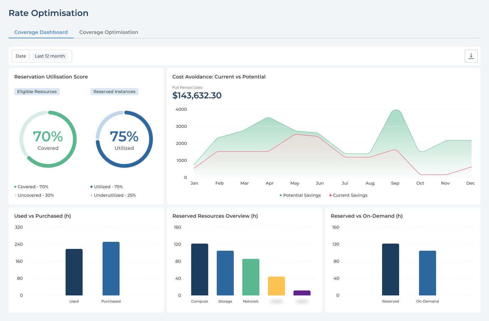
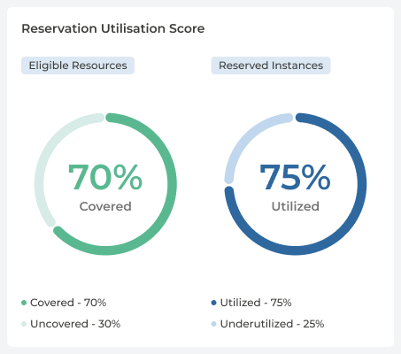
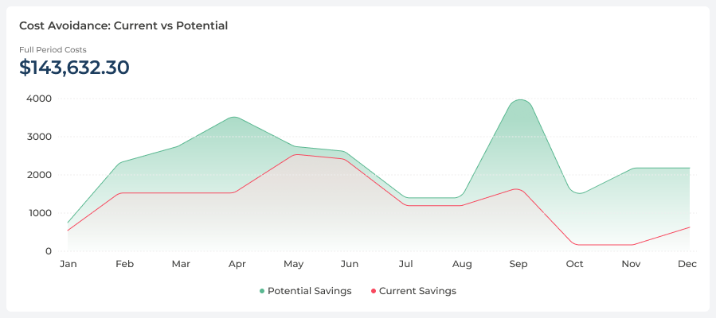

# Rate Optimisation
{: .no_toc }

Rate Optimisation answers the question that remains once you only run what you need: *are we paying the best rate for it?* It shows how much of your estate your reservations cover, how much of what you reserved is actually used, and what those commitments save you now against what they could.

  

    Table of contents
  

  {: .text-delta }
- TOC
{:toc}

---

## What the Page Is For

A cloud bill is usage multiplied by rate, and Cloud Economics works on both:

- **Usage** - [Cost Savings](cost-savings.md) finds what to resize, stop or remove.
- **Rate** - Rate Optimisation looks at what you keep running, and whether it is paid for at a committed rate or at the full on-demand price.

The page has two tabs:

- **Coverage Dashboard** - how your reservations are performing: coverage, utilisation, the savings they bring and where the reserved hours go. This is the tab you read from.
- **Coverage Optimisation** - the tab for acting on what the dashboard shows.

Like the rest of Cloud Economics, the tab follows the cloud provider and currency selected in the header.

---

## How Reservations Save Money

A reservation is a commitment to a level of usage for a set period, in return for a lower rate than on demand. Two measures decide whether it pays off:

- **Coverage** - how much of the usage that could be reserved actually is. Anything outside a reservation is billed at the on-demand rate.
- **Utilisation** - how much of the reserved capacity is actually used. A reservation is paid for whether it is used or not, so unused reserved hours are money spent for nothing.

**The two pull in opposite directions.** Reserve too little and steady workloads pay on-demand prices; reserve too much and you pay for capacity nobody uses. The dashboard puts both side by side so that neither is improved at the expense of the other.

---

## Choosing the Period

**Date**, above the cards, sets the period for everything on the tab: the last 3, 6, 12 (the default), 24 or 36 months, or **All Commitment Period**, the full span of your commitments.

The 24- and 36-month options are offered only when Pulse holds that much history for your company.

---

## Reservation Utilisation Score

Two scores, one for each measure:

| Score | Measured across | What it tells you | Legend |
| --- | --- | --- | --- |
| **Covered** | **Eligible Resources** - everything that could run under a reservation | The share of it that does | **Covered** · **Uncovered** |
| **Utilized** | **Reserved Instances** - everything you have reserved | The share of it that is used | **Utilized** · **Underutilized** |

In the example above, 70% covered means 30% of eligible usage is still billed on demand, and 75% utilised means a quarter of the reserved capacity is paid for but not used.

**Read the two scores together:**

| | Low utilisation | High utilisation |
| --- | --- | --- |
| **High coverage** | More is reserved than is used. Adjust or retire reservations before buying more | The goal - most eligible usage is reserved, and the reservations are used |
| **Low coverage** | The reservations are in the wrong place: they go unused while eligible usage pays on demand | What is reserved works. There is room to reserve more |

---

## Cost Avoidance: Current vs Potential

Cost avoidance is spend that did not happen: what the same usage would have cost at on-demand rates, less what it cost under a reservation. The chart shows it month by month across the period, as two series:

- **Current Savings** - what the reservations you already have are saving.
- **Potential Savings** - what could be saved with rates optimised further. It is a projection, not money already saved.

Hover any month to see both figures for it. **Full Period Costs**, above the chart, totals the selected period.

**The gap between the two is the opportunity.** Current Savings is already in the bill; the distance up to Potential Savings is what better coverage, or better-sized reservations, would add. A gap that stays wide month after month is the case for the next commitment.

---

## Where the Reserved Hours Go

Three charts along the bottom of the tab, all in hours (h):

| Chart | What it shows | How to read it |
| --- | --- | --- |
| **Used vs Purchased (h)** | Reserved hours used against reserved hours purchased, across the whole estate | The difference is reserved capacity paid for and not used - the hours behind the **Utilized** score |
| **Reserved Resources Overview (h)** | Reserved hours by resource type - compute, storage, network and so on | Where your commitments sit. Compare it with where your spend sits in [Cost Analysis](cost-analysis.md) |
| **Reserved vs On-Demand (h)** | Hours run under a reservation against hours run at on-demand rates, across the whole estate | On-demand hours are paid at the full rate. Where they could be reserved, they make up the **Uncovered** share of the score |

---

## Nothing Here Changes Your Cloud

**Rate Optimisation reads your reservations and usage; it does not buy, change or cancel anything.** Reservations are purchased and managed in your cloud provider, and Pulse reports on them from there.

- **On Pulse Premium** - by your own teams, using the dashboard to decide what to commit to and what to adjust.
- **With Managed Cloud Economics** - with Devoteam, as part of the managed service.

---

## Q&A

### How is this different from Cost Savings?
{: .no_toc }

[Cost Savings](cost-savings.md) reduces usage - a smaller machine, a stopped resource, a deleted disk. Rate Optimisation reduces the price of the usage that remains. They work best in that order: resize first, then reserve what is left, so you do not commit to capacity you are about to remove.

### Should coverage be 100%?
{: .no_toc }

Usually not. Steady, predictable usage is what reservations suit. Usage that is temporary, seasonal or about to change is often better left on demand, because a reservation keeps costing money after the usage it was bought for has gone.

### Why is utilisation below 100%?
{: .no_toc }

Part of what was reserved is not being used. Typically the workload it was bought for has shrunk, moved or been resized since the purchase. **Used vs Purchased** shows how many hours that is.

### Is Potential Savings money I will save?
{: .no_toc }

No. It is a projection of what further rate optimisation could achieve. Only Current Savings reflects reservations you already have.

### Why can I not choose 24 or 36 months?
{: .no_toc }

Those periods are offered only when Pulse holds that much history for your company. Until then, the longest choices are 12 months and **All Commitment Period**.

### Do I need to add my reservations to Pulse?
{: .no_toc }

No. Reservations are bought and managed in your cloud provider, and Rate Optimisation reports on them from there. Nothing needs to be entered in Pulse, and nothing in Pulse changes them.
