# Cloud Inventory
{: .no_toc }

**Cloud Essentials** is where every Pulse customer starts, at no cost. Connect AWS, Azure and Google Cloud and you get a single inventory of everything running in them - costs, resources, tags, regions, security alerts and compliance posture. This page walks through each screen, what it tells you and what to do with it.

Three things worth knowing before you start:

- **Pulse only reads.** Every permission it is granted is read-only. It discovers and reports; it changes nothing in your cloud.
- **You keep your own identity.** Sign-in goes through your existing identity provider, and no passwords are stored in Pulse.
- **Data arrives within a day.** Resources, findings and costs appear up to 24 hours after a cloud is connected.

<details open markdown="block">
  <summary>
    Table of contents
  </summary>
  {: .text-delta }
- TOC
{:toc}
</details>

Screenshots on this page show the page content only - the surrounding navigation and header are omitted so each one focuses on the screen being described. Subscription and account names, resource names and anything identifying a person are blurred; figures, service names, regions and dates are shown as they are.
{: .fs-3 }

---

## Where This Fits

| Tier | What it adds |
| --- | --- |
| **Cloud Essentials** | Everything described on this page, at no cost |
| **Pulse Premium** | Cloud Essentials plus the Cloud Economics and Cloud Compliance features |
| **Managed Service** | Cloud Essentials plus the managed services - Managed Cloud Reliability, Managed Cloud Economics, Managed Cloud Compliance and others - delivered with Devoteam service management |

Some of the screens below belong to the Economics and Compliance services but are open to Cloud Essentials customers anyway, so you can see what they offer on your own data. Two limits apply at this tier:

- **Costs** works in monthly granularity. The daily view comes with Cloud Economics.
- **Budget & Alerts** is visibility only - you can see budgets and how spend tracks against them. Alerting itself comes with Pulse Premium or a managed service.

See [Pulse Ecosystem](README.md) for what each service covers.

---

## Controls Shared by Every Page

Three selectors sit in the header and apply everywhere:

| Selector | What it does |
| --- | --- |
| **Cloud provider** | Restricts every figure on every page to the providers you pick. Choose one to read a single cloud, or several to compare. |
| **Company** | Switches the active organisation when your tenant holds more than one. |
| **Currency** | Re-states all monetary values - costs, savings, budgets - in your preferred currency. |

Most pages also carry a **date range** control. Recommendations, Tags, Locations and Security Alerts offer presets - Last 7 Days, Last 30 Days, Last 90 Days - while Assets and Costs take a custom range.

Every table behaves the same way: free-text search, sortable columns, a column show/hide menu, pagination, and **CSV export of the whole result set** rather than just the page on screen.

---

## Dashboard

The landing page after login, and the answer to "what changed since last week".

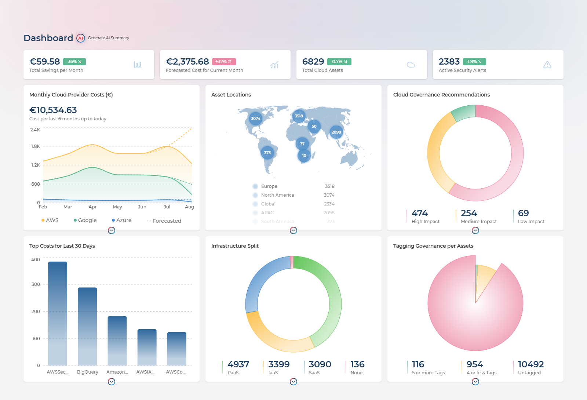

Four KPI cards run across the top. Each is a link into the page that explains it:

| Card | Reads as | Takes you to |
| --- | --- | --- |
| **Total Savings per Month** | Money the recommendation engine thinks you can stop spending | Recommendations, pre-filtered to Cost and Sustainability |
| **Forecasted Cost for Current Month** | Where this month lands if consumption holds, with a trend badge against last month | Costs |
| **Total Cloud Assets** | Every resource discovered across connected providers, and how that count moved | Assets |
| **Active Security Alerts** | Open findings needing attention, and the change since the previous period | Security Alerts |

Below them, six insight charts, each with its own link onward:

- **Monthly Cloud Provider Costs** - spend by provider over recent months, with the forecast for the current month overlaid as a dashed line
- **Asset Locations** - where in the world your resources actually sit
- **Cloud Governance Recommendations** - open recommendations split by High, Medium and Low impact
- **Top Costs for Last 30 Days** - the services taking the largest share of spend
- **Infrastructure Split** - the proportion of your estate by asset category
- **Tagging Governance per Assets** - how much of the estate carries tags

<div class="takeaway" markdown="block">
**What to do with it.** Use it as the weekly five-minute check: the four figures and their trend badges tell you whether cost, footprint and exposure moved in the direction you expected. When one has, the card is a link to the page that explains why, so the dashboard is where an investigation starts rather than where it ends.
</div>

---

### AI Summary

On top of the charts themselves, Pulse will interpret them for you. **Generate AI Summary**, next to the page title, turns the dashboard into a written assessment - at two levels at once.

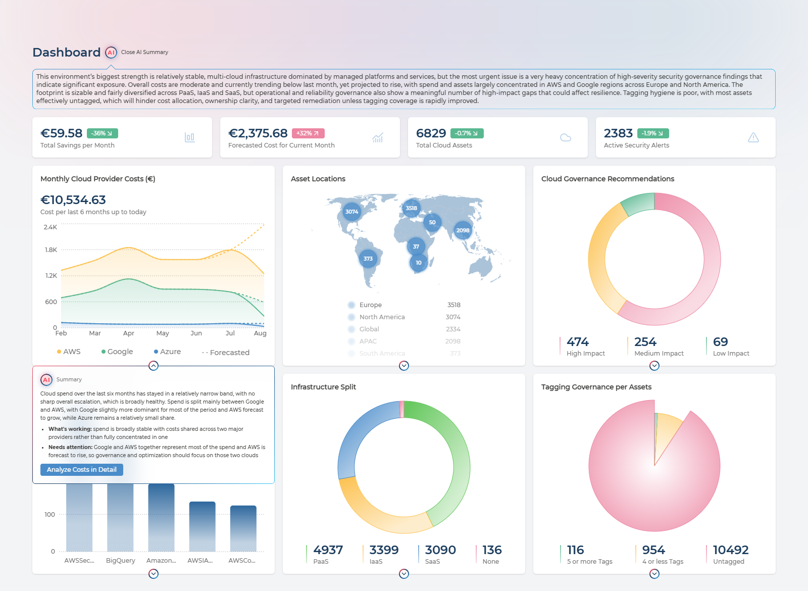

**The overall assessment** appears as a panel under the title and judges the estate as a whole - what is going well, what is most urgent, and how those relate. In the example above it identifies stable multi-cloud spend and a balanced PaaS/SaaS/IaaS mix as the strengths, then names governance and security as the pressing weakness, and connects weak tagging to the inability to act on the governance findings at all. That last point is the kind of link across four separate charts that is easy to miss when reading them one at a time.

**Each card also explains itself.** The chevron beneath any chart opens a summary for that chart alone, written in the same plain language and split into **What's working** and **Needs attention**, with a button through to the page where you would act on it. The screenshot shows the cost chart's summary: spend stable across two providers rather than concentrated in one, with the caveat that AWS is forecast to rise and should be where optimisation effort goes.

Opening the overall assessment generates all six card summaries at the same time, so they are ready by the time you get to them. One card summary is shown at a time. The feature appears once at least one cloud is onboarded - before that there is nothing to summarise.

<div class="takeaway" markdown="block">
**What to do with it.** Use it as the written commentary for a monthly review or a report to management, where the argument matters more than the axes. Read it before drawing your own conclusions to see whether it noticed a relationship you had not, and treat each **Needs attention** point as a candidate action with the linked page as the place to start.
</div>

---

## Recommendations

Every cloud publishes its own optimisation advice, in its own console, in its own format. This page collects all of it in one table.

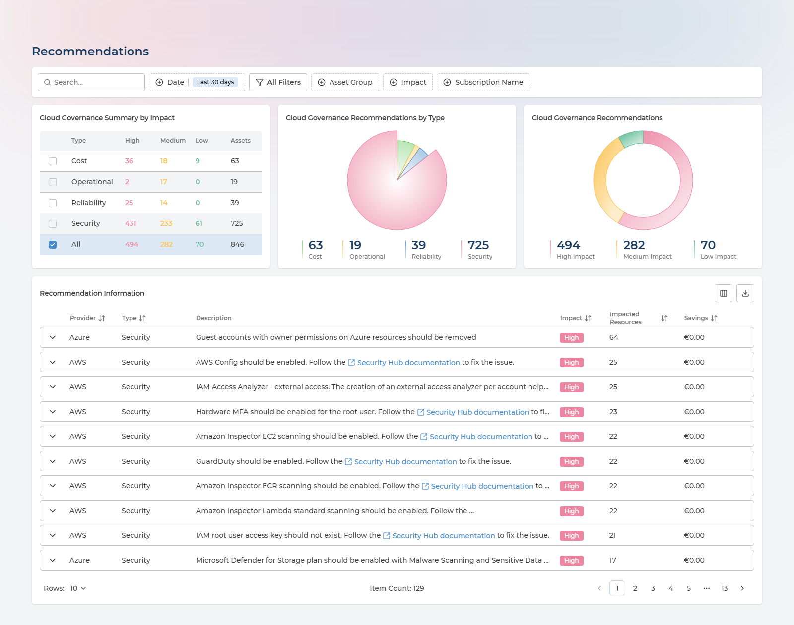

Recommendations are collected from each cloud's own advisory service - **AWS Trusted Advisor**, **Google Cloud Recommender** and **Azure Advisor** - and sorted into seven categories: **Cost**, **Security**, **Reliability**, **Performance**, **Operational**, **Manageability** and **Sustainability**.

The top of the page answers "where is the value". **Cloud Governance Summary by Impact** counts High, Medium and Low findings per category alongside the number of assets each affects, and doubles as a filter - tick a category to narrow everything below. Beside it, two charts break the same totals down **by Type** and **by Impact**. Underneath, the full table lists every recommendation with its potential saving.

Expanding a row reveals the individual resources the recommendation applies to, each with its own monthly saving - which is what you need to hand the work to whoever owns those resources.

<details markdown="block" class="reference-box">
  <summary>Columns in the recommendations table</summary>

Provider, Type, Description, Impact, Impacted Resources, Savings (in the selected currency).

Expanded rows add: Date, Asset Name, Subscription, Monthly Savings.

</details>

Filter by category, subscription name, provider and date preset; export the result to CSV.

<div class="takeaway" markdown="block">
**What to do with it.** Sort by savings and work down - the top of that list is usually a handful of oversized or idle resources worth more than everything below combined. Filter to Security and treat it as a hardening backlog. Export the impacted-resource list and hand each group to whoever owns it, which is exactly what [Asset Ownership](asset-ownership.md) makes possible. Track the total impact figure month to month: if it climbs while you are closing items, new deployments are outpacing the cleanup.
</div>

---

## Costs

Multi-cloud spend, sliced whichever way matches how your business is organised.

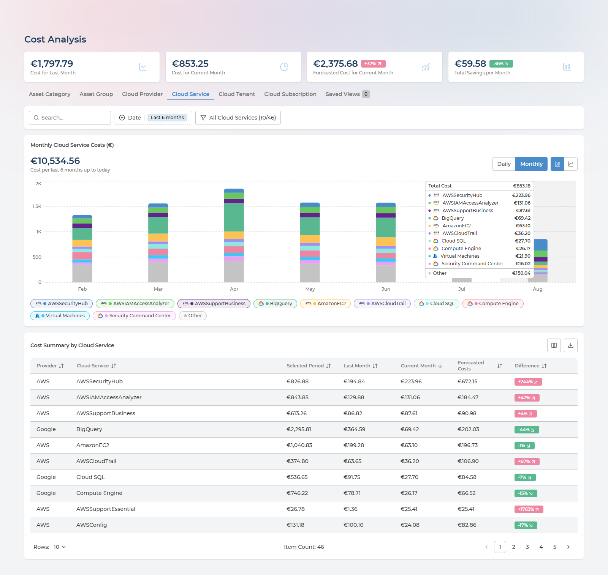

The page is titled **Cost Analysis** for customers who have the Cloud Economics service, where it also moves out of Cloud Essentials into its own section. The content described here is the same either way.
{: .fs-3 }

Four figures head the page: **Cost for Last Month**, **Cost for Current Month**, **Forecasted Cost for Current Month** (with a trend badge) and **Total Savings per Month**.

The tabs beneath them re-cut the same spend along a different dimension:

| Dimension | Use it to |
| --- | --- |
| **Asset Category** | See how much goes to compute versus storage versus networking |
| **Asset Group** | Read spend per business unit, once ownership groups are configured |
| **Cloud Provider** | Compare AWS, Azure and Google side by side |
| **Cloud Service** | Find the individual services driving the bill |
| **Cloud Tenant** | Split by tenant or organisation |
| **Cloud Subscription** | Split by subscription, account or project |

The last two are labelled with the terminology of whichever provider you have selected. A **Saved Views** tab keeps combinations of tab, period and filters you expect to return to.

The chart and the table below it follow the tab you pick. The toolbar controls the period - last 3, 6 or 12 months, current year or last year - and an **Include Current Month** toggle decides whether the incomplete month is drawn.

The chart works in monthly totals, and hovering any month opens the full breakdown for it - the total plus every service in the stack with its own figure, as in the screenshot above.

The filter panel lets you pick up to ten categories to chart at once, with a shortcut to select the top ones and an **Include Others** toggle that folds everything else into a single series. Searching for part of a subscription or resource group name is the quickest route to a per-business-unit view.

Export the table to CSV at any point.

<div class="takeaway" markdown="block">
**What to do with it.** Compare **Cost for Current Month** against the forecast to see whether this month is on track before the invoice decides for you. Switch to **Cloud Service** to find what is actually driving the bill, then to **Cloud Subscription** or **Asset Group** to find who owns it. Search part of a subscription or resource group name to carve out a business unit, and export that as the basis for internal recharging. Use the six- or twelve-month view to separate genuine growth from a one-off spike - and when a month looks wrong, hover it to see which service moved.
</div>

---

## Budget & Alerts

Costs tells you what you spent. This page tells you whether that was the plan.

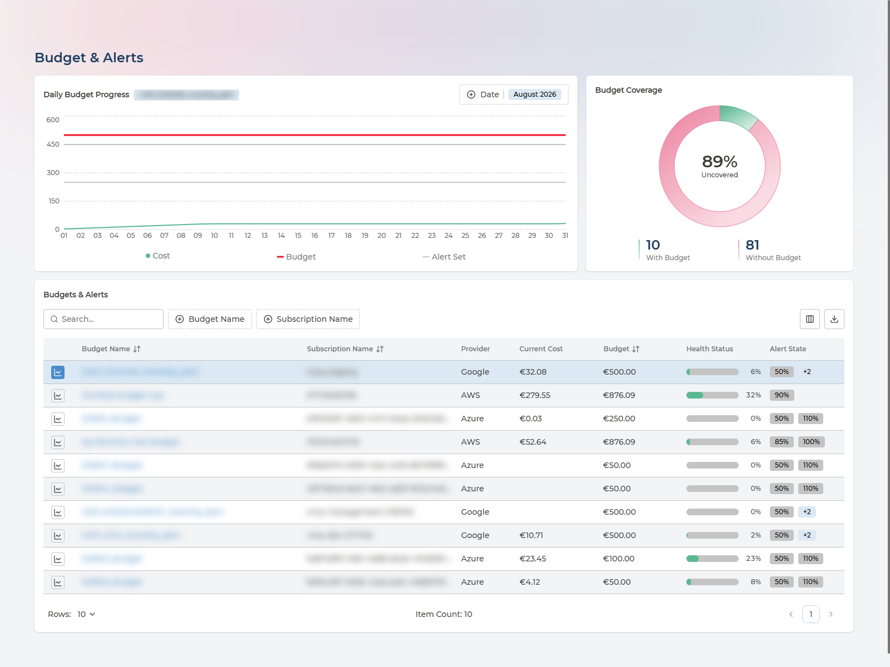

The **Daily Budget Progress** chart tracks running spend against the budget for the period, so overspend shows up mid-month rather than on the invoice. **Budget Coverage** splits your subscriptions into those with a budget and those without, and calls out the uncovered percentage - usually the more revealing of the two on a first visit.

The table lists every budget with its current cost, its limit, a health status and its alert state. Opening a row gives the spend history and the alert configuration - the thresholds and the recipients who would be notified.

On Cloud Essentials this page is visibility only: you can read budgets and see how spend is tracking against them, but notifications are not sent. Alerting comes with Pulse Premium or a managed service.
{: .fs-3 }

<details markdown="block" class="reference-box">
  <summary>Columns in the budget table</summary>

Budget Name, Subscription Name, Provider, Current Cost, Budget, Health Status, Alert State.

Alert rows within a budget add: Type, Threshold, Amount, Email.

</details>

<div class="takeaway" markdown="block">
**What to do with it.** Start with **Budget Coverage** rather than the budgets themselves - the uncovered share tells you how much of your spend has no ceiling at all, and that is usually the finding. Check the **Daily Budget Progress** chart mid-month while there is still time to act, rather than discovering the overspend on the invoice. Watch Health Status for budgets that are consistently under: those are candidates for reallocating money rather than congratulation.
</div>

---

## Assets

**An Asset Management Database (AMDB) for your cloud, included with Cloud Essentials.** Every resource across AWS, Azure and Google Cloud, discovered automatically and kept current by Pulse's own scanners - one queryable record of what you run, with no agents to deploy, no spreadsheets to maintain and nothing to reconcile by hand. Most organisations either pay for this or do without it.

An asset is anything Pulse discovers in your clouds - not only virtual machines, databases and IP addresses, but the containers too: subscriptions, accounts, projects and resource groups. The single-asset example further down is an AWS account, which is why it carries costs and recommendations of its own.

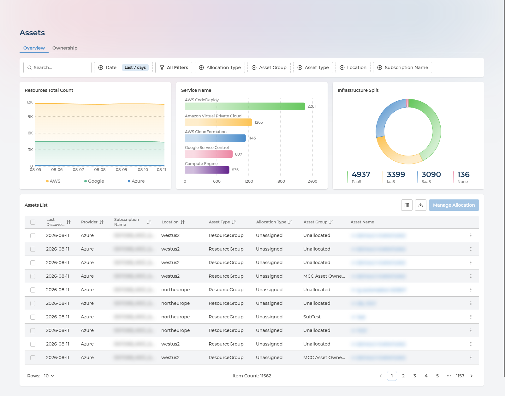

Three charts sit above the list: **Resources Total Count** over time, **Service Name** showing which services hold the most resources, and **Infrastructure Split** by asset category. An estate heavily weighted toward IaaS is a signal that some of it could move to managed or SaaS equivalents.

### Filtering the inventory

The **Assets List** is the part you will live in, and the filters are what turn 11,000 rows into an answer:

| Filter | What it narrows to |
| --- | --- |
| **Search** | Free text across asset names |
| **Date** | The discovery window - see below |
| **Allocation Type** | How an asset got its owner: direct, tag-based, inherited or unassigned |
| **Asset Group** | One ownership group, so you see only what a given team is responsible for |
| **Asset Type** | A kind of resource - virtual machines, resource groups, public IP addresses |
| **Location** | A single cloud region |
| **Subscription Name** | One subscription, account or project |

**Date deserves a word, because it is not the filter you might assume.** It filters on when Pulse last *discovered* each asset, not when the asset was created. The default recent window therefore answers "what exists right now" - a live view of the estate. Widening it brings back resources seen earlier in the period, including ones that have since been deleted, which is how you check what a subscription looked like last month or confirm something is really gone.

Two row actions save the most time: **View Cloud Resource** opens the resource in its provider's own console, and **Copy ID** puts the identifier on your clipboard.

<div class="takeaway" markdown="block">
**What to do with it.** Answer the questions that otherwise need three consoles: how many resources of this type exist, where, and in whose subscription. Use it as the authoritative list for audits, migration planning and licence counts. Filter by Allocation Type to find assets nobody owns, and by Location to check nothing has appeared in a region you do not permit. Export the filtered list to CSV to feed a CMDB, ticket or spreadsheet elsewhere. Watch **Infrastructure Split** over time: an estate drifting toward IaaS is accumulating operational work that PaaS or SaaS equivalents would remove.
</div>

<details markdown="block" class="reference-box">
  <summary>Columns in the assets list</summary>

Last Discovery, Provider, Subscription Name, Location, Asset Type, Allocation Type, Asset Group, Asset Name.

The Subscription column is labelled with the terminology of the selected provider - subscription, account or project. Further columns, including Asset ID, are available from the column show/hide menu.

</details>

### Inside a Single Asset

Clicking any row opens that resource's own page, which gathers everything Pulse knows about it in one place. This is where the multi-cloud story pays off at the level of a single thing you can act on: identity, owner, tags, cost and outstanding recommendations, without opening the provider console.

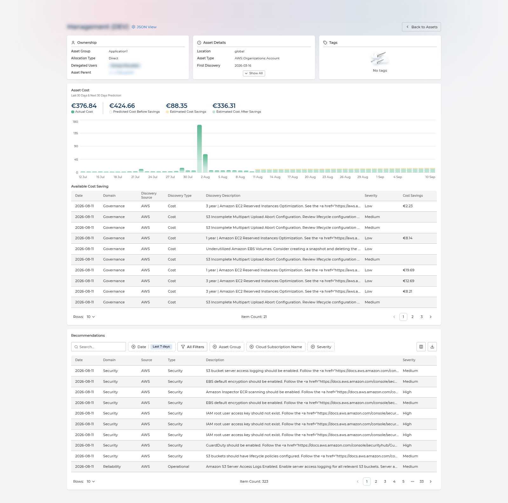

Three cards sit across the top:

- **Ownership** - which Asset Group holds it, how it got there (**Allocation Type**), who is delegated to that group, and its **Asset Parent** as a link, so you can walk up the hierarchy towards the subscription or account.
- **Asset Details** - where and what it is, when it was first discovered and last seen, and its identifiers. Three fields are shown with the rest behind **Show All**.
- **Tags** - every tag on the resource, or a clear statement that it has none.

**Asset Cost** then charts this one resource's daily spend over the last 30 days alongside a 30-day forecast, with four figures above it: **Actual Cost**, **Predicted Cost Before Savings**, **Estimated Cost Savings** and **Estimated Cost After Savings**. **Available Cost Saving** lists the specific opportunities behind that savings figure, each with a severity and a euro value. Underneath, **Recommendations** lists everything raised against this asset alone, with the same filters and export as the main page.

**JSON View**, beside the title, shows the raw record Pulse holds for the resource - useful when you need a field that no card surfaces, or to confirm exactly what was scanned.

<details markdown="block" class="reference-box">
  <summary>Fields on the Asset Details card</summary>

Location, Asset Type, First Discovery, Last Update Date, Asset ID, Asset Name, Provider, Tenant ID, Tenant Name, Subscription ID, Subscription Name, Resource Group ID, Resource Group Name, Asset Category, Asset Service, Asset Service Model.

Identifier fields have a copy button. Fields that do not apply to the resource show a dash rather than being hidden.

</details>

<div class="takeaway" markdown="block">
**What to do with it.** Use it as the answer to "what is this thing, who owns it, and what is it costing us" - the question that otherwise means asking three people. When a cost spike appears on the Costs page, drill to the asset and read its daily chart to date the change. Before deleting or resizing anything, check the Ownership card so you know whom to tell. And treat the per-asset recommendations as the specific, costed to-do list for that resource, rather than filtering the estate-wide list down by hand.
</div>

### Ownership

The page's second tab answers a different question: not what exists, but who is answerable for it. Assets are grouped into **Asset Groups**, each with its own delegated users, which is what makes the **Asset Group** and **Allocation Type** filters above useful and what puts a per-team figure on the Costs page's Asset Group tab.

It is a feature in its own right, with its own page: see [Asset Ownership](asset-ownership.md).

---

## Tags

Tags are what make cost allocation and ownership possible. This page tells you whether yours are good enough to rely on.

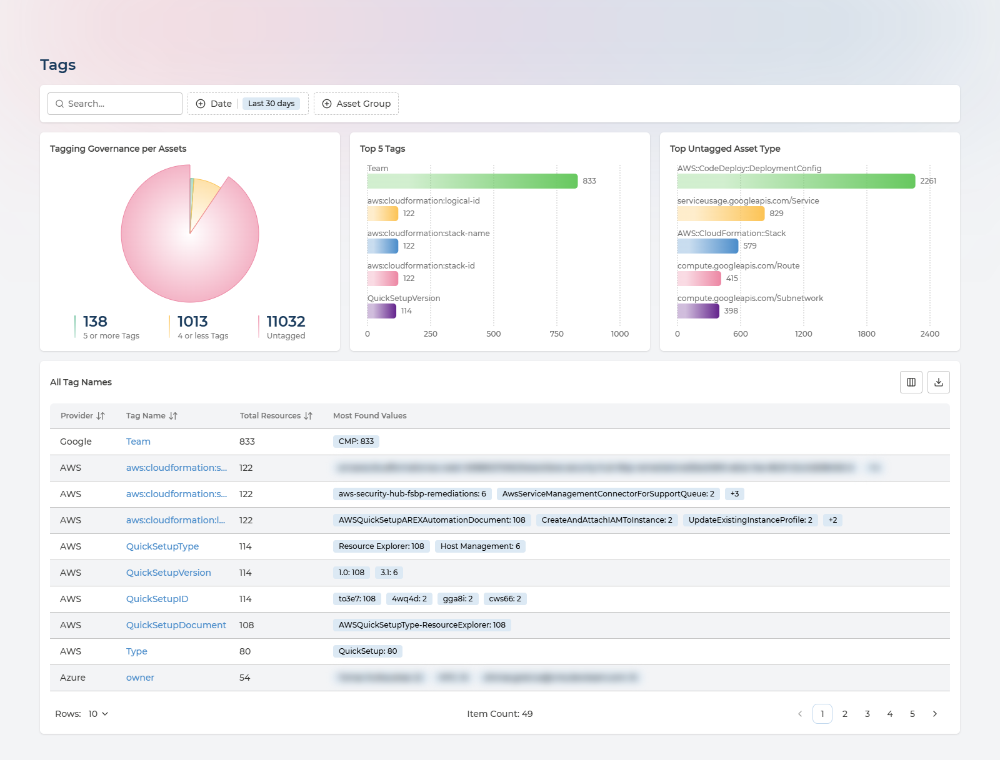

Three charts frame the question:

- **Tagging Governance per Assets** - the share of your estate carrying tags at all
- **Top 5 Tags** - the tag keys actually in use across the estate
- **Top Untagged Asset Type** - where the gaps are concentrated

The **All Tag Names** table lists every tag key found, how many resources carry it, and its most common values with counts. Clicking a tag name opens a panel with every distinct value and its resource count - the fastest way to spot the misspellings and case variants that quietly break cost allocation.

CSV export includes the value-and-count pairs, not just the tag names.

<div class="takeaway" markdown="block">
**What to do with it.** Decide whether your tags can be trusted before you build cost allocation or ownership on them - the untagged share is that answer. Open the tag key you intend to govern by and look for near-duplicate values: `Finance`, `finance` and `finace` are three groups where you wanted one, and fixing them in the cloud is cheaper than working around them forever. Use **Top Untagged Asset Type** to target remediation where it clears the most resources per unit of effort, and check that the tag key driving [Asset Ownership](asset-ownership.md) is among your most-used ones.
</div>

---

## Locations

Where your data physically resides, which is a compliance question before it is a technical one.

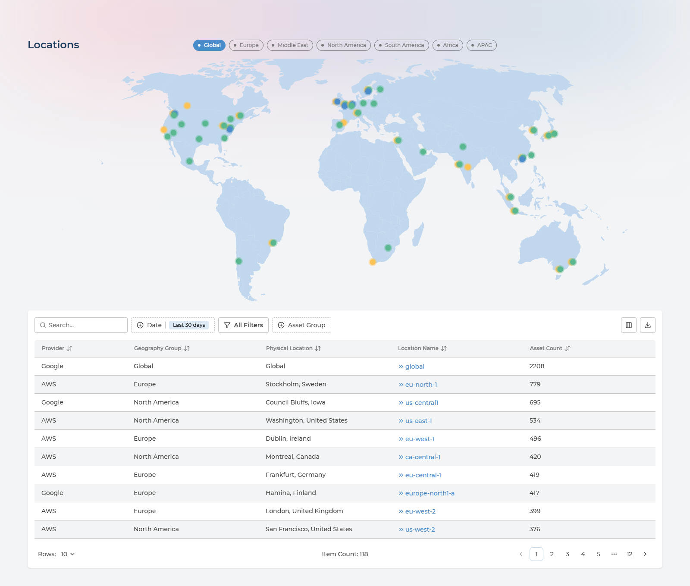

Region buttons - Global, Europe, Middle East, North America, South America, Africa, APAC - zoom the map to a part of the world. Markers show where resources are deployed.

The **Regions** table lists each cloud region in use with its geography group, physical location and asset count. Clicking a location name jumps to the Assets list filtered to that region, so "what exactly is running in that region" is one click away.

<details markdown="block" class="reference-box">
  <summary>Columns in the regions table</summary>

Provider, Geography Group, Physical Location, Location Name, Asset Count.

</details>

<div class="takeaway" markdown="block">
**What to do with it.** Check data residency against what you have committed to customers or regulators - if resources sit outside the regions your policy allows, this is where that shows up, and clicking the location name takes you straight to the assets in question. Confirm your footprint matches the architecture you think you have: regions nobody remembers provisioning are a common source of both cost and risk. And use the spread to sanity-check latency assumptions for users who are nowhere near your main region.
</div>

---

## Security Alerts

Findings from each provider's native security service - **AWS GuardDuty**, **Google Security Command Center** and **Microsoft Defender for Cloud** - consolidated so you triage once instead of three times.

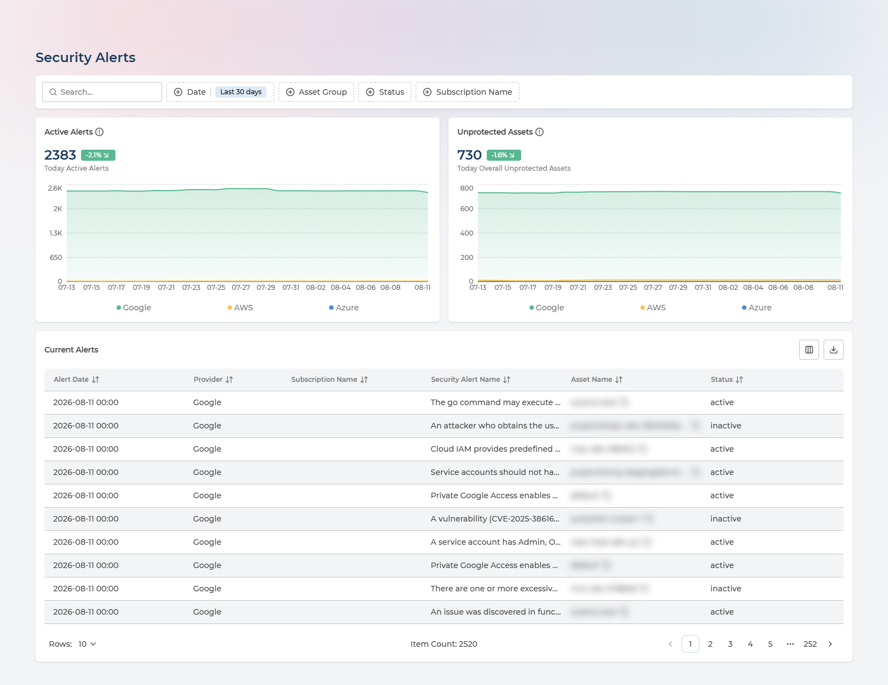

Two cards summarise today, each broken down by provider: **Active Alerts** counts the findings themselves, and **Unprotected Assets** counts the resources those findings are raised against. Read together they separate "many alerts on one resource" from "a problem spread across the estate".

The **Current Alerts** table lists every active finding with the resource it concerns and its status.

<details markdown="block" class="reference-box">
  <summary>Columns in the current alerts table</summary>

Alert Date, Provider, Subscription Name, Security Alert Name, Asset Name, Status.

</details>

Filter by date preset and export to CSV.

<div class="takeaway" markdown="block">
**What to do with it.** Triage once across all three clouds instead of rotating between consoles - and read the two cards together, because many alerts on one resource is a different problem from a few alerts spread across hundreds. Watch the trend rather than the absolute count: a flat line while you are closing findings means new ones are arriving just as fast. Export the current alerts and route them by the resource's owner rather than by provider, which is where [Asset Ownership](asset-ownership.md) earns its setup cost.
</div>

---

## Compliance State

A read-only view of how the estate scores against a security framework.

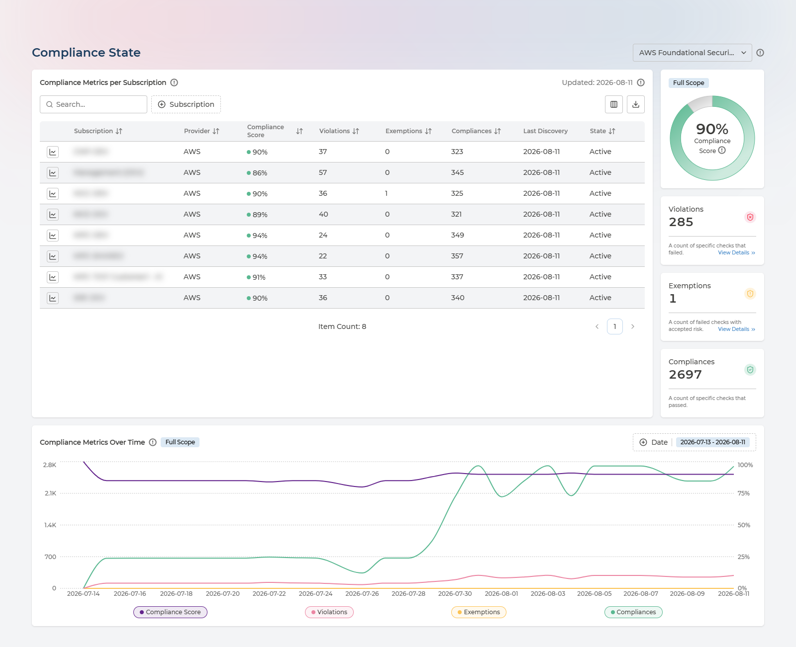

Pick a framework from the selector next to the page title. **Compliance Metrics per Subscription** then scores each subscription and counts its violations, exemptions and passing checks, while the panel alongside gives the overall **Compliance Score** as a dial with the totals behind it - failed checks, failed checks with accepted risk, and passed checks. **Compliance Metrics Over Time** plots all four against each other so a drop is attributable rather than just visible.

The score is calculated as:

```
(Compliances + Exemptions) / (Violations + Compliances + Exemptions) x 100%
```

Selecting a row narrows the chart to that subscription. The table exports to CSV.

<details markdown="block" class="reference-box">
  <summary>Columns in the compliance metrics table</summary>

Subscription, Provider, Compliance Score, Violations, Exemptions, Compliances, Last Discovery, State.

</details>

<div class="takeaway" markdown="block">
**What to do with it.** Get an evidence-backed answer to "how compliant are we" instead of an opinion, per subscription rather than as one blended figure - the weakest subscription is where to start. Use the trend to show whether a hardening effort is working, and read exemptions as a deliberate, reviewable list of accepted risk rather than as failures. When an audit asks, this page plus its CSV export is the answer.
</div>

---

## Questions and Answers

### Does Pulse change anything in my cloud?

No. Every permission Pulse is granted is read-only - it discovers and reports. The only privileged access involved is on your side, once, to grant that read-only access; see [Cloud Onboarding](onboarding/README.md) for exactly which roles each cloud needs and why.

### How soon does data appear, and how current is it?

Resources, findings and costs load within 24 hours of a cloud being connected, and refresh from then on. Each asset carries a **Last Discovery** date, so you can always see when Pulse last saw it rather than having to trust that the view is current.

### What is included, and what needs more than Cloud Essentials?

Every screen on this page is open to Cloud Essentials customers, including some that belong to the Economics and Compliance services. Two limits apply at this tier: costs are monthly rather than daily, and Budget & Alerts shows budgets without sending notifications. Pulse Premium adds the Cloud Economics and Cloud Compliance features; a managed service adds Managed Cloud Reliability, Managed Cloud Economics, Managed Cloud Compliance and others, delivered with Devoteam service management - see [Where This Fits](#where-this-fits).

### Why is a resource I know exists not in the list?

Three usual reasons. It may sit outside the scope you granted Pulse - a subscription or account not covered by the read-only role. It may be newer than the last discovery run, so wait up to 24 hours. Or the **Date** filter may be excluding it: that filter works on discovery dates, not creation dates, so a narrow window shows only recently-seen resources.

### Who can see what?

By default the pages describe the whole connected estate. Asset Groups narrow that: a user delegated to a group sees the assets in it rather than everything. See [Asset Ownership](asset-ownership.md).

### Can I get the data out?

Every table exports to CSV, and the export covers the whole filtered result set rather than just the page on screen. Individual assets also expose their raw record through **JSON View**.

---

## Next Steps

- Start using Pulse Cloud Inventory yourself: [Cloud Onboarding](onboarding/README.md)
- Set up ownership so costs and resources can be attributed: [Asset Ownership](asset-ownership.md)
- Learn more about the wider platform: [Pulse Ecosystem](README.md)
- Request a demo if you would rather be shown around: [Request Demo | Devoteam](https://www.devoteam.com/services/cloud-managed-services/#contact)
