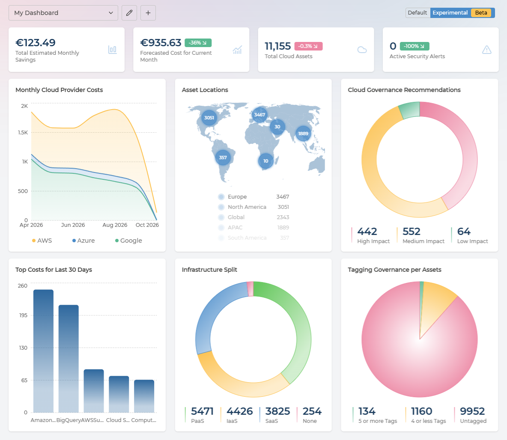
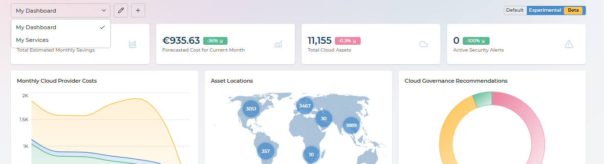
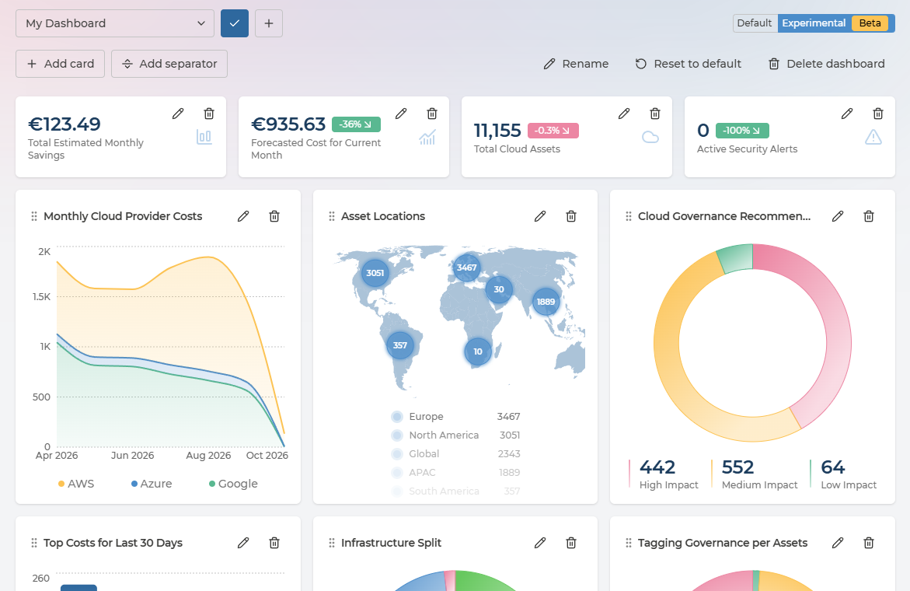
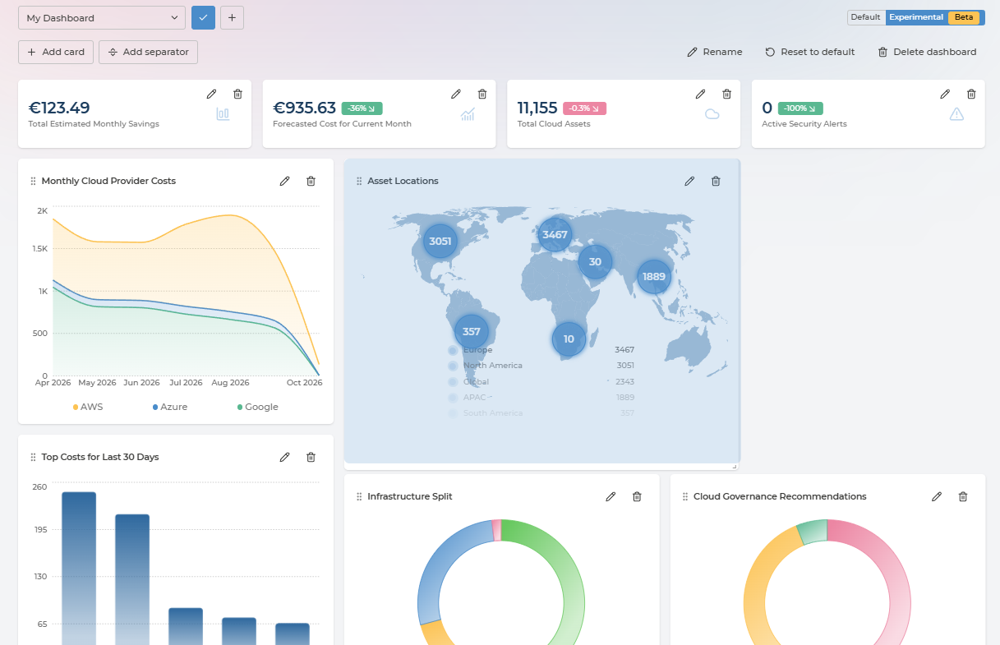
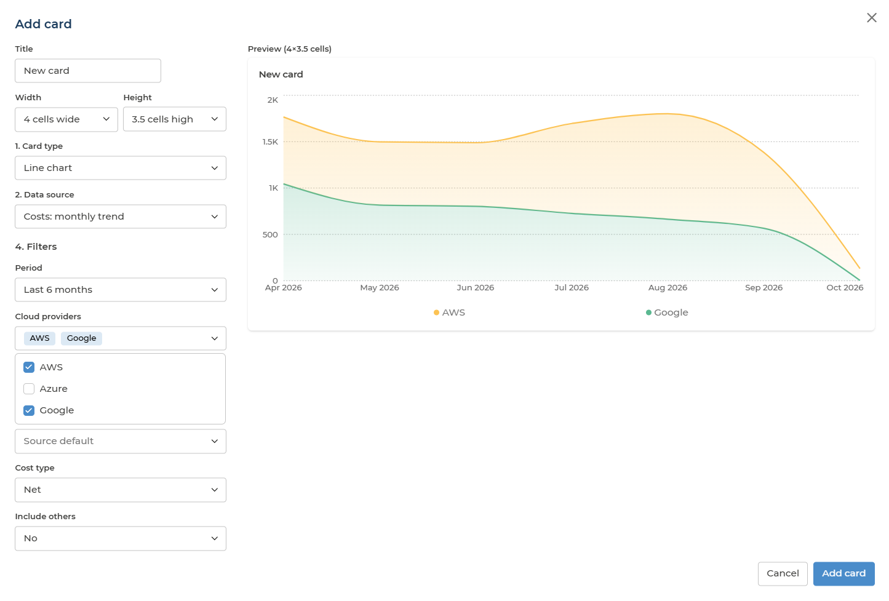
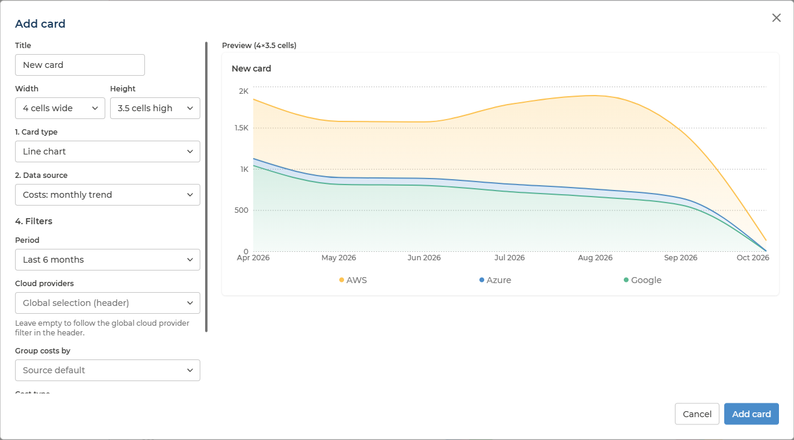
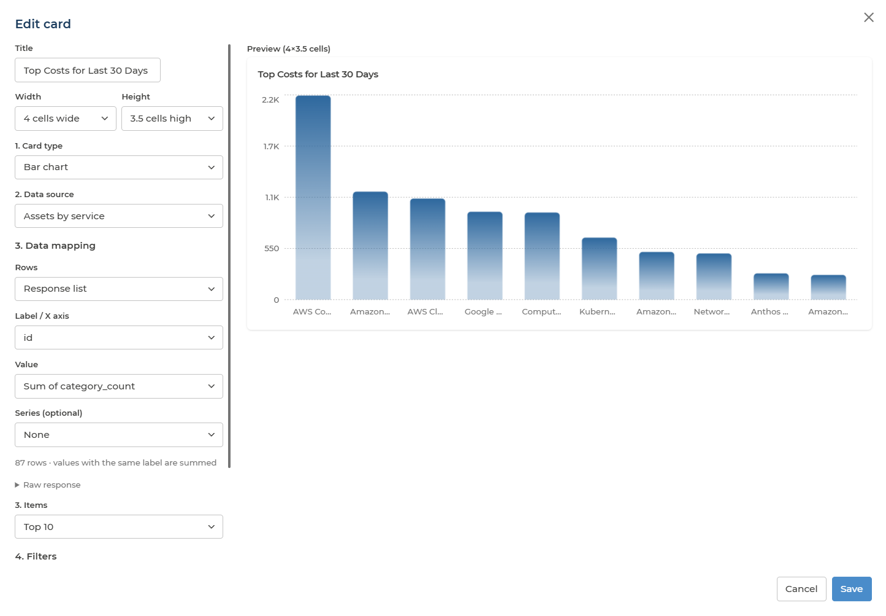

# Customizable Dashboard
{: .no_toc }

Build your own dashboards in Pulse from ready-made cards, arrange them the way you work, and share them with your colleagues.
{: .fs-6 .fw-300 }

{: .important }
The Customizable Dashboard is available to **Enterprise** customers for now. It is marked **Beta** in Pulse while we collect feedback.

  

    Table of contents
  

  {: .text-delta }
1. TOC
{:toc}

---

## What it is

The Customizable Dashboard sits next to the default dashboard on the **Dashboard** page. Use the **Default / Customizable** switch in the page header to move between them; the default dashboard does not change.

With the Customizable Dashboard you can:

- create as many dashboards as you need, each with its own name;
- add cards that show your costs, assets, recommendations, security alerts, tags and compliance;
- group cards under titled separators;
- move and resize cards on a grid;
- keep a dashboard to yourself, or share it with colleagues or with your whole company.

Your dashboards are saved in Pulse, so they are the same on every browser and device you sign in from.

## Main features

### Dashboards

The dashboard selector in the page header lists every dashboard you can see, grouped as **My dashboards**, **Shared with me** and **Company**. Next to it are three buttons:

| Button | What it does |
| --- | --- |
| **Edit** | Switches the dashboard into edit mode. Select **Done** to save your changes. |
| **Share** | Opens the sharing settings for the selected dashboard. |
| **New** (+) | Creates a new, empty dashboard. |

New dashboards are personal: only you can see them until you share them. A ready-made **My Dashboard** template shows the same cards as the default dashboard, so you have a starting point to adjust.

### Edit mode

In edit mode a toolbar appears under the header:

- **Add card** opens the card builder (see [Card types](#card-types) and [Data sources](#data-sources)).
- **Add separator** adds a full-width line with a title, to group the cards below it.
- **Rename** and **Delete dashboard** change the dashboard itself.

Each card and separator shows an edit (pencil) and a delete (bin) button. When you delete something, a message with **Undo** appears for a few seconds.

### Layout and sizes

Cards sit on a grid of **12 columns**. Heights are measured in **cells**; one cell is the height of one KPI card.

- **Width:** 1 to 12 columns.
- **Height:** 1 to 6 cells, in half-cell steps.
- **Moving:** drag a card or separator to a new place. Drop a card onto another card to swap them.
- **Resizing:** drag the bottom-right corner of a card, or set the width and height in the card builder.
- **Separators** always span the full width and are one thin row high. They do not hold cards: you can move cards freely above and below them.

New cards start at a size that fits their type:

| Card type | Default size (columns × cells) |
| --- | --- |
| KPI, stat tile | 3 × 1 |
| Gauge | 3 × 3 |
| Line, bar, doughnut, pie chart, location map | 4 × 3.5 |

### Titles

Every card has a title. In the card builder you can:

- hide the title with the **Show title** checkbox;
- place it **top left**, with the content below it, or **middle left**, with the content to its right.

### Filters

Cards follow the filters in the Pulse header: **company**, **currency** and **cloud providers**.

On top of that, each card can have its own filters, depending on its data source: period, cloud providers, cost grouping, cost type, subscriptions, tags, recommendation categories or compliance standard.

{: .note }
If you choose cloud providers on a card, that card **stops following the cloud provider filter in the header** and shows only the providers you chose. The card builder reminds you of this when you set them.

## Card types

| Card type | Best for | Options |
| --- | --- | --- |
| **KPI** | One headline number, such as last month's cost | Which value to show; how to combine values (sum, latest, average, maximum); comparison with the previous period, and whether an increase is good or bad |
| **Line chart** | A trend over time | Card filters |
| **Bar chart** | Comparing items, such as costs per service | Show all items or the top 3, 5 or 10 |
| **Doughnut chart** | Parts of a whole | Show all items or the top 3, 5 or 10 |
| **Pie chart** | Parts of a whole | Show all items or the top 3, 5 or 10 |
| **Location map** | Where your assets are | Always shows asset locations |
| **Stat tile** | Two or three related numbers side by side | Which values to show; an optional severity tag (critical, warning, info) |
| **Gauge** | A percentage, such as budget coverage | Which value to show, and what it is a share of |

The card builder shows a live preview while you choose.

## Data sources

Each card shows one data source. You only see the data sources you have access to: the same ones you can open as pages in Pulse. If a shared dashboard has a card you cannot access, the card says so instead of showing data.

### Curated sources

Ready to use, with the same numbers as the matching pages in Pulse.

| Data source | What it shows | Card filters |
| --- | --- | --- |
| Costs: monthly trend | Monthly costs per cloud provider (or the grouping you choose), stacked | Period, cloud providers, cost grouping, cost type, include others |
| Costs: breakdown | Total cost per service (or the grouping you choose) over a period | Period, cloud providers, cost grouping, cost type, include others |
| Costs: key metrics | Current month, forecasted month and last month cost, estimated monthly savings | Cloud providers |
| Assets: count history | Daily asset count per cloud provider | Period, cloud providers, subscriptions, tags |
| Assets: infrastructure split | Assets split by PaaS, IaaS and SaaS | Period (latest scan by default), cloud providers, subscriptions, tags |
| Assets: locations | Asset count per geography | Period, cloud providers |
| Recommendations: by impact | Recommendations by high, medium and low impact | Period, cloud providers, recommendation categories |
| Tags: coverage | Assets with 5 or more tags, 1 to 4 tags, or none | Period, cloud providers |
| Security: active alerts | Active security alerts today and a week ago | Cloud providers |
| Compliance: overall score | Compliance score, compliant items, violations and exemptions for the selected framework | None |

Cost sources show values in the currency selected in the header.

### API sources (advanced)

For anything the curated sources do not cover, you can pick data straight from the Pulse API. You then choose which part of the response to chart: the list of rows, the label, the value (a sum or a count of rows) and, optionally, a series for multi-line charts.

| Group | Data sources |
| --- | --- |
| Costs | Costs monthly, Costs daily, Costs summary, Costs totals, Budgets, Budget coverage, Cost scope values, Saved cost views |
| Cost savings | Savings recommendations, Savings action summary, Savings comparison, Cumulative savings, Savings by category, Savings by state |
| Assets | Assets list, Asset groups, Asset count history, Assets by service, Assets by infrastructure, Asset locations |
| Governance | Recommendations list, Recommendation aggregates, Recommendation impacted assets, Security alerts list, Security alerts history, Security affected assets history, Security alert totals |
| Tags | Tag names, Assets by tag count, Top tag names, Untagged assets, Organization tags |
| Compliance | Compliance standards, Violations, Compliance analysis: violations, Compliance analysis: rules, Policy rules, Exempted violations, Exemption requests |
| ITSM | Tickets list, Tickets count, Open incident split, Incident SLA, Incident resolve times, ITSM integrations |
| Organization | Users, Managed services, Service contracts, Billing subscriptions |

## Sharing and permissions

You can share a dashboard with named colleagues or with your whole company, with **read** or **write** access:

- **Read:** view the dashboard.
- **Write:** edit the dashboard: rename it, add, change and delete its cards and separators, and change its sharing within your role's limits.

What you can do depends on your role and on whether you own the dashboard:

| Action | Owner: user, analyst | Owner: manager, owner | Write access: user, analyst | Write access: manager, owner | Read access |
| --- | --- | --- | --- | --- | --- |
| View the dashboard | Yes | Yes | Yes | Yes | Yes |
| Rename, add, change or delete cards and separators | Yes | Yes | Yes | Yes | No |
| Share with named colleagues | Yes | Yes | No | Yes | No |
| Share with the whole company | No | Yes | No | Yes | No |
| Change or remove existing shares | Yes, own shares with colleagues | Yes | No | Yes | No |
| Delete the dashboard | Yes | Yes | No | No | No |

{: .note }
Only the owner can delete a dashboard. Deleting it removes it for everyone it was shared with.
